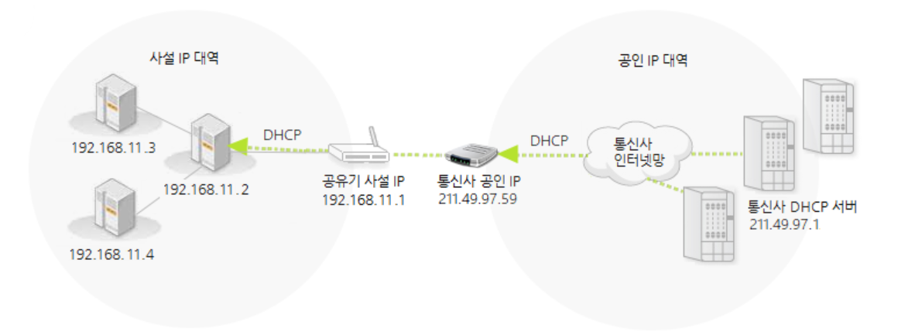

# 공인 IP  사설 IP 고정 IP 유동 IP

IP(Internet Protocol)은 NIC와 같은 host interface에 주소를 부여하고, data를 데이터그램으로 캡슐화시켜 IP 네트워크에 걸쳐 데이터그램을 라우팅하는 역할을 한다.

이를 위해 IP는 패킷의 형식을 정의하고 주소 체계를 제공한다.

이 때 부여되는 IP 주소는 다음과 방법으로 분류될 수 있다.

IP주소의 공개 범위에 따른 분류 

- 공인 IP 주소
- 사설 IP 주소

IP 주소의 변동성에 따른 분류

- 고정 IP 주소
- 유동 IP 주소

## IP주소의 공개 범위에 따른 분류

### 공인(public) IP 주소

인터넷 사용자의 로컬 네트워크를 식별하기 위해 ISP(Internet Service Provider)에서 임대하는 IP 주소이다.  공용 IP 주소라고도 불리며 외부에 공개되는 IP주소이다.

[http://www.codns.com/b/B05-104](http://www.codns.com/b/B05-104)

### 사설(private) IP 주소

전체 IP 대역 중 사설 환경에서 사용하도록 별도로 지정해둔 주소 대역으로 인터넷의 다른 공인IP에 노출되지 않는 주소이다.

사설 IP는 하나의 공인 IP를 통해 구성되는 하위 네트워크 개념으로 공유기/라우터와 같은 장치를 통해 공인 IP를 여러 디바이스가 나눠 사용한다.

아래의 주소 대역이 사설 IP로 고정되어있고 내부 네트워크에서 유일하지만 다른 네트워크와는 중첩되어 사용될 수 있다

class A : 10.000 ~ 10.255.255.255

class B : 172.16.0.0 ~ 172.31.255.255

class C : 192.168.0.0 ~ 192.168.255.255

위 클래스에 속하지 않는 모든 주소는 공인IP 주소로 사용된다.

## IP주소의 변동성에 따른 분류

### 고정 IP

IP를 임대하는 순간부터 반납할 때까지 IP가 바뀌지 않는 IP를 의미한다.

어떠한 서비스를 운영하기 위한 목적으로 사용된다.

### 유동 IP

장비에 접속할 때 여유분의 IP 중 하나의 IP를 선택해 부여하는 방법으로 IP 주소를 할당한다.

낭비되는 ip를 최소화할 수 있고 일정 범위의 IP를 자동적으로 분배할 수 있어(DHCP 프로토콜) ISP 또는 공유기에서 사용된다.