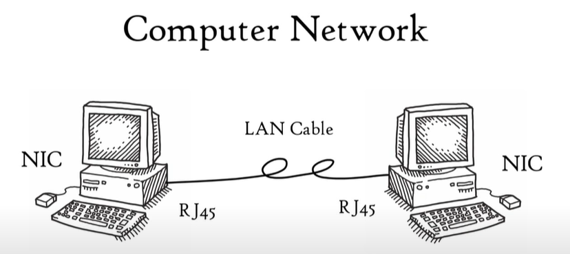

# OSI 7계층

OSI 7 계층

Please Do Not Throw Sausage Pizza Away!

7. Application Layer

6. Presentation Layer

5. Session

4. Transport

3. Network 

2. Data link

1.  Physical

TCP/IP의 network access는 link layer라고 불리기도 한다.

TCP/IP는 프로토콜에서 사용하는 data의 단위를 기준으로 layer를 나눈다.

MAC : Media Access Control

ARP : address solution protocol

PPP : WAN protocol

이더넷 802 : wire protocol

802.11 : wireless protocol

SONET/SDH : 광통신

ICMP : message

IPSec : ip security로 하위 레이어에 내장됨

OSPF, EIGRP : 라우팅 프로토콜

user가 사용하는 프로토콜들

SSH : remote connection

SMTP : mail

POP, IMAP : mailbox

SNMP : network management

TLS/SSL : security socket layer

BGP , RIP: 라우팅

# Application Layer?

Application layer : 유저가 사용하는 프로토콜 또는 서비스

Presentation layer :  데이터를 포맷팅, 암호화, 복호화, 압축하고 user에서 보여준다. (MIME types)

Session layer : session을 열고 닫고 관리한다. 

Transport layer 

- ports를 통해 동시에 여러 Application이 사용될 수 있게 도와준다. (멀티플렉싱, multiple services)
- reliable(TCP) , unreliable(UDP) end-to-end data transport and data stream services(TCP, UDP, SCTP(새로운 버전))
- connection oriented, connectionless , data stream service

Network layer

- IP : provide host addressing
- Routing : 최적의 경로
- Forwarding : switch packets out of the correct interface
- QoS : 서비스 품질 유지 ( 대역폭 컨트롤, 우선 순위 , ...)
- connectionless end to end networking (연결은 transport layer에서 유지)

Data Link

- 2 sublayers
    - Logical link control (LLC, 802.2)
        - 상위 계층에 service를 제공
    - MAC
        - medium에 어떻게 접근할지 결정
        - CSMA/CD ( wire) , CSMA/CA (wifi), Host addressing(MAC addressing)

## 2. Data link

data link는 두 개의 연결된 노드 간의 전송을 가능케 한다. 

물리 계층에서 발생할 수 있는 에러를 최대한 정확히 감지한다.

물리적으로 연결된 장치 사이에서 연결과 종료를 위해 사용되는 프로토콜을 정의한다.

두 장치 사이의 flow control을 위한 프로토콜 또한 정의한다.

IEEE 802에서는 data link layer를 2가지 로 구분한다.

MAC - 네트워크 상에 있는 장치들의 medium에 접근할 수 있는 권한을 통제한다.

LLC - 

## 1. Physical

2진 형태의 data를 전기/광/전자 신호로 변환해주는 물리적 전송 매개물을 의미한다. 

simplex, half duplex, full duplex와 같은 전송 모드 또한 physical layer에서 정의되고 USB, Bluetooth, Ethernet 규범 또한 Physical layer 명세에 포함된다.

## Why?