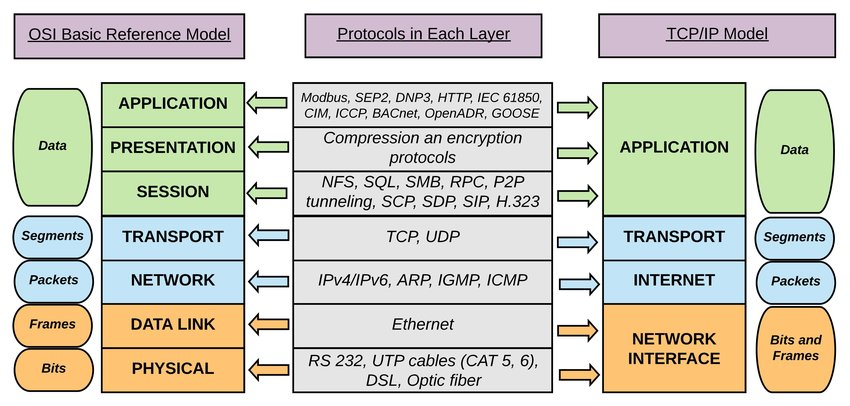

# TCP/IP 4계층

네트워크를 구성하는 수많은 장비들은 대부분 TCP/IP 프로토콜을 이용해 통신하며 TCP/IP 프로토콜을 통한 연결 체계를 이더넷이라고 한다.

TCP/IP는 인터넷 프로토콜을 대표하는 프로토콜이다. 떄문에 네트워크를 TCP/IP를 기준으로 계층으로 나누어 구분하는데 이를 TCP/IP 4계층이라 한다.

TCP/IP는 OSI 모델과는 달리 **서로 다른 컴퓨터간의** **연결**에 초점을 둔다.

TCP/IP 모델의 특징

[https://www.notion.so/TCP-IP-4-b418a1b38c9047b0a3c0fee4abbd16b0](https://www.notion.so/TCP-IP-4-b418a1b38c9047b0a3c0fee4abbd16b0)