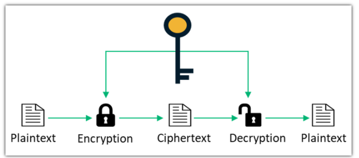

# Symmetric / Asymmetric Encryption

HTTP 요청에서 송신자가 데이터를 전송할 경우 전송되는 데이터는 인간이 이해할 수 있는 정보를 그대로 포함한다. 따라서 데이터가 전송되는 중간 과정에서 도청이 발생할 경우, 노출되서는 안 될 정보가 그대로 외부로 노출될 수 있다. 

따라서 외부에 노출되어서는 안 되는 데이터를 전송할 경우,  데이터 형식을 변활할 떄 인간이 이해할 수 있는 데이터를 포함하는 비트 정보를 수학적 알고리즘을 통해 암호화(encryption)하여 전송하고 서버에서 데이터를 수신할 때 암호화된 데이터를 복호화(decryption)해 client에서 보낸 정보를 읽어들인다. 

암/복호화 알고리즘에서는 secret key가 사용되며 암/복호화에서 사용하는 secret key가 동일할 경우 대칭 암호화  다를 경우 비대칭 암호화 방식이라 하고, 이러한 정보 보호 방법을 Cryptography(암호 작성법)이라 한다. 

## 대칭 암호화 (Symmetric Encryption)

암/복호화에서 사용되는 key가 동일할 경우 대칭 암호화라 한다.

암복호화에서 사용되는 key가 동일하므로 key가 외부로 노출되어서는 안 된다. 

따라서 어떠한 서비스에 대칭 암호화가 적용될 경우 해당 서비스는 허가된 third party에게만 서비스를 확장할 수 있다. 또한 key가 유출될 경우 외부에서 암호화된 데이터를 복호화할 수 있기 때문에 이에 대한 위험이 따른다.

## 비대칭 암호화 (Asymmetric Encryption)

암/복호화 과정에서 서로 다른 key를 사용할 경우 비대칭 암호화라 한다.

비대칭 암호화 방식에서는 암/복호화 과정에서 서로 다른 key를 사용하며 암호화 key를 통해 복호화 key를 유추할 수 없다. 따라서 암호화 key(public key)는 key를 필요로하는 곳에 공개적으로 제공하고 복호화 key(private key)는 server에서 비공개적으로 안전하게 관리한다. 

복호화 key는 암호화 key를 통해 유추할 수 없게끔 알고리즘이 설계되었기 때문에 암호화 key 유출에 대한 위험이 없다는 장점이 있어 보안이 중요한 (계정, 결제 정보, ...) 곳에서 주로 활용된다.

## 대칭/비대칭 암호화 특징 비교

대칭 암호화

- 암/복화 알고리즘이 간단하기에 속도가 빠르다.
- key의 길이가 128~255 bits이다.
- 속도가 빠르기에 큰 데이터를 처리할 때 사용된다.
- key 유출에 대한 위험이 따른다.
- 관련 알고리즘 : RC4, AES, DES, 3DES,

비대칭 암호화

- 알고리즘이 복잡해 속도가 느리다.
- 2048 bits 이상의 key size가 권장된다.
- 속도가 느려 작은 단위의 데이터를 처리하며 secure한 연결을 구축할 때 사용된다. ( secure connection을 비대칭 암호화로 구축하고, 그 연결 위에서 대칭 암호화 방식을 통해 data를 주고 받는다)
- private key를 따로 관리하기에 key 유출에 대한 위험이 없다.
- 관련 알고리즘 : RSA, Diffie-Hellman, ECC

[https://www.ssl2buy.com/wiki/symmetric-vs-asymmetric-encryption-what-are-differences](https://www.ssl2buy.com/wiki/symmetric-vs-asymmetric-encryption-what-are-differences)