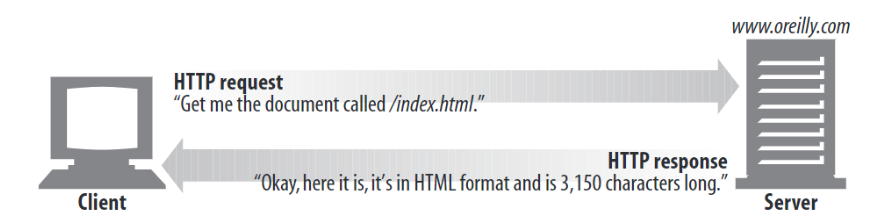

# Ch1. Overview of HTTP

챕터에서 다룰 내용

- 어떻게 client와 서버가 통신하는지
- web content가 어디에서 전달되는지
- web transaction이 어떻게 동작하는지
- HTTP 통신에 사용되는 message format
- TCP network transport
- HTTP 프로토콜의 variations

## Web Clients and Servers

web content는 web server에 위치하며 web server(HTTP server)는 HTTP 프로토콜을 통해 speak한다.



## Resources

web servers는 web resources(source of web content)를 host한다. 

static files : HTML file, JPEG file, .

dynamic content resources : content를 만들어내는 software ( 주식 거래, 카메라를 통한 이미지 촬영, 온라인 스토어 ...)


즉,  Search Engine, web gateway와 같은 소프트웨어 또한 resource에 속한다.

### Media Types

Internet hosts는 여러 종류의 데이터 타입을 갖기 때문에, HTTP는 web을 통해 전송되는 각 object에 data format을 라벨링하며, 이를 MIME(Multipurpose Internet Mail Extensions) type이라 한다.

MIME은 본래 서로 다른 전자메일 시스템 사이의 메세지 전송을 위해 개발되었고 이를 HTTP에서 mujltimedia content를 설명하고 라벨링하기 위해 채택하였다.

web server는 모든 HTTP object data에 MIME type을 첨부하고, object를 전달 받는 client는 MIME type를 통해 어떻게 object를 처리할지를 결정하게 된다.

대부분의 브라우저는 수백가지의 object 타입을 처리할 수 있다.

- html parsing, formatting
- playing  audio through computer speaker,
- ...

MIME 타입 예시

```jsx
Content-type: image/jpeg (primary object type / specific subtype)
Content-length: 12984
```

- text/html
- text/plain
- image/jpeg
- image/gif
- application/vnd.ms-powerpoint
- ... (appendix D)

### URIs

웹 서버 resource는 URI(uniform resource identifier)라는 resource name을 가지고 있기 때문에, client는 필요한 resource를 요청할 수 있다.

URI는 resource에 unique하게 부여되는 인터넷의 우편 번호라 생각하면 이해가 쉽다.

```jsx
http://www.joes-hardware.com/specials/saw-blade.gif
```

URIs come in two flavors, called URLs and URNs.

[https://stackoverflow.com/a/28865747/12694425](https://stackoverflow.com/a/28865747/12694425)

### URLs

URL(uniform resource locator)는 가장 일반적인 resource identifier로, 특정 서버가 갖는 resource의 특정 위치를 나타낸다. 


URL은 Scheme / server Internet address / server에서의  resource 위치로 구분된다.

- Scheme : resource에 접근할 때 사용되는 프로토콜을 나타내며 일반적으로 http가 사용된다.


### URNs (deep dive in ch2)

URN은 특정 content의 일부를 나타내며, resource가 현재 위치하는 곳과는 무관한 unique한 name을 부여한다(location independent). 따라서, resource의 서버 상의 위치가 바뀔 때에도 동일한 URN을 통해 resource에 접근이 가능하다.

원문이 작성되었던 당시에는 URN은 실험적으로 도입되었다.

## Transactions

HTTP transaction은 client와 server간의 request, response 과정을 의미한다.

client/server는 request/response를 전달하기 위해 HTTP message를 사용한다.


### Methods

HTTP는 여러 request 명령어를 지원하며, 이를 HTTP methods라 한다.

서로 다른 methods는 server가 어떤 action(fetch web page, delete a file, ...)을 취하는지에 따라 결정된다.

- GET : 서버가 named resource를 클라이언트로 전송
- PUT :  named server resource에 client에서 생성한 data를 저장
- DELETE : server에 있는 named resource 삭제
- POST : server gateway application에 client의 데이터 전송
- HEAD : 서버가 named resource의 response header 정보만 클라이언트로 전송

### Status Codes (deep dive in ch3)

server는 client에 HTTP 메세지를 전달할 떄, client에 메세지 전송 결과를 알리기 위해 HTTP 메세지와 함께 Status code를 전달한다.

RFC 2616에 정의된 상태 코드

[https://developer.mozilla.org/en-US/docs/Web/HTTP/Status](https://developer.mozilla.org/en-US/docs/Web/HTTP/Status)

- informationsl responses : 100-199
- successful responses : 200-299
- redirects : 300-399
- client errors : 400-499
- server errors : 500-599

또한, HTTP는 상태 코드에 대한 설명이 담긴 'reason phrase' 를 함께 전달한다.


### Web pages Can Consist of Multiple Objects

HTTP 통신 시, HTTP transaction이 여러번 발생할 경우 통신 처리 과정에서 에러가 발생할 수도 있다.

ex)

1. browser가 html을 fetch
2. image를 추가적으로 fetch 


## Messages


- start line
- header fields
    - 각 field는 name : value로 구성됨
    - 마지막은 blank line
- body
    - optional mesasge
    - 문자로 구조화된 start line, header와는 달리 binary data를 저장할 수도 있음.(video, image, audio, tracks, software application...)

### Simple message example


http://www.joes-hardware.com/tools.html

## Connections

### TCP/IP

HTTP는 layer protocol로, 하위 계층인 transport protocol에 해당되는 TCP/IP와 같은 프로토콜을 이용해 통신한다. 따라서, 네트워크의 아주 디테일한 부분들까지는 관여하지 않는다.

TCP는 아래와 같은 동작을 보쟝한다.

- 에러가 없는 데이터 전송
- 순차적 전송
- 분리되지 않은 data stream (따라서, 어떠한 시간에도 원하는 크기로 데이터를 쪼갤 수 있다.)

인터넷은 TCP/IP에 기반하며, TCP/IP는 개별적 네트워크, 하드웨어의 기능을 숨기고 그 위에서 신뢰성 있는 통신을 제공한다.

TCP/IP 연결이 이루어지면, client와 server 컴퓨터 간에 교환된 메세지는 순차적으로 반드시 전송된다.

아래 그림은 HTTP 프로토콜 스택을 보여준다.


## Connections, IP addresses, Port numbers

HTTP client가 server에 메세지를 전송하려면, Internet Protocol(IP) 주소와 port numbers를 통해 client와 server 간의 TCP/IP 연결이 이루어져야한다.

마치 지역 번호와 핸드폰 번호를 이용해 전화를 연결하는 것처럼, server IP 주소를 통해 서버에 접근하고, TCP port number를 통해 서버에서 실행 중인 software program으로 연결을 요청한다.

ex) 


IP address / port number

- 207.200.83.29 / 80

hostname / port number

- [www.netscape.com](http://www.netscape.com) / 80
- [www.netscape.com](http://www.netscape.com) / 80 ( default )

hostname은 DNS(deep dive in ch2)를 통해 ip address로 변환된다.

port number를 부여하지 않을 경우 80이 default로 지정된다.

client에서 server에 tools.html 파일을 요청할 떄 진행되는 통신 흐름은 다음과 같다.


telnet을 통해 HTTP transaction 과정을 살펴보면

ex) [http://www.joes-hardware.com:80/tools.html](http://www.joes-hardware.com/tools.html) 요청문 (굵은 글씨가 입력한 명령어)

```jsx
**%telnet www.joes-hardware.com 80**
Trying 161.58.228.45...
Connected to joes-hardware.com. // connection 성공
Escape character is '^]'
**GET /tools.html HTTP/1.1
Host: www.joes-hardware.com**

HTTP/1.1 200 OK
Date: Sun, 01 Oct 2000 23:25:17 GMT
Server: Apache/1.3.11 BSafe-SSL/1.38 (Unix) FrontPage/4.0.4.3
Last-Modified: Tue, 04 Jul 2000 09:46:21 GMT
ETag: "373979-193-3961b26d"
Accept-Ranges: bytes
Content-Length: 403
Connection: close
Content-Type: text/html

<HTML>
<HEAD>
<TITLE>Joe's Tools</TITLE>
</HEAD>
<BODY>
<H1>Tools Page</H1>
<H2>Hammers</H2>
<P>Joe's Hardware Online has the largest selection of hammers on the earth.</P>
<H2><A NAME=drills></A>Drills</H2>
<P>Joe's Hardware has a complete line of cordless and corded drills, as well as the latestin plutonium-powered atomic drills, for those big around the house jobs.</P>
 ...</BODY>
</HTML>
Connection closed by foreign host.Example 1-1. 
```

## Protocol Versions

**[MDN으로 대체](https://developer.mozilla.org/en-US/docs/Web/HTTP/Basics_of_HTTP/Evolution_of_HTTP)**

단순 HTML 객체를 fetch하기 위해 고안된 HTTP/0.9 초기 버전부터 점차 발전해왔다.

## Architectual Components of the web

- proxies : client와 server 사이의 중개자 역할
- caches : web page 복사본을 저장해두는 HTTP storehouses
- gateways : 다른 application에 연결하기 위한 special web server
- [tunnels : Special proxies that blindly forward HTTP communications](https://developer.mozilla.org/en-US/docs/Web/HTTP/Proxy_servers_and_tunneling)
- agents : HTTP request를 자동화하는 semi intelligent web clients

### Proxies (deep dive in ch6)

proxy는 web 보안, application 통합, 성능 최적화에 중요한 역할을 한다.


그림에서 보이는 것과 같이 proxy는 client와 server 사이에서 client의 HTTP request를 받고 proxy를 통해 수정된 HTTP request를  server에 전달한다. 

proxy는 다음의 목적으로 위해 사용된다.

- 보안
- 수많은 web traffic flow에서도 신뢰성 있는 메세지 전송 보장
- 요청, 응답 메세지 필터링 ( 바이러스 검사, 콘텐츠 심의 )

## Caches ( deep dive in ch7 )

network request를 줄이기 위해 고안된 기술로, server 에서 proxy를 거쳐 client로 document를 전송할 떄 document의 copy본을 proxy cache에 저장해두고 동일한 document를 요청하는 다음 client 요청에는 server를 거치지 않고  캐싱된 document를 곧바로 전송한다.

## Gateways (deep dive in ch 8)

gateway는 다른 server를 위해 중개 역할을 하는 HTTP traffic을 다른 protocol로 바꿀 때 사용된다.

getway는 resource의 origin server에 의해 발생한 요청에 대해서만 메세지를 전송받으며 client는 gateway와 통신 중인지 확인할 수 있는 방법이 없다.

ex) 

HTTP request를 통해 FTP URIs를 전달받은 경우,  gateway를 거쳐 http 프로토콜을 FTP 프로토콜로 바꾸고 ftp 서버에서 document를 fetch할 수 있다. 요청에 의해 전달받는 document는 HTTP message에 패킹되어 client로 전달된다.

## Tunnels

tunnels은 HTTP applications로, setup이 발생한 후 두 연결 간에 raw data를 교환한다. 

HTTP tunnels는 non-HTTP data를 여러 HTTP 연결에 전송하기 위해 사용된다. 이 때 data는 확인 절차를 거치지 않으며 전송 과정은 외부에서 확인할 수 없다.

tunnels가 사용되는 대표적인 예로는 'HTTP 연결을 통한 암호화된 SSL traffic  전송'이 있다.

HTTP/SSL tunnel은 HTTP request만을 전달받는다. 


## Agents

user agent(HTTP agent)는 user를 대신해 HTTP request를 요청하는 client program이다. 

지금까지는 HTTP agent의 한 종류인 web browser에 대해서만 다뤘지만, 이 외에도 여러 user agents가 존재한다. ( ex) machine automated user agents )

**machine automated user agents :** 사람의 interaction에 의해 http request가 요청되는 것이 아니라, 자동적으로 web을 돌아다니며 HTTP trasactions를 발행하고 content를 fetch한다.

- spider : web을 돌아다니며 web content를 수집한다.
- web robots :

