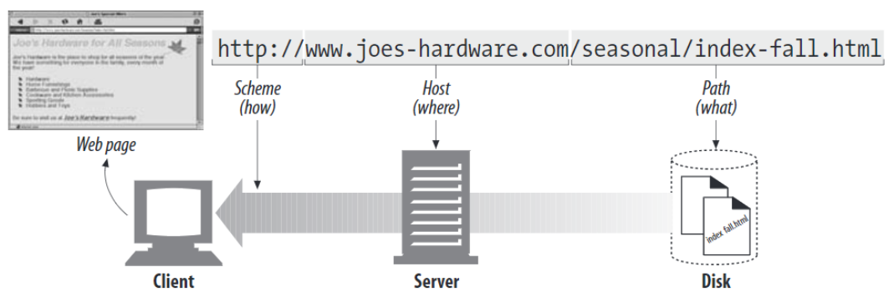
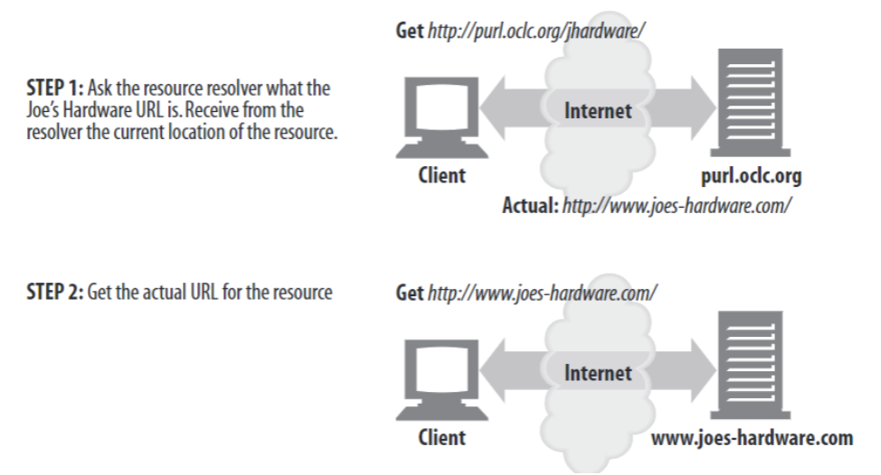

# Ch 2. URLs and Resources

we'll cover

- URL syntax, what the various URL components do
- URL shorcuts : relative URL, expandomatic URL
- URL encoding and character rules
- common URL shcmes
- URL의 미래 ( URN )

## Navigating the Internet's Resources

URL은 네트워크 요청을 위한 human access point로, user가 URL을 입력하면 browser는 알맞은 프로토콜을 이용해 요청을 발행한다.

사실, URL은 URI의 일부로, URI는 크게 URL과 URN으로 나뉜다. 

URI

- URL : resource가 어디에 위치해있는지?
- URN : resource에 대한 고유한 id 정보

HTTP specification에 의해 URI는 URL, URN으로 나뉘지만 실질적으로 HTTP applications는 URL을 이용한다. 책에서는 URI/URL을 용어를 혼용해서 사용할 것이며 일반적으로는 URL을 의미할 것이다.

URL syntax는 다음과 같이 구분된다.

- URL scheme : web client가 어떻게 resource에 접근할 것인지?(어떤 프로토콜을 쓸 것인지?)
- server location :  resource를 host하는 server의 위치
- resource path : resource가 server 상의 어떤 경로에 위치하는지



URL의 URL scheme을 통해 여러 프로토콜을 이용할 수 있다.

- mailto: xxxxxx@xxxxx.gov
- [ftp://xxxxxxx.xls](ftp://xxxxxxx.xls) (파일 전송)
- rtsp://xxxxxxx:554/cto_video (비디오 스트림 호스팅)

## The Dark Days before URLs

Web과 URLs이 도입되기 전까지는, Net에 분포해있는 data에 접근하기 위해 rag-tag assortment of aapplications을 이용했다. 

기존의 방법은 프로토콜 지정, 로그인, 디렉토리 설정 등 복잡한 절차를 거쳐야 했고 이를 간소화하기 위해 URL을 고안했다.

URL은 여러 Components로 구성되어있다.

## URL Syntax

```jsx
<scheme>://<user>:<password>@<host>:<port>/<path>;<params>?<query>#<frag>
```

scheme

- 어떤 프로토콜 사용할 것인지
- 대소문자 구분 X

user 

password

host : hostname 또는 IP address

port 

- resource를 호스팅하는 server가 listen하고 있는 port number
- scheme마다 서로 다른 default port number를 가지며, HTTP의 경우에는 80이 default value

path

params : name/value 쌍으로 이루어진 input 변수로 여러 params field를 포함할 수 있다

query :  internet gateways (DB, bulletin boards, search engines)에 parameters를 전달하기 위해 사용된다.

flag : server에서 object를 참조할 때 사용되지 않는 field로, client에의해 내부적으로만 이용된다.

U**sernames and Passwords**

일반적으로 FTP servers에서 사용된다.

**web token이나 oauth가 이 통신 과정을 처리해주는 것인지, 과거의 인증 방법인지, FTP에서 사용되는 인증 방법인지 확인해야될 듯**


username, password를 입력하지 않을 경우, username은 `anonymous` 가 입력되며 password로는 agent마다 정해진 password가 사용된다.

P**arameters**

대부부의 scheme에서 server에 저장된 object에 접근하기 위해 host/path 외의 추가적인 정보가 필요하다.  

ex) 

FTP 프로토콜은 binary 또는 text 형태의 파일 전송 방법을 가지고 있다. HTTP 요청 시, params를 통해 원하는 file type을 url에 포함할 수 있다.

ftp://xxxxx**;type=d**

여러 path segmnet에 대해 param을 전달할 수도 있다.

http://xxxx/path1;slae=false/path2;index.html;graphics=true

**Query Strings**

db service와 같이 resource의 type을 narrow down하도록 요청할 경우 사용된다.

ex) [http://www.joes-hardware.com/inventory-check.cgi?item=12731&color=blue&size=large](http://www.joes-hardware.com/inventory-check.cgi?item=12731&color=blue&size=large)


## Fragments

fragment는 resource의  특정 section을 가리키는 reference로 HTML과 같이 resource가 resource level에서 쪼개질 수 있는 경우 사용된다.

서버에서는 fragment에 대한 정보를 처리하지 않는다. 따라서, fragment 정보는 서버에 전달되지 않으며 서버로부터 전달받은 response는 client에서 fragment section만 추려 user에게 보여준다.

ex) 서버에서 tools.html#drills를 요청할 경우 서버로부터 tools.html을 전달받고, 클라이언트에서 drills fragment를 찾아 user에게 보여준다.


## URL shortcuts

### Relative URL

base URL로부터 상대적인 path를 통해 absolute url을 추론한다.


**Base URLs**

relative URL을 absolute URL로 바꾸기 위한 첫 번째 과정은 base URL을 찾는 것이다. baseURL은 다음과 같이 분류된다. 

- resource에 명시되는 경우 : ex) HTML의 <base> 태그
- resource를 포함하는 base URL : 별도로 base URL이 명시되지 않을 경우에는, 그림의 예시와 같이 embedded resource의 URL을 base URL로 사용한다.
- no base URL : absolute URL 또는 broken/incomplete url

**Resolving relative references**

base URL을 찾은 후, base URL과 relative URL을 components로 쪼갠다. (decomposing the URL)

Converting relative to absolute URL


## Expandomatic URLs

몇몇 브라우저는 URL을 자동적으로 확장한다. 

**Hostname expansion**

ex) yahoo를 입력할 경우, www.yahoo.com으로 자동적으로 url을 확장한다.

단점 : proxy에 문자를 야기할 수 있다.(deep dive in ch6)

**History expansion**

브라우저는 history를 통해 URL 자동완성 기능을 제공한다.

URL auto-expansion은 proxy에 따라 다르게 동작하며 이는 ch6에서 다루도록 한다.

## Shady Characters

URL은 다양한 프로토콜에서도 resource를 식별할 수 있도록 설계되었다. ( **portable** )여러 프로토콜들은 서로 다른 메커니즘을 이용해 데이터를 전송하므로 이를 지원하는 것은 중요한 요소이다.

URL은 손실 없이 정보를 전달해야한다.( **safe transmission** ) 가령,  email 프로토콜은 데이터 전송 시 일부 문자열을 제거하는데 이를 해결하기 위해 URL은 문자 사용에 제한을 두었다. 또한 가독성을 위해 일부 문자를 제한했다.

통신이 점차 복잡해지면서 complete한 기능을 제공할 필요가 있었고, URL designer들은 binary data와 일반적으로 통용되지 않는 unsafe한 문자를 safe하게 인코딩해주는 escape mechanism을 개발했다. 

이 섹션에서는 universal alphabet과 URL을 위한 encoding rules을 요약한다.

### The URL Character Set

역사적으로, 많은 computer applications는 US_ASACII character set을 사용해왔다.

US_ASCII는 오래 유지되어왔기 때문에 portable했지만 US에 편리한 반면, 유럽 또는 수백개의 non-Romantic언어에는 적합하지 않았다.

뿐만 아니라, 몇몇 URL은 임의의 binary data를 포함할 필요가 있었고 이러한 필요성을 해결하고자, 기존의 제한된 문자를 사용 가능한 문자로 인코딩해주는 escape sequence를 도입했다.

### Encoding Mechanisms

[uri를 인코딩하는 js의 builtin 메소드 encodeURIComponent()](https://developer.mozilla.org/en-US/docs/Web/JavaScript/Reference/Global_Objects/encodeURIComponent)

URL에서 unsafe한 문자를 지원하고자 %와 아스키 코드의 16진수로 표현되는 인코딩 기법을 도입했다.


### Character Restrictions

URL components에서 사용되거나, US-ASCII printabled set에 정의되지 않은 문자들은 사용이 제한된다.

internet gateways나 protocols에서 문제를 일으킬 수 있는 문자들 또한 사용이 제한된다.


scheme마다 unsafe한 문자가 다르기 때문에, unsafe한 문자일지라도 어떠한 프로토콜을 사용하는 경우에는 통신에 성공할 수도 있다. 하지만 모든 프로토콜을 염두에 두고 unsafe한 문자는 인코딩하도록 한다.

## A Sea of Schemes

주요 URL Schemes 

- http
    - port 80


- https
    - http + Secure Sockets Layer(SSL) (encryption of HTTP connections)
    - port 443


- mailto
    - 다른 schemes와는 달리 email address를 참조한다.

- ftp
    - File Transfer Protocol URLs는 FTP server에 file을 업로드하거나, FTP server에 있는 콘텐츠 리스트를 가져올 떄 사용된다.

        

- rtsp, rtspu
    - RTSP URLs는 Real Time Streaming Protocol를 통해 가져오는 audio/video 미디어 리소스에 대한 식별자이다.
    - rtspu의 u는 UDP 프로토콜을 사용한다는 것을 의미한다.

        

- file
    - file scheme은 호스트 머신(local disk, network filesystem, other file-sharing system)에서 접근할 수 있는 files를 나타낸다.
    - host가 생략될 경우, localhost를 default value로 사용한다.

        

## The Future

URL의 단점

- resource가 이동할 경우, 유효하지 URL이 된다.

URN

- resource의 위취가 아닌, resource에 고유한 이름을 부여한다.

PRUL : url의 한 종류로 현재 resource의 위치를 네이밍하는 resource locator server를 이용한다.

