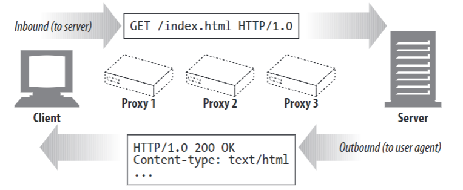

# Ch 3. HTTP Messages

다룰 내용

- 메세지 전송 과정
- HTTP message를 이루는 세 가지 요소
- request/response 메세지의 차이점
- 요청 메세지 methods
- 상태 코드
- HTTP headers의 기능

## The Flow of Messages

HTTP 메세지는 HTTP application에 의해 보내지는 블락으로, 메세지의 내용과 의미를 설명하는 meta-information을 담는 text로 시작한다. 
****
HTTP messages는 clients, proxies, servers 사이에서 오고 가며, 메세지가 이동하는 방향은 inbound, outbound, upstream, down-stream로 구분한다.

### Messages Commute Inbound to the Origin Server

inbound : user agent에서 server로 이동

outbound : server에서 user agent로 이동



### Messages Flow Downstream


HTTP 메세지는 request/response와 관계 없이 항상 위에서 아래로 흐른다.

 

## The Parts of a Message


start line : 메세지에 대한 설명

headers : 메세지 속성

start line과 headers는 ASCII 문자로 구성되며, 줄로 구분된다.

body

- 선택적으로 데이터 전송
- start line, headers와는 달리 binary data를 text나 binary data를 포함할 수 있다.

### Message Syntax

request/response 메세지로 나뉘며, 두 메세지는 각각 다음과 같은 기본 구조를 가진다.

```jsx
1. request message

<method> <request-URL> <version>
<header>

<entity-body>

2. response message

<version> <status> <reason-phrase>
<headers>

<entity-body>
```

**method** : 후술

**request -URL**

- complete URL 또는 path URL.
- 서버와 곧바로 통신할 경우, absolute한 위치를 나타내는 path component를 전달하면 된다.

**version**

- HTTP 버전으로 `HTTP/<major>.<minor>` 의 형태를 갖는다.

**status-code** : 후술

**reason-phrase**

- 상태 코드를 설명해주는 human-readable한 문장

**headers**

- 0개 이상의 헤더로, name: value 쌍으로 이루어진다.

**entity body**

- 선택적으로 데이터를 포함한다.

예시


HTTP 헤더는 반드시 빈 줄로 종료된다.

## Start Lines

request의 start line은 메세지가 무엇을 할 것인지를 설명한다.

response의 start line은 무엇이 발생했는지를 설명한다.

Request line (start line of request message)

Request message는 서버에게 리소스로 무언가를 행할 것을 요청한다.

- methods를 포함한다.
- HTTP version를 포함한다.
- 모든 필드는 공백으로 구분된다.

Response line (start line of response message)

Request message는 client에서 요청한 내용에 대한 데이터와  상태 정보를 전송한다.

### Methods

GET : document를 get한다.

HEAD : document에 대한 header 정보만을 get한다.

POST : server에서 process할 data를 보낸다.

PUT : server에 request message에 전달하는 data를 저장한다.

TRACE :  Trace the message through proxy servers to the server

OPTIONS : Determine what methods can operate on a server

DELETE : server의 document를 삭제한다.

server는 위 메소드 외에도 필요한 메소드를 임의로 구현할 수 있다. (extension methods)

### Status codes

상태 코드는 request에 담긴 내용에 대한 server측의 피드백 정보이다.

[MDN 상태 코드 참조](https://developer.mozilla.org/en-US/docs/Web/HTTP/Status)


### Reason phrases

HTTP/1.0 200 OK ⇒ reason phrase is 'OK'

### Version numbers

HTTP/major.minor

version number는 application이 지원하는 가장 높은 버전을 나타낸다.

HTTP/2.22는 HTTP/2.3보다 높은 버전이다. ( 22가 3보다 큰 숫자이므로)

## Headers

지금까지는 start line에 대해 알아보았다.  HTTP header는 start line과 더불어 메세지에 대한 추가적인 정보를 제공한다.

### header classifications

HTTP 스펙에서는 몇 가지 헤더 필드를 정의한다. 스펙에 명시된 headers 외에도 application은 임의로 header를 만들어 사용할 수 있다.

- general headers
    - request/response 메세지에서 모두 나타나는 header
- request headers
    - request에 대한 정보를 제공한다.
- response headers
    - response에 대한 정보를 제공한다.
- entity headers
    - body의 size, context 또는 resource 자체를 설명한다.
- extension headers
    - application에 의해 정의된 header


header의 line이 길어질 경우 다음 줄로 구분한다.

```jsx
HTTP/1.0 200 OK
Content-Type: image/gif
Content-Length: 8572
Server: Test Server
		Version 1. 
```

## Entity Bodies

HTTP 메세지의 마지막 부분은 optional entity body이다.

HTTP message의 payload로, 여러 종류의 digital data(images, video, HTML documents, software applications, credit card transactions, electronic mail)을 전송할 수 있다.

## Methods

server는 모든 HTTP methods를 구현하지 않아도 되며, server configuration을 통해 resource에 대한 method 사용에 대해 제한을 걸어둘 수 있다.

### Safe methods

HTTP reuest로 인해 발생되는 action이 없는 GET, HEAD 메소드는 safe method라 한다.

하지만 safe method가 action을 야기하지 않는 것이 보장되어있는 것은 아니다. 

대신 safe methods는 action이 발생할 경우 반드시 user에게 이를 알린다.

### GET

GET은 서버에게 resource를 요청할 경우 사용된다.


### HEAD

HEAD는 GET과 동일하게 동작하나, server가 응답에 대한 header만을 리턴한다.

아래와 같은 경우에 사용된다.

- resource에 대한 정보만을 얻고자 할 때 (type같은 내용들)
- object가 server에 존재하는지 확인할 때 (status code를 통해 확인)
- resource가 수정되었는지 확인할 때 ( header를 통해 확인)


### PUT

PUT 메소드는 server에 documents를 작성할 떄 사용한다. 

요청된 URL에 명시된 새로운 document를 생성하거나, 이미 있는 URL일 경우 body를 이용해 기존 document를 수정한다.

PUT은 content를 바꿀 수 있도록하며, PUT은 auth 과정이 요구된다. (Ch 12)


### POST

post는 server에 입력 데이터를 보내도록 디자인되었다. 실제로, HTML form을 이용할 떄 사용되며, 


### TRACE

client가 요청할 때, request는 firewalls, proxies, gateways와 같은 다른 applications를 따라 travel한다. 이러한 applications는 처리 과정에서 HTTP 요청을 수정할 수 있는데, TRACE method를 이용할 경우 server에서 받는 최종적으로 수정된 HTTP request를 client에서 확인할 수 있다.

TRACE request는 "loopback" diagnostic을 서버에 요청하고, 서버는 마지막 단에서 최초 요청과 함께 HTTP request 수정에 대한 내용을 client로 전달한다.


### OPTIONS


resource에 실제로 접근하지는 않고, 어떤 메소드를 통해 리소스에 접근할 수 있는지를 확인하기 위해 사용된다.

### DELETE

### Extension Methods

HTTP는 field-extensible하게 설계되었기에 새로운 methods를 추가할 수 있다.

ex) WebDEV HTTP extension


하지만, HTTP extension은 이를 받아들이는 쪽에서도 해석이 가능해야하므로 항상 요청에 성공하는 것은 아니다. proxy는 downstream server로 메세지 전송을 시도하고 만약 실패할 경우 501 Not Implemented 상태 코드가 응답된다.

## Status Code

### 100-199 : Informational Status Code

100 [continue] : client application이 용량이 큰 entity body를 요청해야될 경우, 이를 송신하기 전에server에서 해당 entity body를 받아들일 수 있는지 확인하기 위해 사용한다. (용량이 큰 entity 처리에 대한 최적화) 

101 [Switching Protocols]

### Clients and 100 Continue

client에서 100-continue와 함께 Expect request header를 보낼 경우, entity를 송신하기 전에 server에서 해당 entity를 처리할 수 있는지 확인하고, 100 Continue 응답을 응답한다.

관례적으로 서버 측에서 100-continue에 대한 처리가 미흡할 수 있기에 client에서는 unexpected 100 continue 응답에 대한 처리를 구현해둔다.

### Servers and 100 Continue

server는 Expect header에서 100-continue를 전달받을 경우, 100 Continue 응답 또는 에러 코드를 처리한다. 만약 서버가 100 Continue 응답을 client 측에 송신하기 전에 entity를 전달받을 경우에는 이미 client에서 100 continue를 결정한 것이기 때문에 100 Continue 응답을 송신하지 않는다.

### Proxy and 100 Continue

proxy는 client와 server의 Expect header에 대한 호환성을 고려해 client, server와 메세지를 주고받는다.

## 200-299 : Success Status Codes

200 [ OK ] : 요청에 성공하고, entity body가 요청된 resource를 포함할 경우

201 [ Created ] : server에 object를 create할 경우. response의 entity body는 생성된 resource의 URL과 location header를 포함한다. 

202 [ Accepted ] : server에서 요청을 accept하는 순간 어떠한 action을 취하기 전에 client 측에 accept 상태를 알리는 경우. server는 entity body에 request의 상태에 대한 설명과 언제 action이 완료될 것인지에 대한 추정 시간을 담아 전달한다.

203 [ non authoritative information ] : 200 상태와 유사하나 entity header에 origin server가 아닌 resource의 copy로부터 데이터를 전달받을 경우 사용된다.

204 [ no content ] : response가 start line, header를 포함하지만 entity body를 포함하지 않을 경우

206 [ partial content ] : range request(ch 15)에 성공할 경우

## 300-399 : Redirection Status code

server에서 client가 요청한 resource의 위치가 변경되었거나, content 대신 다른 response를 전달할 경우 사용한다.


몇몇 redirection 상태 코드는 origin server에 있는 application의 local copy를 validate( ex) local copy가 server의 수정된 resource와 일치하는지)하는 것에 사용되기도 한다. 

If-Modified-Since header를 전송하면 server에서 최신 상태인지 확인 후, 상태코드를 전달한다.


300 [ multiple chocies ] : 다국어 지원과 같이 server에서 여러 버전의 resource를 list로 제공하고 client에서 필요한 resource를 선택하는 경우

301 [ moved permanently ] : 요청된 URL이 위치를 옮겼을 때 사용되며, 수정된 URL을 location header에 담아 보낸다.

302 [ found ] : ?Like the 301 status code; however, the client should use the URL given in the Loca-tion header to locate the resource temporarily. Future requests should use the oldURL.Clientwww.joes-hardware.comHTTP/1.1 304 Not Modified...ClientGET /seasonal/index-fall.html HTTP/1.1Host: www.joes-hardware.comAccept: *If-Modified-Since: Fri, Oct 3 1997 02:16:00 GMTRequest messageResponse messageClient has previously requested copy of:[http://www.joes-hardware.com/seasonal/index-fall.htmlHas](http://www.joes-hardware.com/seasonal/index-fall.htmlHas) not changedBrowser displays local copy, since the originalhas not changed since we last requested it.?

303 [ see other ] : 다른 URL을 이용해 resource를 fetch할 것을 client에게 알릴 때 사용되며 새로운 URL 정보는 응답 메세지의 location header에 담겨진다. 일반적으로 POST 요청 시 response에서 resource에 대한 URL을 알릴 때 사용된다.

304 [ not modified ] : conditional header를 사용해서 리소스를 요청할 경우, 리소스가 수정되지 않았다면 304 상태 코드와 함께 entity body 없이 응답을 전달받는다. 

305 [ use proxy ] : proxy를 통해 접근된 리소스임을 확인할 떄 사용된다.  

307 [ temporary redirect] : 301 상태 코드와 유사하나, 일시적으로 옮겨진 리소스 위치를 location header에 담아 응답한다.

300 q

## 400-499 Client Error Status Codes

client에서 server에서 처리할 수 없는 요청을 전달할 경우 발생한다.

400 [ bad request ] : 잘못된 요청 형식, 잘못된 요청 메세지 구조, 잘못된 리퀘스트 라우팅이 발생할 경우

401 [ unauthorized ] : 리소스에 대한 authentication credentials이 없을 경우

403 [ forbidden ] : 리소스에 대한 authorization이 없을 경우. 즉, auth에는 성공하였으나 리소스에 대한 접근 권한 자체가 없을 경우 403 에러가 발생한다.

404 [ not found ] :  요청된 URL을 서버에서 찾을 수 없을 경우

405 [ method not allowed ] : server에서 해당 method를 알고 있지만, target resource에 대해 method 지원이 되지 않는 경우. 서버는 Allow 헤더 필드를 통해 target resource가 현재 지원하는 메소드를 알려야한다.

407 [ proxy authentication required ] : 어떻게 auth하는지에 대한 proxy-authenticatie 헤더와 함께 보내진다.

408 [ request timeout ] : 서버가 사용되지 않는 연결로 판단해 종료했을 경우

409 [ conflict ] : conflict는 일반적으로 PUT 요청에서 발생한다. ex) 동일한 이전 버전의 파일 업로드

410 [ gone ] : 서버에서 target resource에 대한 접근을 더 이상 지원하지 않을 경우 ( 불확실한 경우라면 404)

411 [ length required ] : Content-Length 헤더가 없는 요청에 대해 서버가 거절할 경우

413 [ request payload too large ] : 서버에서 정해둔 entity 크기보다 클 경우, 연결 종료 또는 Retry-After 헤더 필드를 전달 받는다.

414 [ request URI too long ]

- POST해야할 다량의 query 정보를 GET으로 사용할 경우
- redirection loop에 빠져 url이 길어질 경우
- server가 보안에 취약해 공격당할 경우

415 [ unsupported media type ] : Content-Type , Content-Encoding이 서버에서 지원하지 않을 경우

416 [ requested range not satisfiable ] : document의 range가 없거나, Range 헤더 값이 없을 경우 . Conent-Range: bytes */12777의 형태로 unsatisfied한 range를 알려준다.

417 [ expectation failed] : Expect 헤더가 조건을 만족하지 못할 경우

## 500 ~ 599 : Server Error Status Codes

client가 valid한 요청을 송신했으나 서버 자체적인 문제로 error가 발생할 경우

proxy가 발생한 error 또한 500번대에 해당될 수 있다.

500 [ internal server error ] : 어떤 5xx를 응답할 지 불분명할 경우

501 [ not implemented ] : server가 처리할 수 없는 요청을 날린 경우 ( server에서 지원하지 않는 method를 요청할 경우 )

502 [ bad gateway ] :  서버가 proxy 또는 gate way로 동작하는 동안 upstream으로부터 invalid한 응답을 받을 경우

503 [ service unavailable  ] : 일시적으로 서비스 사용이 불가능할 경우

504 [ gateway timeout ] : gateway 또는 proxy로 동작하는 동안 request에 필요한 upstream으로부터의 response를 시간 내에 받지 못할 경우

505 [ HTTP version not supported ] : 서버가 구 버전의 프로토콜을 지원하지 않을 경우

# Headers

헤더는 5개의 main class로 분류된다.

1. General Headers 
2. Request headers
3. Response headers
4. Entity header
5. extension headers

## General headers

connectoin : req/res 연결 설정

date : 메세지 생성 날짜

mime version : sender가 보내는 mime 버전

trailer : 무결성 check, 디지털 서명, post-processing 상태와 같은 metadata를 chunked message에 추가해준다.

transfer-encoding : 인코딩 정보

upgrade : sender가  프로토콜 버전을 업그레이드할 경우 사용

via : 메세지가 거쳐온 intermediaries( 게이트웨이, 프록시) 정보

**General caching headers ( Ch7 )**

Cache control

Pragma

## Request headers

request 메세지에서만 사용되는 header

Client-IP : client의 IP 주소

From : client user의 이메일

Host : 요청을 보낸 서버의 hostname과 port

Referer : 현재 요청된 URI를 포함하는 document의 URL

UA-Color 

UA-Disp 

UA-OS

UA-Pixels

User-Agent

**Accept headers**

Accept : client에서 받아들일 수 있는 미디어 타입

Accept-Charset : client에서 받아들일 수 있는 Charset

Accept-Encoding 

Accept-Language

TE : Ch15

**Conditional request headers**