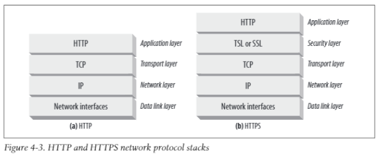
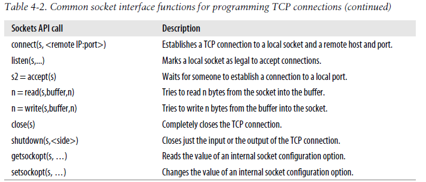

# ch4 connection management

- 어떻게 HTTP가 TCP 연결을 이용하는지
- TCP 연결에서의 Delay, bottlnecks, clogs
- hTTP 최적화 (parallel, keep-alive, pipelined connections)
- Dos and Don'ts for managing connections

## TCP Connection

HTTP communication의 대부분은 TCP/IP를 통해 전송된다.
client application은 server application에 TCP/IP 연결을 open할 수 있으며
연결이 성립되면, client와 server가 교환하는 메세지는 절대 없어지거나 손상되거나 전송되는 순서가 바뀌지 않는다.

http://www.joes-hardware.com:80/power-tools.html url에 접속할 경우
- hostname에 해당되는 www.joes-hardware.com(DNS)의 IP 주소(202.43.48.3)를 찾고
- 202.43.48.3의 port 80로 TCP 연결을 이루어낸다.
- 브라우저는 server에 HTTP GET 요청을 보내고
- server로부터 전달된 response message를 read하고
- 연결을 종료한다.

## TCP Reliable Data Pipes

HTTP 연결은 TCP 연결 위에서 몇 가지의 규칙만을 더해 이루어진다. 
TCP 연결은 신뢰성 있는 인터넷 연결로, 이를 잘 이해함으로써 data를 정확하고 빠르게 전송할 수 있다.
TCP는 HTTP에 reliable bit pipe를 전달한다. 한 쪽에서 전달하는 Bytes 정보는 이를 수신하는 쪽에서도 원 데이터와 동일한 순서로 전달된다.

## TCP Streams are Segmented and Shipped by IP Packets

TCP는 데이터를 IP패킷(데이터그램)이라 불리는 작은 chunks로 쪼개어 전송하며 이러한 전송 방식에서 HTTP > TCP > IP > Network Interface 순으로 계층이 형성된다. 
HTTPS는 HTTP와 TCP 사이에 cryptographic encryption 계층이 추가된 계층 구조를 가지며 TSL 또는 SSL을 사용한다.

HTTP가 메세지 전송을 시도할 경우, HTTP는 TCP 연결을 open하고 TCP는 데이터 스트림을 받아 segments라 불리는 작은 단위로 쪼개고 이를 IP packets으로 캡슐화해 전송한다. HTTP는 TCP 연결을 open할 뿐, TCP를 통해 진행되는 과정에는 전혀 관여하지 않는다.
IP 패킷은 다음 요소를 포함한다.

- IP packet header : IP 주소 정보, 패킷 크기, other flags
- TCP segment header : TCP 포트 번호, TCP control flags, 순서 정보, 무결성 확인을 위한 숫자 정보
- chunk of TCP data

!

## Keeping TCP Connections Straight

컴퓨터는 동시에 여러 개의 TCP 연결을 가질 수 있는데, TCP는 이를 port numbers를 통해 유지한다.
TCP 연결은 4 종류의 숫자 정보를 통해 구분될 수 있다.
1. source IP 주소
2. source port
3. destination IP 주소
4. destination port

C , D와 같이 TCP 연결은 서로 같은 도착지의 port를 공유할 수도 있다.
B, C의 경우에는 서로 같은 IP 도착 주소를 가진다.

## Programming with TCP Sockets

TCP 연결을 조작하는 방식은 운영체제마다 서로 다르게 구현되어 있다.
소켓 API는 TCP/IP 처리 과정을 감추어 HTTP를 사용하는 프로그래머가 손쉽게 연결을 open할 수 있도록 돕는다.
소켓 API는 Unix 운영 체제에 의해 처음 개발되었지만, 현재에는 여러 운영체제와 언어로 구현되어 있다.

<<<<<<< Updated upstream
socket API는 TCP endpoint 자료 구조를 만들어, end points(노드)를 server TCP endpoints에 연결하고, data stream을 read/write한다.
TCP API는 네트워크 프로토콜 핸드쉐이킹, TCP data stream의 조각화, 재조합과 같은 복잡한 과정을 숨긴다.

아래 그림은 power-tools.html 다운로드 과정을 보여준다.

- 웹 서버는 커넥션이 연결되는 것을 기다리고(listen)
- 클라이언트는 URL을 통해 IP 주소와 port number를 결정하며 server에 TCP 연결을 성립시킨다.
- 연결에 소요되는 시간은 서버까지의 거리, 서버에서의 load, 인터넷 혼잡에 따라 달라진다.
- 연결이 이루어질 경우, 클라이언트는 HTTP 요청을 서버에 보내고 서버는 이를 read한다.
- 서버는 client의 메세지를 받고 data를 client에게 보낸다.

## TCP performance Considerations

HTTP는 TCP 바로 위에 놓여있는 계층으로, TCP plumbing을 어떻게 하는지에 따라 성능이 크게 좌우된다. 

## HTTP Transaction Delays

그림에서 보이는 것과 같이 transaction processing은 request/response 메세지 전송 시간에 비해 짧은 시간 내에 이루어진다. 클라이언트 또는 서버가 복잡하거나 dynamic한 resource를 전송하지 않는 이상, HTTP delay는 TCP network delay에 의해 발생한다.

HTTP transaction 딜레이는 아래의 과정에서 크게 발생한다.
- URI의 hostname을 최근에 방문한 적이 없다면 DNS resolution을 통해 URI가 IP 주소로 변환되어야 한다.
- 이후 클라이언트는 IP주소와 port번호를 통해 server에 연결을 요청하고 연결 여부에 대한 피드백을 기다린다.
- 연결이 성립되면, HTTP 요청은 새롭게 연결된 TCP pipe를 통해 전송된다.
- server는 클라이언트로 HTTP 응답을 보낸다.

## Performance Focus Areas

- TCP 연결 setup 핸드쉐이크
- TCP slow-start 혼잡 제어
- data aggregation을 위한 Nagle's 알고리즘
- piggybacked acknowledgements를 위한 TCP의 지연 인식 알고리즘
- TIME_WIAIT 딜레이와 port 고갈

## TCP connection handshake delay

핸드쉐이크 절차는 아래와 같다.
1. 새로운 TCP 연결을 요청하기 위해, 클라이언트는 작은 TCP 패킷(40-60 bytes)을 전송한다. 이 때 패킷은 연결 요청 패킷이라는 정보를 담기 위해 'SYN' flag set을 포함
2. SYN 패킷을 전달 받으면, 연결에 필요한 파라미터를 계산하고 전달받은 SYN 패킷에 연결 요청이 받아들여졌다는 것을 의미하는 ACK flags set을 추가해 패킷을 client에 되돌려 보낸다.
3. 클라이언트가 Acknowledgment를 서버에 다시 돌려 보내 연결이 성공적으로 성립되었다는 것을 알린다. 이 떄, ACK 패킷 안에 data를 담아 보내기도 한다.

패킷은 TCP/IP를 통해서만 처리되기 때문에 HTTP 프로그래머는 이러한 패킷을 확인할 수 없다. HTTP 프로그래머는 TCP 연결에 대한 지연 시간만을 확인할 수 있다.

SYN/SYN+ACK 핸드쉐이크는 요청 데이터의 크기가 작을 경우 필요 데이터를 처리하는 것에 비해 상당한 지연 시간을 야기한다.
연결 정보를 담는 패킷이 전체 요청/응답 메세지를 전송할 수 있는 여유가 있다면 데이터를 포함해 전송한다.

## Delayed Acknowledgements

인터넷 자체가 신뢰성있는 패킷 전송을 보장하지는 않으므로, TCP는 성공적인 데이터 전송을 위해 acknowledgment scheme을 구현한다.

각 TCP 조각은 sequence number와 data-integrity checksum을 부여받는다. segment를 전달받는 수신자는 몇 개의 ACK 패킷 조각들을 sender에게 돌려보낸다.
sender가 정해진 시간 내에 ACK 패킷을 전달받지 못할 경우 패킷이 유실/파괴/변형되었다고 판단해 data를 다시 전송하게 된다.
ACK는 크기가 작기 때문에 TCP는 같은 방향으로 전달되는 data packet에 이를 얹혀 전달한다.(piggy back)
=======
>>>>>>> Stashed changes
