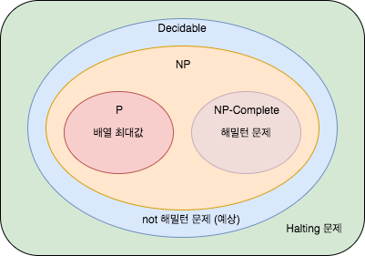

# 알고리즘

 주어진 문제가 있을 때, **데이터에 대한 정확한 정의**와 **데이터 변환 순서**는 일련의 명령어에 의해 결정되는데 이를 알고리즘이라고 한다.

 어떤 문제에 대한 알고리즘은 입력과 출력이 존재한다. 또한 알고리즘을 평가하는 요소는 공간적 조건과 시간적 조건이 있는데 asymptotic notation으로 표기할 수 있다.

 알고리즘을 네 가지 분류로 나누면,

- P (Polynomial Time, 다항 시간)

     주어진 알고리즘의 연산 횟수를 입력 크기 N에 대한 다항식 형태로 표현할 수 있는 문제이다. 보통 이러한 알고리즘은 효율적이라고 한다.

- NP(Non-Deterministic Polynomial Time, 비결정적 다항 시간)

    NP 문제는 특정 솔루션을 다항 시간으로 검증할 수 있지만 알려진 다항 시간 솔루션은 없는 문제이다.

- EXPTIME (Exponential Time, 지수 시간)

    EXPTIME 문제는 입력 크기에 대한 지수 함수 형태의 시간 복잡도 솔루션을 갖는다.

- PSPACE (Polynomial Space, 다항식 공간)

     다항식 크기의 공간이 필요한 문제이다.

 [[다른 분류] P-NP 문제](https://seungkwan.tistory.com/6)

# 알고리즘 설계 패러다임

[분할 정복 (divide-and-conquer)](./divide-and-conquer.md)