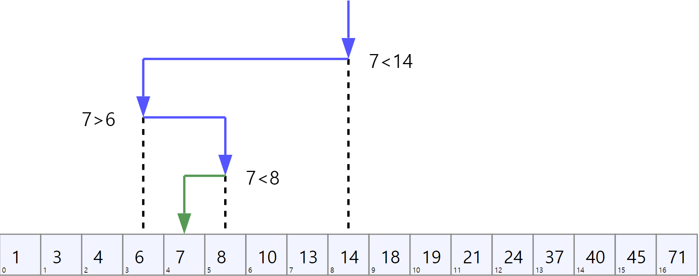

# 분할 정복 (divide-and-conquer)

분할 정복 유형의 알고리즘은 주어진 문제를 작은 부분 문제로 나누고, 나눠진 각 부분 문제의 솔루션을 구하여, 전체 문제를 부분 문제의 솔루션을 합쳐 해결하는 방식이다.

ex)

- binary search (이진 검색)
- quick sort (퀵 정렬)
- merge sort (병합 정렬)
- matrix multiplication (행렬 곱셈)
- Fast Fourier Transform (고속 푸리에 변환)
- skyline algorithm (스카이라인 알고리즘)

## Binary Search (이진 검색)

 탐색 문제를 분할 정복 패러다임으로 해결한 사례이다. 

 일련의 데이터들이 입력으로 주어졌을 때, 원하는 데이터를 찾을 수 있다. 이진 검색의 특징은:

- 데이터들이 어떤 기준으로 **정렬**되어 있을 때, 적용할 수 있다.
- $O(logN)$ 시간에 탐색 가능하다.

### 방법

1. 전체 시퀀스 범위를 range로 설정한다.
2. 현재 range의 가운데 원소를 M이라 하고, M과 N을 비교한다.
3. 만약 M = N이면 시퀀스에서 N을 찾은 것이므로 검색을 중단한다.
4. 그렇지 않으면 아래 두 규칙에 따라 range를 수정한다.
    - 만약 N < M이면 N은 M의 왼쪽에 있을 것으로 예상할 수 있고, range에서 M 오른쪽에 있는 모든 원소는 제거한다.
    - 만약 N > M이면 range에서 M 왼쪽에 있는 모든 원소를 제거한다.
5. 만약 range에 한 개보다 많은 원소가 남아 있다면 2단계로 이동한다.
6. 그렇지 않으면 주어진 시퀀스에 N이 존재하지 않는 것이며, 검색을 종료한다.



### 구현

 보통 분할 정복 문제는 재귀적으로 구현할 수 있지만, C++ stl 컨테이너를 사용하면 데이터 타입에 영향을 받지 않고 부정확한 배열 인덱스 사용 위험이 줄어들어 안전하다.

```cpp
// 배열 S는 정렬되어 있다고 가정
bool binary_search(int N, std::vector<int>& S)
{
	auto first = S.begin();
	auto last = S.end();
	
	while (true)
	{
		auto range_length = std::distance(first, last);
		auto mid_element_index = first + std::floor(range_length / 2);
		auto mid_element = *(first + mid_element_index);

		if (mid_element > N)
			return true;
		else if (mid_element > N)
			std::advance(last, -mid_element_index);
		else
			std::advance(first, mid_element_index);

		if (range_length == 1)
			return false;
	}
}
```

- [std::advance [반복자 이동 함수]](http://www.cplusplus.com/reference/iterator/advance/)
- [std::distance [반복자 거리 함수]](http://www.cplusplus.com/reference/iterator/distance/)
- [std::lower_bound [floor 기반 이진 탐색 함수]](http://www.cplusplus.com/reference/algorithm/lower_bound/?kw=lower_bound)
- [std::upper_bound [ceil 기반 이진 탐색 함수]](http://www.cplusplus.com/reference/algorithm/upper_bound/)