# 네트워크 어플리케이션의 원리

 네트워크 어플리케이션 개발은 다른 end-system에서 동작하고 네트워크를 통해 서로 통신하는 프로그램을 작성하는 것이다. 중요한 점은 계층 구분으로 애플리케이션 개발자가 라우터나 링크 계층 스위치 같은 **네트워크 코어 장비에서 실행되는 SW를 작성할 필요는 없다**는 것이다.

 end-system에만 어플리케이션 SW가 존재한다는 기본 설계는 인터넷 어플리케이션의 광대하고 빠른 발전의 원동력이 됐다.

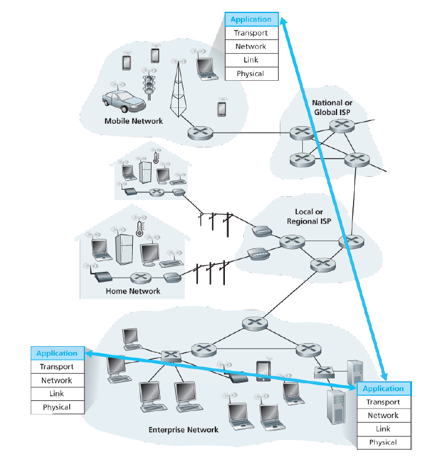

## 네트워크 애플리케이션 구조

  애플리케이션 개발자 관점에서 네트워크 구조는 고정되어 있고 애플리케이션에 특정 서비스 집합을 제공한다.

 **애플리케이션 구조(application architecture)**는 애플리케이션이 다양한 end system에서 어떻게 조직되어야 하는지를 지시한다. 이는 애플리케이션 개발자가 설계하는 것이다. 대표적인 구조로 Client-Server 구조, P2P 구조가 있다.

### 클라이언트-서버 구조 (client-server architecture)

 항상 켜져 있는 호스트를 서버(server)라 부르는데, 이 서비스는 클라이언트(client)라는 다른 호스트들의 요청을 받는다. 클라이언트는 항상 켜져 있을 필요는 없다. 이 구조의 특징은 다음과 같다.

- 클라이언트는 서버로 서비스를 요청하고 서버는 요청된 객체를 응답한다.
- 클라이언트는 서로 직접적으로 통신하지 않는다.
- 서버가 고정 IP 주소를 갖는다.
- 클라이언트-서버 구조의 예로는 웹, 파일 전송, 원격 로그인, 이메일 서비스 등이 있다.
- 하나의 서버 호스트가 모든 클라이언트의 요청을 응답하는 것이 불가능한 경우가 있다.
→ 많은 수의 호스트를 갖춘 **데이터 센터**가 가상의 서버를 생성하는 기술을 사용한다.
- 서비스 제공자들은 데이터 센터로부터 데이터를 보내기 위해 상호연결과 대역폭에 대한 비용을 지불하기도 한다.

### P2P 구조 (peer-to-peer architecture)

 항상 켜져 있는 기반구조 서버에 의존하지 않거나 최소로 의존한다. 대신 어플리케이션은 피어(peer)라는 간헐적으로 연결된 호스트 쌍이 **서로 직접 통신**하도록 한다. 피어는 서비스 제공자가 소유하지 않고 사용자들이 제어하는 데스크톱이나 랩톱이다.

- 예시로는 파일 공유 [BitTorrent], 피어-지원 다운로드 가속기[Xunlei], 인터넷 전화 및 비디오 컨퍼런스 [스카이프] 등이 있다.
- **자가 확장성**(self-scalability)를 갖는다. 예를 들어, 파일 공유 app에서는 비록 각 피어들이 파일을 요구함으로써 작업 부하를 만들어 내지만 각 피어들은 또한 파일을 다른 피어들에게 분배함으로써 **그 시스템에 서비스 능력을 추가**한다.
- 상당한 서버 기반구조와 서버 대역폭을 요구하지 않기 때문에 **비용 효율적**이다.
- 고도의 분산 구조 특성으로 인해 보안, 성능, 신뢰성 등에 단점이 있다.

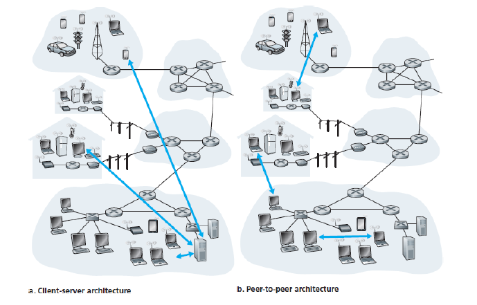

---

## 프로세스 간 통신

 네트워크에서 서로 통신하는 것은 프로세스(process)이다. 즉, 서로 다른 호스트의 각 프로세스가 네트워크를 통한 **메시지 교환**으로 서로 통신한다. 송신 프로세스는 메시지를 만들어 네트워크로 보내면 네트워크는 그 메시지를 수신 프로세스로 잘 전달하는 의무를 갖는다.

### 클라이언트와 서버 프로세스

  네트워크 애플리케이션은 네트워크에서 서로 메시지를 보내는 두 프로세스로 구성되는데 두 프로세스를 클라이언트와 서버로 구분할 수 있다.

 클라이언트와 서버 프로세스를 다음과 같이 정의할 수 있다.

**두 프로세스 간의 통신 세선에서 통신을 초기화(다른 프로세스와 세션을 시작하려고 접속을 초기화)하는 프로세스를 클라이언트라 하고, 세션을 시작하기 위해 접속을 기다리는 프로세스를 서버라고 한다.**

- 웹 애플리케이션의 웹 브라우저 프로세스(client)는 웹 서버 프로세스(server)와 메시지를 교환한다.
- P2P 파일 공유 시스템의 한 피어 프로세스(client process)는 다른 피어의 프로세스(server process)로 파일을 전송한다.

### 소켓 (socket)

 하나의 프로세스로부터 다른 프로세스로 보내는 메시지는 네트워크를 통해 움직인다. 이때 프로세스는 **소켓(socket)**을 통해 네트워크로 메시지를 보내고 받는다.

 

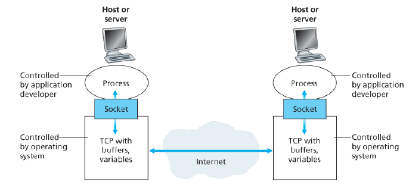

 소켓은 네트워크 애플리케이션이 인터넷에 만든 프로그래밍 인터페이스이므로, **애플리케이션과 네트워크 사이의 API (Application Programming Interface)**라고도 한다. 애플리케이션 개발자는 소켓의 애플리케이션 계층에 대한 모든 통제권을 갖지만 소켓의 트랜스포트 계층에 대한 통제권을 거의 갖지 못한다.

 트랜스포트 계층에 대한 애플리케이션 개발자의 통제는 다음 뿐이다.

1. 트랜스포트 프로토콜의 선택
2. 최대 버퍼와 최대 세그먼트 크기와 같은 약간의 트랜스포트 계층 매개변수의 설정

### 프로세스 주소 배정

 수신 프로세스를 식별하기 위해, 두 가지 정보가 명시될 필요가 있다.

1. 호스트의 주소
2. 그 목적지 호스트 내의 수신 프로세스를 명시하는 식별자

 인터넷에서 호스트는 **IP주소**로 식별된다. 또한 호스트 내의 수신 프로세스를 목적지 **포트 번호(port)**로 식별할 수 있다.

 인기 있는 응용은 특정한 포트 번호가 할당된다. 예를 들어, 웹 서버는 80번으로, 메일 서버는 25번으로 식별된다. ([참조](http://www.iana.org))

---

## 애플리케이션이 이용 가능한 트랜스포트 서비스

 인터넷을 포함해서 많은 네트워크들은 하나 이상의 트랜스포트 프로토콜을 제공한다. 애플리케이션 개발자들은 사용 가능한 트랜스포트 프로토콜 중에서 하나를 선택해야 한다.

 개발하려는 애플리케이션이 요구하는 서비스에 맞춰 트랜스포트 프로토콜을 결정할 수 있는데 프로토콜이 제공하는 서비스들은 크게 네 가지로 나눌 수 있다.

### 신뢰적 데이터 전송

 패킷은 컴퓨터 네트워크 내에서 손실될 수 있다. (라우터 버퍼에서 오버플로우, 패킷의 비트가 잘못되어 호스트/라우터에 의해 버려짐)

 이메일, 파일 전송, 원격 호스트 접속, 웹 문서 전송 및 재무 애플리케이션과 같은 경우 데이터 손실은 위험한 결과를 가져온다. 따라서 이들 애플리케이션을 지원하기 위해 한 애플리케이션이 보낸 데이터가 올바르고 완전히 다른 애플리케이션에 전달되도록 보장하기 위해 조치를 취할 수 있다.

 이렇게 프로토콜이 보장된 데이터 전송 서비스를 제공하는 것을 **신뢰적 데이터 전송**을 제공한다고 한다.

 반면, 어느 정도의 데이터 손실을 참아낼 수 있는 실시간 오디오/비디오 혹은 저장 오디오/비디오와 같은 멀티미디어 애플리케이션은 **손실 허용 애플리케이션(loss-tolerant application)**이라고 한다. 이들의 손실 데이터는 플레이되는 오디오/비디오 품질에 약간의 영향을 미칠 수 있다.

### 처리량

 네트워크 경로를 따라 두 프로세스 간의 통신 세션에서 **송신 프로세스가 수신 프로세스로 비트를 전달할 수 있는 비율**을 처리량(throuput)이라고 한다.

 다른 세션들이 네트워크 경로를 따라 대역폭을 공유하고, 이 세션들이 생겼다 없어졌다 하기 때문에 가용한 처리율은 시간에 따라 변동한다. 하지만 트랜스포트 프로토콜은 어느 명시된 속도에서 보장된 가용 처리율을 제공한다.

 예를 들어, 인터넷 전화 애플리케이션이 32kbps로 음성을 인코드하면, 이 애플리케이션은 이 속도로 데이터를 네트워크로 보내야 하고 수신 애플리케이션으로 전달되어야 한다. 만약 트랜스포트 프로토콜이 이 처리율을 제공할 수 없다면, 애플리케이션은 낮은 속도로 인코드하거나 포기해야 한다.

- **대역폭 민감 애플리케이션(bandwidth-sensitive application):** 처리율 요구 사항을 갖는 애플리케이션. ex) 멀티미디어 애플리케이션
- **탄력적 애플리케이션(elastic appliction)**: 가용한 처리율을 많으면 많은 대로 적으면 적은 대로 이용. ex) 이메일, 파일 전송, 웹 전송 애플리케이션

### 시간

 **상호 작용 실시간 애플리케이션**에서는 애플리케이션이 효과적으로 동작하기 위해 데이터 전송에 엄격한 시간제한 조건을 요구한다. 예를 들어, 인터넷 폰에서의 긴 지연 시간은 대화하는데 부자연스러운 정지 기간을 야기한다.

 **비실시간 애플리케이션**의 경우 낮은 지연이 항상 높은 지연보다 좋지만 end system간 지연에 엄격한 제약을 받지는 않는다.

### 보안

 하나 이상의 보안 서비스를 제공할 수 있다. 두 프로세스 사이의 데이터가 어느 정도 관찰된다 하더라도 **비밀성**을 보장한다.

 예를 들어, 송신 호스트에서 트랜스포트 프로토콜은 송신 프로세스가 전송하는 모든 데이터를 암호화할 수 있고 수신 호스트에서 그 프로토콜은 데이터를 수신 프로세스로 전달하기 전에 해독할 수 있다.

 트랜스포트 프로토콜은 비밀성 이외에도 **데이터 무결성**과 **종단 인증** 등의 서비스를 제공할 수 있다.

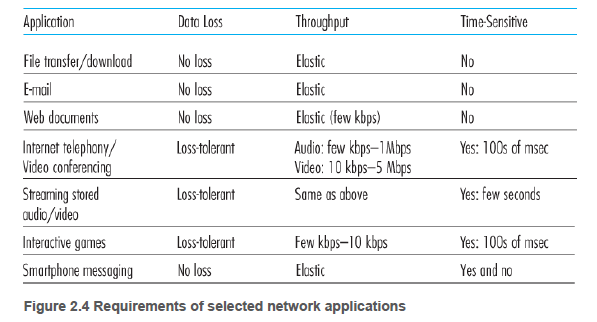

---

## 트랜스포트 프로콜이 제공하는 서비스

 일반적으로 2개의 전송 프로콜이 존재한다. UDP (User Datagram Protocol)과 TCP(Transmission Control Protocol)를 제공한다.

 개발자들이 새로운 인터넷 애플리케이션을 만들 때 첫 번째 결정해야 하는 것 중 하나가 UDP 또는 TCP 중 어느 것을 사용할지이다.

### TCP 서비스

- **연결지향형 서비스**

     애플리케이션 계층 메시지를 전송하기 전에 TCP는 클라이언트와 서버가 서로 전송 제어 정보를 교환하도록 한다. 이 **핸드셰이킹 과정**이 클라이언트와 서버에 패킷이 곧 도달할 것이니 준비하라고 알려 주는 역할을 한다. 

     이 셰이킹 단계를 지나면, TCP 연결이 두 프로세스의 소켓 사이에 존재한다고 할 수 있고 두 프로세스가 서로 동시에 메시지를 보낼 수 있다 (full-duplex connection). 애플리케이션이 메시지 전송을 마치면 연결을 끊어야 한다. 

- **신뢰적인 데이터 전송 서비스**

     통신 프로세스는 모든 데이터를 오류 없이 올바른 순서로 전달하기 위해 TCP에 의존한다. TCP는 애플리케이션의 한쪽이 바이트 스트림을 소켓으로 전달하면 그 바이트 스트림을 손실하거나 중복되지 않게 수신 소켓으로 전달한다. → congestion control, flow control

### UDP 서비스

 최소의 서비스 모델을 가진 간단한 전송 프로토콜이다.

- **비연결형 서비스**

     두 프로세스가 통신 하기 전에 핸드셰이킹을 하지 않는다. 

- **Best-effort 서비스 (비신뢰적인 데이터 전송 서비스)**

     하나의 프로세스가 UDP 소켓으로 메시지를 보내면, 그 메시지가 수신 소켓에 도착하는 것을 보장하지 않는다. 또한 수신 소켓에 도착하는 메시지들의 순서가 뒤바뀔 수 있다.

     UDP는 혼잡제어 (Congestion control) 방식을 포함하지 않기 때문에 송신 측이 원하는 속도로 네트워크 계층으로 보낼 수 있다. 하지만 실제 종단간 처리율은 중간 링크들의 제한된 대역폭 혹은 혼잡으로 인해 이 속도보다 작아질 수 있다.

### 인터넷 전송 프로토콜이 제공하지 않는 서비스

  TCP와 UDP에 대해서 **처리율** 혹은 **시간 보장**에 대한 이야기는 빠졌다. 이는 분명히 인터넷 전송 프로토콜이 제공하지 않는 서비스이다.

 하지만 인터넷 전화와 같은 시간 민감 애플리케이션이 오늘날의 인터넷에서 수행될 수 없다는 것을 의미하지는 않는다. 그 이유는 이러한 보장이 없는 경우에도 가능한 잘 대처할 수 있도록 TCP나 UDP가 설계되었기 때문이다.

 즉, 오늘날의 인터넷은 때로 시간 민감 애플리케이션에게 만족스런 서비스를 제공할 수는 있으나 시간 혹은 대역폭 보장을 제공할 수는 없다.

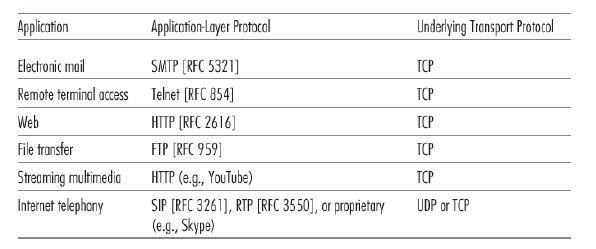

 인터넷 전화 응용 개발자들은 보통 UDP를 채택하는데 많은 방화벽(firewall)들이 대부분 형태의 UDP 트래픽을 차단하도록 설정되어 있기 때문에, UDP 통신이 실패할 경우를 대비하여 TCP를 사용하도록 설계되어 있다.

---

## 애플리케이션 계층 프로토콜

 애플리케이션 계층 프로토콜은 다른 end system에서 실행되는 애플리케이션의 프로세스가 서로 메시지를 보내는 방법을 정의한다. 

- 교환 메시지 타입 (예: 요청 메시지와 응답 메시지)
- 여러 메시지 타입의 문법 (예: 메시지 내부의 필드와 필드 간의 구별 방법)
- 필드의 의미, 즉 필드에 있는 정보의 의미
- 언제, 어떻게 프로세스가 메시지를 전송하고 메시지에 응답하는지 결정하는 규칙

 네트워크 애플리케이션과 애플리케이션 계층 프로토콜을 구별하는 것은 중요하다. 애플리케이션 계층 프로토콜은 네트워크 애플리케이션의 한 요소일 뿐이다.

- Web Application은 HTML, 웹 브라우저, 웹 서버, 그리고 HTTP를 포함하는 여러 요소들로 구성된다.
- 인터넷 E-mail Application은 사용자 메일박스를 갖고 있는 메일 서버, 메일 클라이언트, SMTP(Simple Mail Transfer Protocol) 등으로 구성된다.

# [웹과 HTTP](./HTTP/overview.md)

 웹이 여러 데이터 네트워크 중 유일한 데이터 네트워크로 격상될 수 있었던 웹의 특징은 다음과 같다.

1. 온-디맨드 방식으로 동작: 사용자가 원할 때, 원하는 것을 수신할 수 있다.
2. 모든 사람이 매우 낮은 비용으로 발행자가 될 수 있다.
3. 웹과 관련된 프로토콜들은 대부분의 모바일 인터넷 애플리케이션을 위한 플랫폼을 제공한다.

## HTTP 개요

 웹은 애플리케이션 계층 프로토콜로 **HTTP (HyperText Transfer Protocol)**을 채택했다. HTTP는 클라이언트 프로그램과 서버 프로그램, 두 가지 프로그램으로 구현되는데 서로 다른 end-system에서 수행되는 각 프로그램이 서로 HTTP 메시지를 교환하여 통신한다.

 HTTP는 메시지의 구조 및 클라이언트와 서버가 메시지를어떻게 교환하는지에 대해 정의한다.

 웹 페이지는 객체들로 구성된다. **객체(object)**는 단순히 단일 URL로 지정할 수 있는 하나의 파일이다. 이 파일은 HTML 파일이 될 수도 있고, JPEG 이미지, GIF 이미지, 자바 애플릿, 오디오 클립 등이 될 수 있다. 대부분의 웹 페이지는 기본 HTML 파일과 여러 참조 객체로 구성된다.

### URL 구조

 예시 URL:  http://www.someSchool.edu/someDepartment/picture.gif

 URL은 2개의 요소, 객체를 갖고 있는 서버의 호스트 네임과 객체의 경로 이름을 갖고 있다. http는 프로토콜을 나타내고, www.someSchool.edu는 호스트 네임이고, /someDepartment/picture.gif는 경로 이름이다.

 **웹 브라우저**는 HTTP의 클라이언트 측을 구현하고 서버 측을 구현한 **웹 서버(Web server)**는 URL로 각각을 지정할 수 있는 웹 객체를 갖고 있다. 인기 있는 웹 서버로는 아파치, 마이크로소프트 인터넷 인포메이션 서버(IIS) 등이 있다.

 사용자가 웹 페이지를 요청할 때, 브라우저는 페이지 내부의 객체에 대한 HTTP 요청 메시지를 서버에게 보낸다. 서버는 요청을 수신하고 객체를 포함하는 HTTP 응답 메시지로 응답한다.

### HTTP 프로토콜의 전송 프로토콜: TCP

 TCP는 HTTP에게 신뢰적인 데이터 전송 서비스를 제공한다. 따라서 HTTP는 데이터의 손실 또는 TCP가 어떻게 손실 데이터를 복구하고 네트워크 내부에서 데이터를 올바른 순서로 배열하는지 걱정할 필요가 없다. 

 서버가 클라이언트에게 요청 파일을 보낼 때, 서버는 클라이언트에 관한 어떠한 상태 정보도 저장하지 않는다.  → **비상태 프로토콜(stateless protocol)**

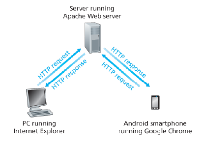

 

---

## 비지속 연결과 지속 연결

 애플리케이션 개발자는 클라이언트-서버 상호작용이 TCP 상에서 발생할 때 결정을 내려야한다.

- **비지속 연결(non-persistent connection)**: 각 요구/응답이 분리된 TCP연결을 통해 보내져야 하는가?
- **지속 연결(persistent connection)**: 모든 요구와 해당하는 응답들이 같은 TCP 연결상으로 보내져야 하는가?

 기본 HTML 파일 1개와 10개의 JPEG 이미지로 구성된 페이지, 이 11개의 객체가 같은 서버에 있다고 가정하자. 해당 HTML 페이지의 URL은 다음과 같다.

http://www.someSchool.edu/someDepartment/home.index

### 비지속 연결 HTTP

 비지속 연결의 연결 수행 과정은 다음과 같다.

1. HTTP 클라이언트는 HTTP의 기본 포트 번호 80을 통해 [www.someSchool.edu](http://www.someSchool.edu) 서버로 TCP 연결을 시도한다. TCP 연결과 관련하여 클라잉너트와 서버에 각각 소켓이 있다.
2. HTTP 클라이언트는 설정된 소켓을 통해 서버로 HTTP 요청 메시지를 보낸다. 이 요청 메시지는 /someDepartment/home.index 경로 이름을 포함한다.
3. HTTP 서버는 연결된 소켓을 통해 요청 메시지를 받는다. 저장장치로부터 /someDepartment/home.index 객체를 추출하고 HTTP 응답 메시지에 그 객체를 캡슐화한다. 그리고 응답 메시지를 소켓을 통해 클라이언트로 보낸다.
4. **HTTP 서버는 TCP에게 TCP 연결을 끊으라고 한다.** ( 실제로는 TCP 클라이언트가 응답 메시지를 올바로 받을 때까지 유지된다. )
5. HTTP 클라이언트가 응답 메시지를 받으면, TCP 연결이 중단된다. 클라이언트는 메시지로부터 HTML 파일을 추출하고 조사하여 10개의 JPEG 객체에 대한 참조를 얻는다.
6. 이후에 참조되는 각 JPEG 객체에 대하여 1~4 단계를 반복한다.

 각 TCP 연결은 하나의 요청 메시지와 하나의 응답 메시지만 전송한다. 따라서 위 예제에서는 사용자가 웹 페이지를 요청할 때 11개의 TCP 연결이 만들어진다.

 HTML 파일을 얻은 후 10개의 TCP 연결에 대해 순차적으로 연결을 하는지 아니면 동시에 TCP 연결을 만들어 얻는지 정하지 않았다. 이는 웹 브라우저 사용자가 동시성 정도를 조절할 수 있다. 일반적으로 기본 모드에서 5~10개의 TCP 연결을 동시에 설정한다.

### 클라이언트가 요청~응답 메시지 수신까지의 시간 측정

 작은 패킷이 클라이언트로부터 서버까지 가고, 다시 클라이언트로 되돌아오는 데 걸리는 시간을 RTT( round-trip time) 정의한다.

 RTT는 패킷 전파 지연(propagation delay), 중간 라우터와 스위치에서의 패킷 큐잉 지연 (queuing delay), 패킷 처리 지연(processing delay) 등을 포함한다.

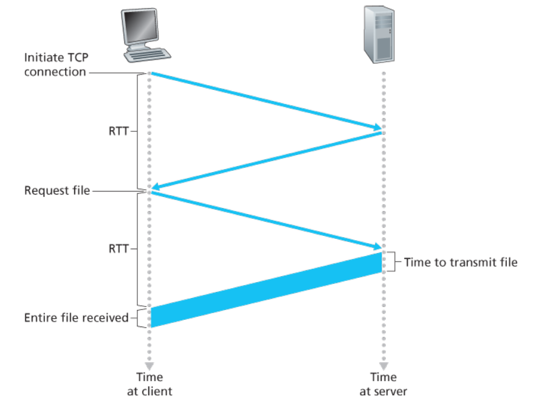

  사용자가 하이퍼링크를 클릭하면 일어나는 일을 나타낸다. 클릭은 브라우저가 브라우저와 웹 서버 사이에서 TCP연결을 시도하게 한다. 이는 "3-hand handshake"를 포함한다.

 three-hand handshake는 클라이언트가 작은 TCP 메시지를 서버로 보내고, 서버는 작은 메시지로 응답하고 마지막으로 클라이언트가 다시 서버에게 응답하는 방식으로 진행된다.

 이 과정의 첫 두 부분이 경과하면 한 RTT가 계산된다. 두 과정이 끝나고 클라이언트는 HTTP 요청 메시지를 TCP 연결로 보내면서 핸드셰이크의 세 번째 부분(응답)을 함께 보낸다. 이 요청 메시지가 성공적으로 서버에 도달하면 HTML 파일을 TCP 연결로 보낸다.

 이 HTTP 요청/응답은 또 하나의 RTT를 필요하므로 총응답 시간은 대략:

 [2*RTT + HTML 파일을 서버가 전송하는 데 걸리는 시간] 이다.

### 지속 연결 HTTP

 비지속 연결의 단점

1. 각 요청 객체에 대한 새로운 연결이 설정되고 유지되어야 한다. → TCP 버퍼가 할당 → TCP 변수들이 클라이언트와 서버 양쪽에 유지 → 웹 서버에 심각한 부담
2. 각 객체는 2RTT를 필요로 한다.(TCP 연결 설정-1 RTT, 객체를 요청하고 받는 데 1 RTT)

 지속 연결에서 서버는 응답을 보낸 후에 TCP 연결을 그대로 유지한다. 

 같은 클라이언트와 서버 간의 이후 요청과 응답은 같은 연결을 통해 보내진다. 이들 객체에 대한 요구는 진행 중인 요구에 대한 응답을 기다리지 않고 연속해서 만들어질 수 있다. [파이프라이닝]

 연결을 닫는 시기는 일정 기간(타임아웃 기간) 사용되지 않을 때이다. 서버가 연속된 요구를 수신할 때, 서버는 **객체를 연속해서 보낸다.**

 최근에, HTTP/2은 같은 연결에서 다중 요청과 응답이 가능하고 이 연결 내에서 HTTP 메시지 요청과 응답의 우선순위 기법이 가능하다.

---

## HTTP 메시지 포맷

 

### HTTP 요청 메시지

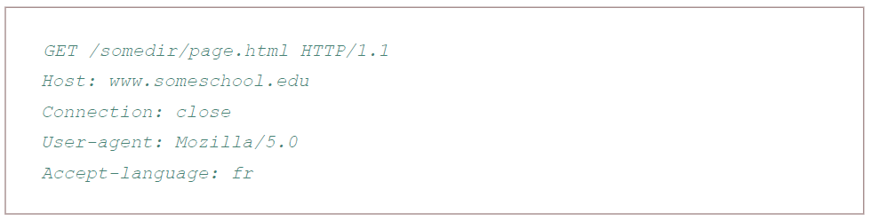

 

 특징은 다음과 같다.

1. 메시지가 일반 ASCII 텍스트로 쓰여 있어 사람들이 읽을 수 있다.
2. 메시지의 각 줄이 Carriage Return과 Line Feed로 구별된다.

 첫 줄은 **요청 라인(request line)**이라 부르고, 이후 줄 들은 **헤더 라인(header line)**이라 부른다.

 요청 라인은 3개의 필드, "방식(method) 필드", "URL 필드", "HTTP 버전 필드"를 갖는다. 대부분의 HTTP 메시지는 GET 방식을 사용하는데 GET 방식은 브라우저가 URL 필드로 식별되는 객체를 요청할 때 사용된다.

 헤더 라인에서

 Host: www.somescholl.edu는 객체가 존재하는 호스트를 명시한다. 이 호스트 헤더 라인이 제공하는 정보는 **웹 프록시 캐시**에서 필요로 한다.

 Connection: close 헤더 라인은 브라우저가 서버에게 지속 연결 사용을 원하지 않는다는 것을 알린다. 

 User-agent: 헤더 라인은 사용자 에이전트, 서버에게 요청을 하는 브라우저 타입을 명시하는데 서버가 같은 객체에 대한 다른 버전을 다른 타입의 사용자 에이전트에게 보낼 수 있다는 데에서 유용하다. Accept-language: 헤더 라인은 객체의 요청 언어를 명시한다.

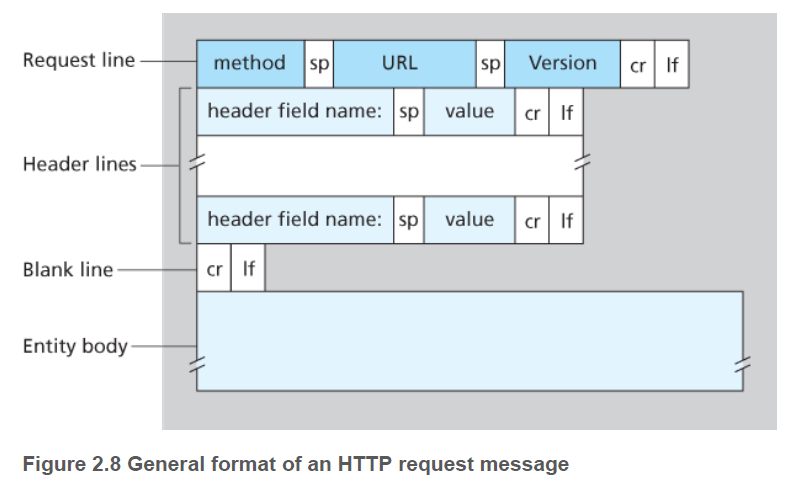

  요청 라인과 헤더 라인의 모든 라인들은 CR과 LF로 줄이 구분된다. 또한, 헤더 라인 이후에 "개체 몸체(entity body)"가 있다. 보통 개체 몸체는 GET 방식에서 비어 있고 POST 방식에서 사용된다.

 HEAD 방식은 GET 방식과 유사하다. 서버가 HEAD 방식을 가진 요청을 받으면 HTTP 메시지로 응답하는데, 요청 객체는 보내지 않는다. 애플리케이션 개발자는 흔히 디버깅을 위해 HEAD 방식을 많이 사용한다.

 PUT 방식은 또한 웹 서버에 업로드할 객체를 필요로 하는 애플리케이션에 의해 사용된다. DELETE 방식은 사용자 또는 애플리케이션이 웹 서버에 있는 객체를 지우는 것을 허용한다.

### HTTP 응답 메시지

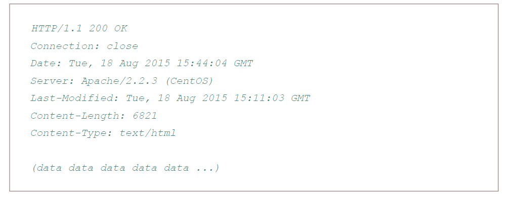

 3개의 섹션으로 구분할 수 있다.

 초기 상태 라인, 6개의 헤더 라인, 개체 몸체로 이루어지는데 객체 몸체는 (data data data data ...)로 표현된 부분을 나타낸다.

 상태 라인은 프로토콜 "버전 필드", "상태 코드", "해당 상태 메시지"를 갖는다.

 헤더 라인을 살펴보면

1. [Connection: close]: 클라이언트에게 메시지를 보낸 후 TCP 연결을 닫는 데 사용한다.
2. Date: HTTP 응답이 서버에 의해 생성되고 보낸 날짜와 시간을 나타낸다.
3. Server: 메시지가 아파치 웹 서버에 의해 만들어졌음을 나타낸다.
4. Last-Modified: 객체가 생성되거나 마지막으로 수정된 시간과 날짜를 나타낸다. 이 헤더는 로컬 클라이언트와 네트워크 캐시서버(proxy server)에서의 객체 캐싱에 중요하다.
5. Content-Length: 송신되는 객체의 바이트 수를 나타낸다.
6. Content-Type: 개체 몸체 내부의 객체가 HTML 텍스트인 것을 나타낸다.

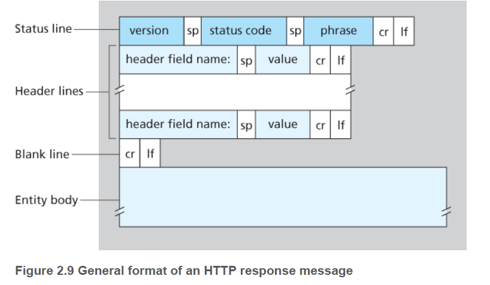

 대표적인 상태 코드와 연관 문장의 예로는,

- 200 OK: 요청이 성공되었고, 정보가 응답으로 보내졌다.
- 301 Moved Permanently: 요청 객체가 영원히 이동되었다. 새로운 URL은 응답 메시지의 Location: 헤더에 나와 있다. 클라이언트 소프트웨어는 자동으로 이 새로운 URL을 추출한다.
- 400 Bad Request: 서버가 요청을 이해할 수 없다는 일반 오류 코드이다.
- 404 Not Found: 요청 문서가 서버에 존재하지 않는다.
- 505 HTTP Version Not Supported: 요청 HTTP 프로토콜 버전을 서버가 지원하지 않는다.