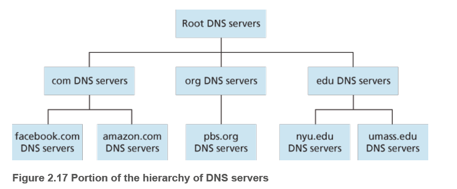
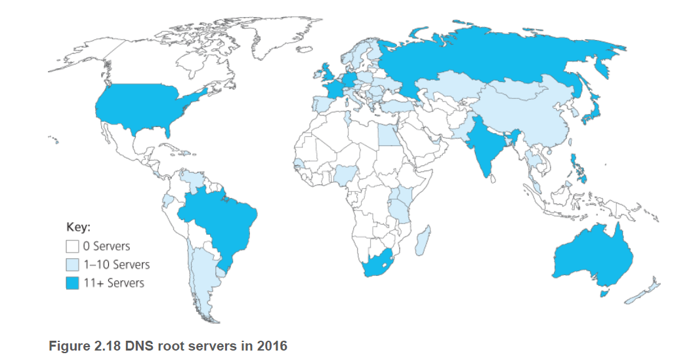
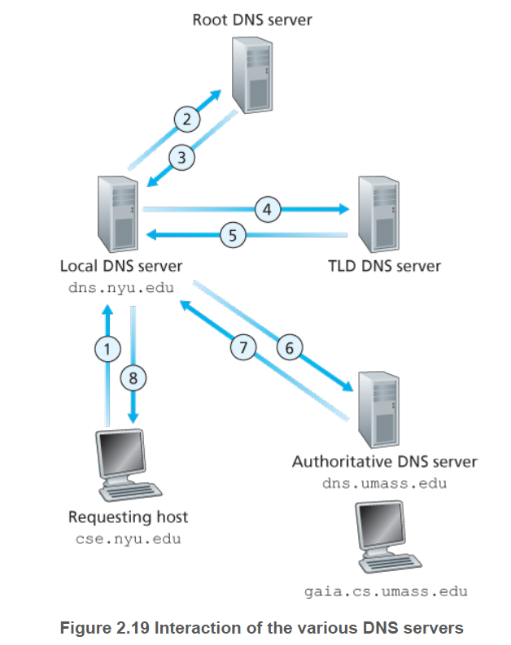
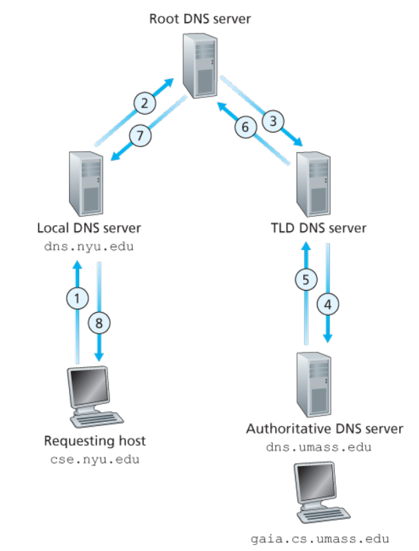
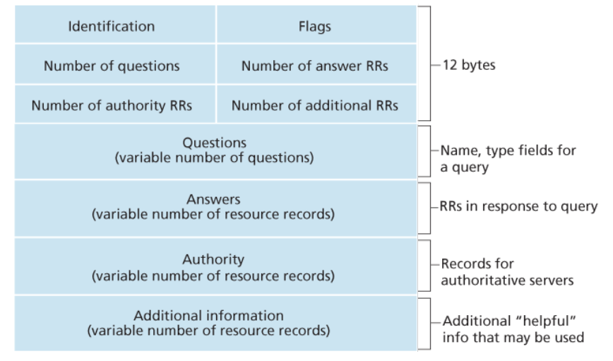

# DNS 인터넷 디렉터리 서비스

 인터넷은 많은 IP 주소로 호스트들을 식별한다. IP 주소는 127.7.106.83과 같은 형태이고, 각 바이트를 점으로 구분한다. IP 주소는 **계층구조**여서 주소를 왼쪽에서 오른쪽으로 조사하여, 그 호스트가 인터넷의 어디에 위치하는지 알아낼 수 있다.

 하지만 4바이트의 숫자들을 사용자들이 기억하기도 쉽지 않고, 익숙하지 않아 이용하기 어렵다. 인터넷은 Application 계층에서 사용자에게 기억하기 쉬운 호스트 네임을 제공하고, 이를 IP 주소로 변환하는 DNS 서비스를 제공한다.

 

## DNS가 제공하는 서비스

 앞서 얘기했듯이 **DNS(Domain Name System)** 의 주요 서비스는 호스트 네임을 IP 주소로 변환해 주는 디렉터리 서비스이다. 

세부적으로 DNS는

1. DNS 서버들의 계층구조로 구현된 **분산 데이터베이스**이다.
2. 호스트가 분산 데이터베이스로 질의하도록 허락하는 애플리케이션 계층 프로토콜이다.
3. DNS 서버는 주로 BIND (Berkeley Internet Name Domain) 소프트웨어를 수행하는 유닉스 컴퓨터이다.
4. DNS 프로토콜은 **UDP**상에서 수행되고 **포트 번호는 53**을 이용한다.

### 디렉터리 서비스의 수행 과정

 예를 들어, 어떤 사용자가 [www.someschool.edu/index.html](http://www.someschool.edu/index.html) 을 요청할 때 무슨 일이 발생할까?

 사용자는 그 웹 서버와 HTTP 프로토콜로 TCP 연결을 하여 리소스를 받아오기를 원하기 때문에 그 웹 서버의 IP 주소를 알아내야 한다.

1. 사용자 컴퓨터가 **DNS 애플리케이션의 클라이언트**가 된다.
2. 브라우저는 URL로부터 호스트 네임 [www.someschool.edu](http://www.someschool.edu)를 추출하고 그 호스트 네임을 DNS 애플리케이션의 클라이언트 측에 넘긴다.
3. DNS 클라이언트는 DNS 서버로 호스트 네임을 포함하는 질의를 보낸다.
4. DNS 클라이언트는 호스트 네임에 대한 IP 주소를 가진 응답을 받는다.
5. 브라우저가 DNS로부터 IP 주소를 받으면, 브라우저는 그 IP 주소와 그 주소의 80번 포트에 위치하는 HTTP 서버 프로세스로 TCP 연결을 초기화한다.

 (참고) DNS 서비스는 사용자가 원하는 메인 서비스(HTTP 프로토콜을 이용하여 리소스를 받아오는 것) 외에 추가적인 작업을 수행하므로 추가 지연을 준다. 하지만 원하는 IP 주소는 가까운 DNS 서버에 캐시되어 있어서 평균 DNS 지연과 DNS 네트워크 트래픽이 현저히 감소된다.

### DNS의 추가 서비스

- **호스트 엘리어싱(host aliasing)**: 복잡한 호스트 네임을 가진 호스트는 하나 이상의 **별명**을 가질 수 있다. 원본 호스트 네임을 **정식 호스트 네임(canonical hostname)**이라 하는데 별칭이 기억하기 쉽기 때문에 사용한다.
- **메일 서버 엘리어싱(mail server aliasing)**: 전자메일 주소 또한 정식 호스트 네임은 기억하기 어렵다. 사용자가 기억하기 쉽게 **별칭을 제공**하는 서비스를 수행한다. 메일 서버의 매핑 데이터를 **MX 레코드**라고 하는데 이 레코드는 기업의 **메일 서버와 웹 서버가 같은 호스트 네임(별칭)**을 갖도록 허용한다. → 간편하다.
- **부하 분산(load distribution)**: DNS는 중복 웹 서버와 같은 여러 중복 서버 사이에 부하를 분산하기 위해서 사용하기도 한다. 트래픽이 많은 웹 서버는 여러 중복 서버를 가지고 있고, 이들은 다른 IP 주소를 갖는다. DNS는 이들을 위해 여러 IP 주소를 통합하는 하나의 정식 호스트 네임을 제공한다. DNS의 데이터베이스에는 이 IP 주소 집합을 갖고 있고 질의에 대해 이 집합 전체를 갖고 응답한다. 이때, IP 주소 집합을 갖고 **순환식으로 질의를 처리**하기 때문에 **여러 중복 서버들 사이에서 트래픽을 분산**하는 효과를 내준다. 이 방식은 전자메일에서도 사용된다.

---

## DNS 동작 원리

- DNS는 간단하고 직접적인 변환 서비스를 제공하는 블랙박스
- 전 세계에 분산된 많은 DNS 서버뿐만 아니라 DNS 서버와 질의를 하는 호스트 사이에서 어떻게 통신하는지 명시하는 애플리케이션 계층 프로토콜로 구성

### 가장 간단한 설계

 만약 DNS 서버가 하나의 서버로 구성되어 모든 IP 주소를 매핑하는 데이터를 갖고 있고, 모든 요청에 응답한다고 한다면 어떻게 될까?

- **서버의 고장**: 이 네임 서버가 고장나면, 전체 인터넷이 작동하지 않는다.
- **트래픽 양:** 단일 DNS 서버가 모든 질의를 처리해야 한다.
- **먼 거리의 중앙 집중 데이터베이스**: 단일 DNS 서버가 모든 질의 클라이언트로 부터 가까울 수만은 없다. 지구 반대편에 있는 서버에 질의하고 응답하는 것은 심각한 지연을 발생시킨다.
- **유지관리**: 모든 레코드를 가지고 있기 때문에 중앙 집중 데이터베이스는 거대해지고 모든 새로운  호스트를 반영하기 위해 자주 갱신해야 한다.

 즉, 이런 중앙 집중 데이터베이스는 **확장성이 전혀 없다**. 결국 DNS **분산**되도록 설게되었다.

### 분산 계층 데이터베이스

 확장성 문제를 해결하기 위해 DNS는 많은 서버를 이용하고 이들을 **계층 형태**로 구성하여 전 세계에 분산시켰다.

 DNS 서버는 세 유형의 DNS 서버로 구성된다.

- **루트 DNS 서버**: 인터넷에는 400개 이상의 루트 DNS 서버(A~M까지 분류)가 있는데, 대부분 북미지역에 위치한다. 루트 서버를 가진 국가들은 대략 10개 이상이고 이 루트 네임 서버들은 13개의 다른 기관에서 관리된다.
- **최상위 레벨 도메인(TLD) 서버**: com, org, net, edu 같은 상위 레벨 도메인과 kr, uk, fr, ca, jp 같은 모든 국가의 상위 레벨 도메인에 대한 TLD 서버(또는 서버 클러스터)가 있다.

     **Verisign Global Registry Services** 는 com TLD에 대한 TLD 서버를 담당한다. TLD를 지원하는 네트워크 인프라는 크고 복잡하다. TLD 서버들은 책임 DNS 서버에 대한 IP 주소들을 제공한다.

- **책임 DNS 서버 (Authoritative DNS servers)**: 인터넷에서 접근하기 쉬운 호스트(ex. 웹 서버와 메일 서버)를 가진 모든 기관은 호스트 네임을 IP 주소로 매핑하는 공개적인 DNS 레코드를 제공해야 한다. **기관의 책임 DNS 서버**가 이 DNS 레코드를 가지고 있다.

     기관은 이 레코드를 갖도록 자신의 책임 DNS 서버의 구현을 선택할 수 있다. 또한 일부 서비스 제공자의 책임 DNS 서버에 이 레코드를 저장하도록 요청하고 비용을 지불한다. **대부분의 대학과 큰 기업**들은 자신의 **기본 책임 DNS 서버와 보조 책임 DNS 서버**를 유지하고 구현한다.

### 로컬 DNS 서버

- 로컬 DNS 서버는 서버들의 계층구조에 엄격하게 속하지는 않지만, DNS 구조의 중심에 있다.
- 대학이나 주거지역 ISP와 같은 ISP들은 로컬 DNS 서버(또는 디폴트 네임 서버)를 갖는다.
- 호스트가 ISP에 연결될 때, 그 ISP는 로컬 DNS 서버로부터 IP 주소를 호스트에게 제공한다.
- 일반적으로 윈도우나 유닉스의 네트워크 상태창에서 로컬 DNS 서버의 IP 주소를 쉽게 결정할 수 있다.
- 호스트의 로컬 DNS 서버는 대체로 호스트에 가까이 있다. (기관 ISP 에선 같은 LAN 상에 있을 수도 있다.) → 보통 주거지역 ISP는 몇 개의 라우터 범위 안에 있다.

 로컬 DNS 서버를 통해 DNS 질의를 처리하는 과정을 보면

예) 호스트 **cse.nyu.edu**가 **gaia.cs.umass.edu**의 IP 주소를 원한다고 가정한다.

 **cse.nyu.edu**에 대한 NYU의 로컬 DNS 서버가 **dns.nyu.edu**이고, **gaia.cs.umass.edu**에 대한 책임 DNS 서버는 **dns.umass.edu**라고 가정한다.

1. 호스트 **cse.nyu.edu**가 자신의 로컬 DNS 서버 **dns.nyu.edu**에게 DNS 질의 메시지를 보낸다.
2. 로컬 DNS 서버는 그 질의 메시지를 **루트 DNS 서버**에게 전달한다.
3. 루트 DNS 서버는 edu를 인식하고, **edu에 대한 책임을 가진 TLD 서버**의 IP 주소 리스트를 로컬 DNS 서버에게 보낸다.
4. 로컬 DNS 서버는 질의 메시지를 TLD 서버로 보낸다.
5. TLD 서버는 umass.edu를 인식하고 **dns.umass.edu**로 이름 지어진 메사추세츠대학교의 책임 DNS 서버의 IP 주소를 응답한다.
6. 로컬 DNS 서버는 직접 **dns.umass.edu**로 질의 메시지를 다시 보낸다.
7. **gaia.cs.umass.edu**의 IP 주소를 얻는다.
8. 이 IP 주소를 호스트 **cse.nyu.edu**에게 응답한다.

 이와 같이 통신하면 총 8번의 DNS 메시지가 보내진다.

 하지만, 일반적으로 TLD 서버가 호스트 네임에 대한 책임 서버를 알지 못하고 **그 책임 DNS를 아는 중간 서버**를 알고 있다. 그러면 한 계층의 추가로 총 10번의 메시지가 오고간다.

 위 예에서 **재귀적 질의(recursive query)**와 반복적 **질의(iterative query)**를 사용한다.

- **재귀적 질의:** cse.nyu.edu→dns.nyu.edu로 보내는 질의는 자신을 대신하여 필요한 매핑을 얻도록 dns.nyu.edu에게 요구한다.
- **반복적 질의**: 나머지 세 가지 질의는 모든 응답이 dns.nyu.edu에 직접 보내지므로 반복적 질의다.

 

 모든 질의가 재귀적일 경우 위와 같다.

하지만 일반 질의는 전형적으로 재귀와 반복을 둘 다 사용하는 형식을 따른다.

### DNS 캐싱

DNS 캐싱의 목적은 다음과 같다.

- 지연 성능 향상
- 네트워크의 DNS 메시지를 줄인다.

 질의 사슬에서 DNS 서버가 DNS 응답을 받았을 때 **로컬 메모리에 응답에 대한 정보를 저장**함으로써 구현한다.

 만약 호스트 네임과 IP 주소 쌍이 DNS 서버에 저장되고 다른 호스트 네임으로부터 같은 질의가 DNS 서버로 도착하면, DNS 서버는 호스트 네임에 대한 책임이 없을 때조차 **원하는 IP 주소를 즉시 제공**할 수 있다.

 하지만 이 호스트 DNS와 IP 주소 사이의 매핑과 호스트는 **영구적인 것이 아니기** 때문에 DNS 서버는 일정한 기간(보통 2일) 이후에 저장된 정보를 제거한다.

---

## DNS 레코드와 메시지

### DNS 레코드

 DNS 서버들은 호스트 네임을 IP 주소로 매핑하기 위한 **자원 레코드(resource record, RR)** 를 데이터베이스에 저장한다. 각 DNS는 하나 이상의 레코드를 가진 메시지로 응답한다.

 자원 레코드는 다음과 같이 4개의 필드를 포함하는 투플로 구성된다.

**(Name, Value, Type, TTL)**

 TTL은 자원 레코드의 생존기간이다. 자원이 캐시에서 제거되는 시간을 결정한다. 또한 Name과 Value의 의미는 Type에 따라 변한다.

- **Type A 레코드**: Name=호스트 네임, Value=호스트 네임에 대한 IP 주소

     표준 호스트 네임의 IP 주소 매핑을 제공한다. ex. **(relay1.bar.foo.com, 145.37.93.126, A, TTL)**

- **Type NS 레코드**: Name=도메인, Value=도메인 내부의 호스트에 대한 IP 주소를 얻을 수 있는 방법을 아는 책임 DNS 서버의 호스트 네임

     ex. **(foo.com, dns.foo.com, NS, TTL)**

- **Type CNAME 레코드**: Name=별칭 호스트 네임, Value=정식 호스트 네임

     ex. **(foo.com, relay1.bar.foo.com, CNAME, TTL)**

- **Type MX 레코드**: Name=메일 서버의 별칭 호스트 네임, Value=메일 서버의 정식 호스트 네임

     MX 레코드는 메일 서버의 호스트 네임이 간단한 별칭을 갖도록 허용한다. 어떤 회사는 한 메일 서버와 다른 서버 (ex. 웹 서버)들이 같은 별칭을 가질 수 있다.

     ex. **(foo.com, mail.bar.foo.com, MX, TTL)**  

 DNS 서버가 특별한 호스트 네임에 대한 **책임 서버**이면, 그 호스트 네임에 대한 **Type A 레코드**를 가지고 있다.

 또한, 서버가 호스트 네임에 대한 책임 서버가 아니라면, 호스트 네임을 포함하는 도메인에 대한 Type NS 레코드를 가지고 있고, NS 레코드의 Value 필드에 DNS 서버의 IP 주소를 제공하는 Type A 레코드도 포함한다.

 즉, 책임 DNS 서버의 **도메인 네임을 응답(NS)**할 수도 있고 그에 대한 **IP 주소(A)**도 응답할 수도 있다는 의미이다.

### DNS 메시지

 DNS의 메시지는 질의와 응답 메시지가 있다. 그리고 이들은 모든 위와 같은 포맷을 가진다.

- 처음 12바이트는 **헤더 영역**으로 여러 필드를 갖는다.
    - 첫 필드(identification)는 질의를 식별하는 16비트 숫자이다. 이 식별자는 질의에 대한 응답 메시지에 복사되어, 클라이언
    - 플래그(Flags) 필드에는 여러 필드가 있다.
        - 1비트의 질의/응답 플래그: 메시지가 질의(0)인지 응답(1)인지 구별한다.
        - 1비트의 책임 플래그: DNS 서버가 질의 이름에 대하여 책임 서버일 때 응답 메시지에 설정된다.
        - 1비트의 재귀 요구 플래그: DNS 서버가 레코드를 갖지 않을 때 재귀적 질의를 수행하기를 클라이언트가 원할 때 설정된다.
        - 1비트의 재귀-가능 필드: DNS 서버가 재귀 질의를 지원하면 응답에 설정된다.-
    - 4개의 개수 필드: 헤더 다음에 오는 데이터 평면의 네 가지 타입의 발생 횟수를 나타낸다.
- **질문 영역**: 현재 질의에 대한 정보를 포함한다.
    - 질의되는 이름을 포함하는 이름 필드
    - 이름에 대해 문의되는 질문 타입을 나타내는 타입 필드 [A, NS, CNAME, MX]
- **답변 영역**: 원래 질의된 이름에 대한 자원 레코드를 포함한다.

     각 자원 레코드에는 Type, Value, TTL가 있다. 호스트 네임은 여러 개의 IP 주소를 가질 수 있기 때문에 여러 개의 RR을 보낼 수도 있다.

- **책임 영역**: 다른 책임 서버의 레코드를 포함한다.
- **추가 영역**: 다른 도움이 되는 레코드를 포함한다.

### DNS 데이터베이스에 레코드 삽입

 처음에 어떻게 레코드를 데이터베이스에 넣는가?

예를 가지고 설명한다.

 네트워크 유토피아라는 새로운 벤처 기업을 설립하였다고 가정한다.

1. 도메인 네임 networkutopia.com을 등록기관(registrar)에 등록한다.

     **등록기관**은 도메인 네임의 유일성을 확인하고 그 도메인 이름을 DNS 데이터베이스에 넣고 그 서비스에 대해 요금을 받는 상업기관이다. ICANN이 여러 등록기관을 승인해준다.

2. 도메인 네임을 등록기관에 등록할 떄 등록기관에 **주책임 서버와 부책임 서버의 이름과 IP 주소**를 제공해야 한다.

     그 이름과 IP 주소가 각각

     dns1.networkutopia.com, dns2.networkutopia.com, 212.212.212.1, 212.212.212.2라고 한다면 **두 책임 서버** 각각에 대해 등록기관은 Type NS와 Type A 레코드가 TLD com 서버에 등록되도록 확인한다.

     주책임 서버에 대한 레코드는 다음과 같다.

     (networkutopia.com, dns1.networkutopia.com, NS)

     (dns1.networkutopia.com, 212.212.212.1, A)

3. 마지막으로 웹서버 www.networkutopia.com에 대한 Type A 자원 레코드와 메일 서버 mail.networkutopia.com에 대한 Type MX 자원 레코드가 책임 DNS 서버에 등록되는 것을 확인해야 한다.

     최근에는 DNS 메시지를 통해 데이터베이스에 데이터를 동적으로 추가/삭제할 수 있도록 DNS 프로토콜에 **UPDATE 선택사양**이 추가되었다.

 이렇게 등록 과정이 끝나면 사용자는 DNS 서비스를 이용해 www.networkutopia.com에 대응되는 웹 서버 IP 주소를 얻을 수 있고, 브라우저는 이 IP 주소로 TCP 연결을 초기화해 HTTP 요청을 보낼 수 있다.