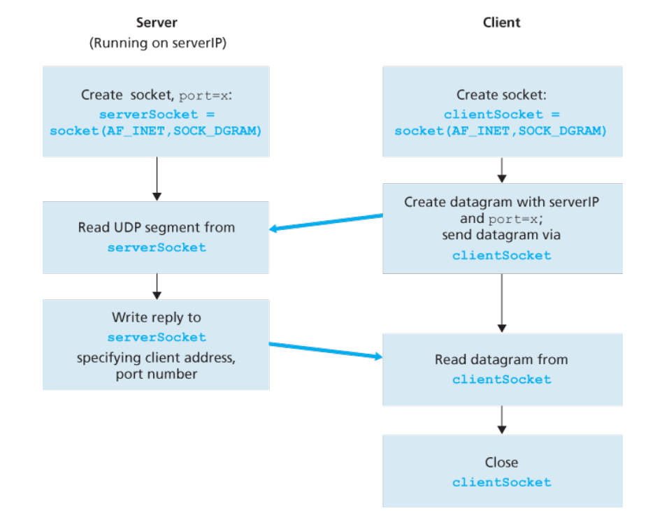
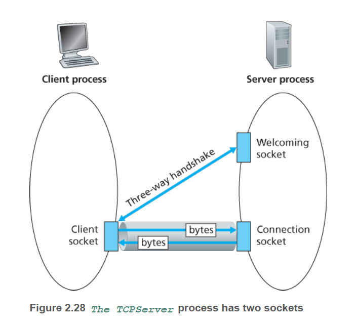
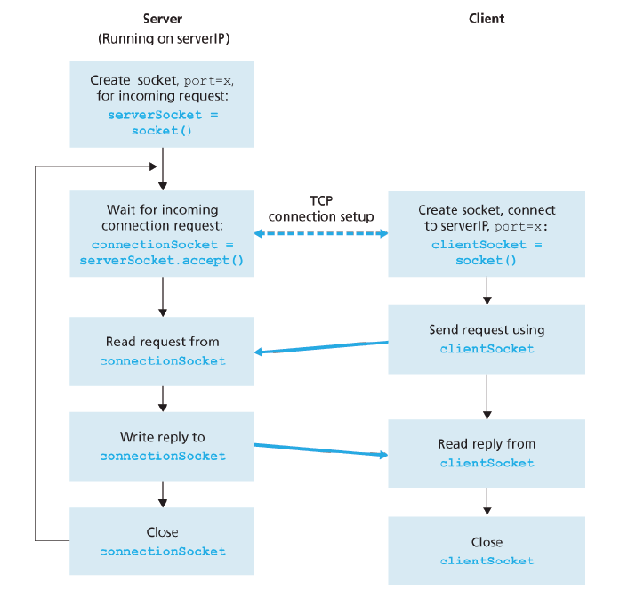

## 네트워크 애플리케이션 작성

- 서로 다른 종단 시스템에 존재하는 Client와 Server 프로그램으록 ㅜ성
- 두 프로세스는 **소켓(Socket)**을 통해 통신
- Client-Server 애플리케이션의 두 형태
    - RFC에 정의된 표준 프로토콜을 구현하는 Client-Server 애플리케이션 → 개방형
        - 그 프로토콜과 연관된 [잘 알려진 포트 번호](https://ko.wikipedia.org/wiki/TCP/UDP%EC%9D%98_%ED%8F%AC%ED%8A%B8_%EB%AA%A9%EB%A1%9D)를 사용해야 함.
        - 예) HTTP 프로토콜 프로그램

             client - HTTP 프로토콜의 클라이언트 측 구현 ([RFC 2616](https://tools.ietf.org/html/rfc2616)에 정의)

             server - HTTP 프로토콜의 서버 프로토콜 구현 (RFC 2616에 정의)

    - 개인의 독점적인 네트워크 애플리케이션
        - RFC 또는 다른 곳에 공식적으로 출판되지 않은 프로토콜 채택
        - 개인 개발자나 개발팀은 이 프로그램 코드에 대한 완전한 제어를 가짐
        - 다른 독립 개발자는 이 애플리케이션과 상호작용하는 코드 개발 불가
        - 잘 알려진 포트 번호를 사용하지 않도록 유의
- 개발자가 애플리케이션 개발시 우선적으로 해야할 일 = 어떤 트랜스포트 프로토콜 (TCP/UDP)을 이용하는지 선택
    - TCP
        - 연결지향형
        - 신뢰적 바이트 스트림 채널 제공
    - UDP
        - 비연결형
        - 데이터를 독립적인 패킷으로 만들어서 전송
        - 전송에 대한 보장은 하지 않음

## UDP를 이용한 소켓 프로그래밍

- 애플리케이션 개발자는 애플리케이션 계층에 대한 제어권을 갖지만, 트랜스포트 계층 쪽에 대한 제어권은 거의 없다.
- 패킷을 소켓에 밀어넣기 전에, UDP를 사용할 때에는 패킷에 목적지 주소를 기입해야함
    - 목적지 호스트의 IP 주소
    - 목적지 호스트 내의 특정한 소켓을 식별할 포트 번호(port number)

        → 소켓이 생성될 때 포트 번호라고 하는 식별자가 소켓에 할당

- 송신자의 소스 호스트 IP 주소와 포트 소스 포트 번호도 붙임
    - UDP 애플리케이션 코드가 하지 않는다.
    - 대신에 하부 운영체제가 자동으로 실행한다.

- 애플리케이션 시나리오
    1. 클라이언트는 키보드로부터 한 줄의 문자(데이터)를 읽고 그 데이터를 서버로 보낸다.
    2. 서버는 그 데이터를 수신하고 문자를 대문자로 변환한다.
    3. 서버는 수정된 데이터를 클라이언트에게 보낸다.
    4. 클라이언트는 수정된 데이터를 수신하고 그 줄을 화면에 나타낸다.



```python
# UDPClient.py

from socket import *
serverName = 'hostname'
serverPort = 12000
clientSocket = socket(socket.AF_INET, socket.SOCK_DGRAM)
message = raw_input('Input lowercase sentence:')

clientSocket.sendto(message.encode(), (serverName, serverPort))
modfiedMessage, serverAddress = clientSocket.recvfrom(2048)
print modifiedMessage
clientSocket.close()
```

- serverName
    - 서버의 IP 주소 혹은 서버의 호스트 이름 사용
    - 호스트 이름을 사용하는 경우 IP 주소를 얻기 위해 DNS 검색이 자동으로 수행
- clientSocket = socket(AF_INET, SOCK_DGRAM)
    - 클라이언트 소켓 생성
    - AF_INET은 주소군(family)로써, 하부 네트워크가 IPv4를 사용함으로 나나냄
    - SOCK_DGRAM은 소켓이 UDP 소켓임을 나타냄
    - 클라이언트 소켓의 포트 번호를 명시하지 않음 → 운영체제가 대신 수행
- clientSocket.sendto(message.encode(), (serverName, serverPort))
    - 소켓으로 바이트 형태로 보내기 위해 encode() 메소드 사용
    - 목적지의 주소 또한 소켓에 전달
- modifiedMessage, serverAddress = clientSocket.recvfrom(2048)
    - 서버로부터의 데이터 수신을 대기
    - modifiedMessage로 수신한 메시지를 받고 serverAddress로 서버의 IP 주소와 포트 번호를 받음
    - recvfrom 메소드는 수신 버퍼가 2048의 버퍼 크기를 갖도록 설정
- clientSocket.close()
    - 소켓을 닫는 메소드로 소켓을 닫는 행위는 예외 처리에 대한 논의가 뒤따른다.

```python
# UDPServer.py

from socket import *
serverPort = 12000
serverSocket = socket(AF_INET, SOCK_DGRAM)
serverSocket.bind(('', serverPort))
print("The server is ready to receive")

while True:
	message, clientAddress = serverSocket.recvfrom(2048)
	modifiedMessage = message.decode().upper()
	serverSocket.sendto(modifiedMessage.encode(), clientAddress)

serverSocket.close()
```

- serverSocket.bind('', serverPort))
    - 포트 번호 12000을 서버의 소켓에 할당
    - 애플리케이션 개발자가 명시적으로 포트 번호를 소켓에 할당

## TCP 소켓 프로그래밍

- UDP와 달리 TCP는 클라이언트와 서버가 서로에게 데이터를 보내기 전에 **먼저 TCP 연결을 설정**할 필요가 있다.
- TCP 연결의 한쪽은 클라이언트 소켓에, 다른 한 쪽은 서버 소켓에 연결
- UDP에서는 매번 목적지 주소를 패킷에 직접 적고 보냈던 반면, TCP는 연결이 설정된 후 소켓을 통해 그 TCP 연결로 데이터를 보내기만 하면 된다.
- TCP 통신 절차
    1. 클라이언트는 먼저 서버로의 접속을 시도한다.
        - 이때 서버는 이 초기 접속을 처리하는 특별한 소켓을 가져야 한다.
        - 클라이언트가 TCP 소켓을 생성할 때 서버에 있는 **welcome 소켓**의 주소를 명시한다.
    2. 클라이언트는 세 방향 핸드셰이크를 하고 서버와 TCP 연결을 설정한다.
        - 전송 계층에서 일어나는 세 방향 핸드셰이크는 클라이언트와 서버 프로그램이 전혀 인식하지 못한다.
    3. 핸드셰이크 후에 서버는 그 클라이언트를 위한 **새로운 소켓**을 생성한다.
- 클라이언트 프로세스는 자신의 소켓으로 임의의 **바이트**를 보낼 수 있으며 보낸 순서대로 서버 프로세스가 바이트를 수신하도록 TCP가 보장한다. → **신뢰적 서비스**
- 연결된 새로운 소켓을 통해 통신하는 것을 **연결된 파이프**로 생각할 수도 있다.



```python
# TCPClient.py

from socket import *
serverName = 'serverName'
serverPort = 12000
clientSocket = socket(AF_INET, SOCK_STREAM)
clientSocket.connect((serverName, serverPort))
sentence = raw_input('Input lowercase sentence: ')
clientSocket.send(sentence.encode())
modifiedSentence = clientSocket.recv(1024)
print('From Server: ', modifiedSentence.decode())
clientSocket.close()
```

- clientSocket = socket(AF_INET, SOCK_STREAM)
    - 클라이언트의 소켓을 생성할 때 해당 소켓의 포트 번호를 명시하지 않는다.
    - 대신에 운영체제가 한다.
- clientSocket.connect((serverName, serverPort))
    - 클라이언트가 TCP 소켓을 이용해서 서버로 데이터를 보내기 전에 TCP 연결이 선행되어야 한다.
    - (serverName, serverPort)는 연결의 서버 쪽 주소이다.
    - 이 라인이 수행된 후에 세 방향 핸드셰이크가 수행되고 클라이언트와 서버 간에 TCP 연결이 설정된다.
- clientSocket.send(sentence.encode())
    - 패킷을 명시적으로 생성하지 않는다.
    - 패킷에 목적지 주소를 붙이지 않는다.

```python
# TCPServer.py

from socket import *
serverPort = 12000
serverSocket = socket(AF_INET, SOCK_STREAM)
serverSocket.bind(('', serverPort))
serverSocket.listen(1)
print('The server is ready to receive')
while True:
	connectionSocket, addr = serverSocket.accept()
	sentence = connectionSocket.recv(1024).decode()
	capitalizedSentence = sentence.upper()
	connectionSocket.send(capitalizedSetence.encode())
	connectionSocket.close()
serverSocket.close()
```

- serverSocket.bind(('', serverPort))
serverSocket.listen(1)
    - serverSocket이 웰컴 소켓이 된다.
    - 출입문을 선정한 후 임의의 클라이언트가 문을 두드리기를 기다린다. (listen)
    - 서버가 클라이언트로부터의 TCP 연결을 듣도록 한다. 파라미터는 연결의 최대 수를 나타낸다.
- connectionSocket, addr = serverSocket.accept()
    - 이 클라이언트에게 지정된 connectionSocket이라는 새로운 소켓을 생성한다.
    - 핸드셰이킹을 완료한 후 클라이언트의 clientSocket과 서버의 connectionSocket 간에 TCP 연결을 생성한다.

