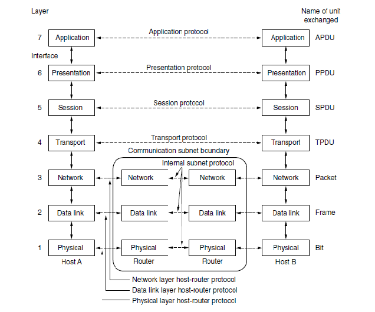
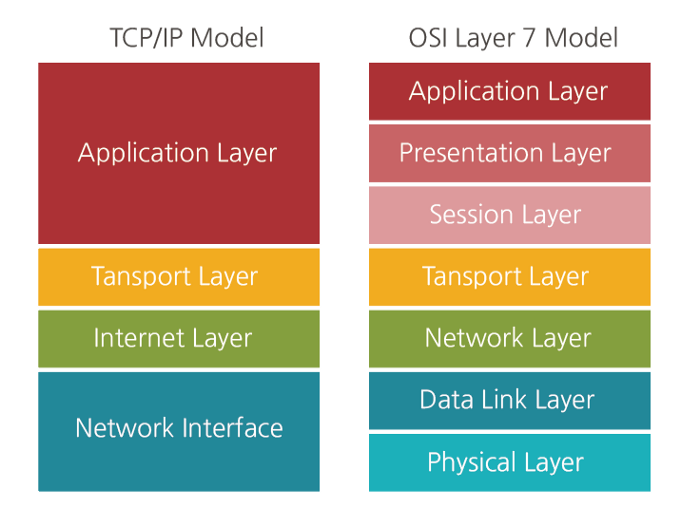
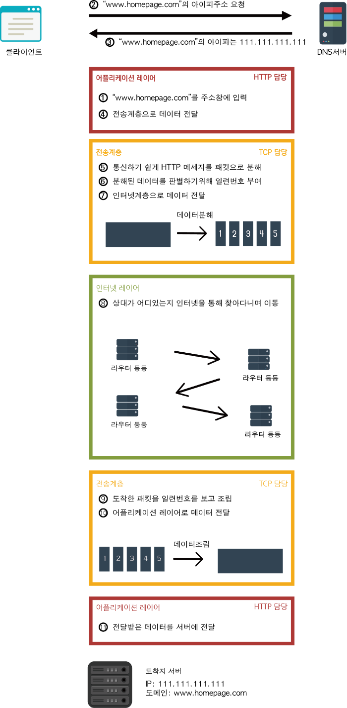

## 컴퓨터 네트워크

 컴퓨터 네트워크 또는 컴퓨터망은 분산된 컴퓨터를 통신망으로 연결하는 것이다. — ([위키백과](https://ko.wikipedia.org/wiki/%EC%BB%B4%ED%93%A8%ED%84%B0_%EB%84%A4%ED%8A%B8%EC%9B%8C%ED%81%AC))

 호스트와 호스트 간 통신을 위해 연결된 망을 의미하는데 아래 제시되는 모든 것이 네트워크가 될 수 있다.

- 호스트와 호스트를 네트워크 케이블로 직접 연결한 것
- 하나의 스위치에 호스트를 각각 연결한 것
- 스위치와 스위치를 연결하고 서로 다른 스위치에 호스트를 연결한 것
- 라우터나 L3 스위치와 같은 장비로 라우팅하면서 서로 다른 원격 네트워크를 연결한 것

즉, **호스트와 호스트 간 통신이 가능하도록 해주는 기반이 되는 인프라**가 네트워크이다.

### 네트워크 디자인/구성의 중요성

 네트워크는 단순히 두 호스트 간 통신이 가능하다고 끝나는 게 아니다. 

네트워크 디자인과 구성에 따라 **호스트 간 통신 경로가 달라지고** 이는 **서비스 품질**로 이어진다. 장애가 발생했을 때도 서비스 영향 범위나 회복 시간이 달라지고 전체적인 인프라 보안에도 영향을 미친다.

 따라서 네트워크 구성은 매우 복잡하고 다양하며 네트워크 구조와 설계는 서비스와 인프라에 매우 큰 영향을 미친다.

---

# 네트워크 종류

## 홈 네트워크

 홈 네트워크는 어떤 인터넷 회선을 연결하더라도 같다.
요즘엔 단말의 급증으로 대부분의 가정에서 공유기를 사용하고 있고 모뎀, 공유기, 단말 간에 물리적 연결이 필요하다. 

무선 연결은 무선 랜 카드와 무선 신호를 보낼 매체(공기)가 필요하고, 유선 연결은 유선 랜 카드(이더넷 랜 카드), 랜 케이블이 필요하다.

## 데이터 센터 네트워크

 안정적이고 빠른 대용량 서비스 제공을 목표로 한다. 안정성을 위해 다양한 [이중화 기술](https://www.notion.so/b317591fa66a491e8d2e7747af219699)을 사용하며 많은 서버와 서비스가 한 네트워크에 연결되어 있어 높은 통신량을 수용할 수 있어야 한다. 이를 위해 **고속 이더넷 기술**이 사용된다.

 초기에는 3계층 구성이 일반적이었지만 가상화 기술과 높은 대역폭을 요구하는 스케일 아웃 (Scale-Out) 기반의 애플리케이션이 등장하면서 2계층 구성인 스파인-리프(Spine-Leaf) 구조로 변화됐다.

 서버 간 통신이 늘어나는 경향에 더해 일반 서버에 10G Base-T 이더넷 포트가 기본적으로 제공되어 TOR 스위치와 연결되고 리프 스위치인  TOR 스위치는 스파인 스위치와 40G, 100G로 연결되는 추세다.

 더 높은 대역폭을 제공하기 위해 400G 네트워크도 표준화되어 사용되고 있기도 하다.

 

---

# 프로토콜

 네트워크에서 통신할 때의 규약을 칭한다. 어떤 표준협회나 워킹그룹이 만들었는지 혹은 어떤 회사에서 사용하느냐에 따라 특징이 많이 달라지고 다양한 프로토콜이 존재한다. 하지만 최근에는 복잡하고 산재되어 있던 여러 가지 프로토콜 기술이 **이더넷-TCP/IP 기반 프로토콜**들로 변경되고 있다.

- 물리적 측면: 데이터 전송 매체, 신호 규약, 회선 규격 등. 이더넷이 널리 쓰인다.
- 논리적 측면: 장치들끼리 통신하기 위한 프로토콜 규격. TCP/IP가 널리 쓰인다.

 적은 컴퓨팅 자원과 매우 느린 네트워크 속도를 이용해 최대한 효율적으로 통신하는 것이 목표이기 때문에 프로토콜이 문자 기반이 아닌 2진수 비트(bit) 기반으로 만들어졌다. **최소한의 비트로 내용을 전송**하기 위해서는 매우 치밀하게 서로 간의 약속을 정의해야 한다.

→  몇 번째 전기 신호는 보내는 사람 주소, 몇 번째 전기 신호는 받는 사람 주소, 몇 번째 전기 신호는 상위 프로토콜 지시자 등과 같이 미리 까다롭게 약속하고 이 약속을 지켜야 한다.

 물론 **애플리케이션 레벨의 프로토콜**들은 비트 기반이 아닌 **문자 기반 프로토콜**이 많이 사용되는데 HTTP와 SMTP와 같은 프로토콜들이 대표적이다. 비트를 사용하지 않고 문자 자체를 이용해 헤더와 헤더 값, 데이터를 표현하고 전송한다. 문자 기반의 프로토콜이기 때문에 효울성은 비트 기반 보다는 떨어지지만 확장성 면에서는 좋다.

 TCP/IP와 같은 프로토콜 묶음으로 **프로토콜 스택**이라고 부른다.  실제로 TCP/IP 프로토콜 스택에는 TCP와 IP뿐만 아니라 UDP, ICMP, ARP, HTTP, SMTP, FTP와 같은 매우 다양한 **애플리케이션 레이어 프로토콜**들이 있다.

---

# OSI 7계층과 TCP

## [OSI 7계층](./OSI-7-layers.md)

 과거에는 통신용 규약이 표준화되지 않았고 각 벤더에서 별도로 개발했기 때문에 호환되지 않는 시스템이나 애플리케이션이 많았고 통신이 불가능했다. 이를 하나의 규약으로 통합하려는 노력이 OSI 7계층으로 남아 있는데 OSI 7계층이 **네트워크 동작을 나누어 이해하고 개발하는 데 많은 도움**이 되어 **네트워크의 주요 레퍼런스 모델**로 활용되고 있지만 현재는 **대부분의 프로토콜이 TCP/IP 프로토콜 스택 기반**으로 되어 있다.

**[OSI 레퍼런스 모델](https://techblogmu.blogspot.com/2017/03/osi-reference-model.html)**

 복잡한 데이터 전송 과정을 OSI 7계층으로 나누어 보면 이해하기 쉽다. 또한, 계층별로 표준화된 프로토콜 템플릿을 통해 프로토콜을 전부 개발하는 대신 계층별로 프로토콜을 개발해 네트워크 구성 요소들을 **모듈화**할 수 있다. 모듈화된 요소들은 기존에 개발된 프로토콜과 연동해 사용할 수 있다.

 1~4계층을 묶어 Data Flow Layer (Lower Layer)라 하고, 5~7계층을 묶어 Application Layer (Upper Layer)라고 한다. Data Flow Layer는 데이터를 표현하는 데 초점을 맞추기 때문에 네트워크 엔지니어가 고려하는 부분이다. 반면, Application Layer는 애플리케이션 개발자들이 고려해야할 영역이므로 네트워크 엔지니어는 일반적으로 고려하지 않는다.

 이런 이유로 애플리케이션 개발자는 하향식으로 네트워크를 바라보고, 네트워크 엔지니어는 상향식 으로 네트워크를 바라본다. 

## TCP/IP 프로토콜 스택

 현대 네트워크는 대부분 TCP/IP와 이더넷으로 이루어져 있다. 일부 특수 환경에서는 다른 프로토콜이 사용되기는 하지만 과거 다양한 기술과 프로토콜 중 어느 것을 선택해야 할지 고민하던 과거와는 상황이 많이 다르다. 특히 TCP/IP는 이론보다 **실용성**에 중점을 둔 프로토콜이다.

 OSI 레퍼런스 모델은 7계층으로 이루어진 반면, TCP/IP 모델은 4계층으로 구분한다.

TCP/IP 모델과 OSI 모델 비교

[TCP/IP를 통해 네트워크를 도식화](https://medium.com/harrythegreat/osi%EA%B3%84%EC%B8%B5-tcp-ip-%EB%AA%A8%EB%8D%B8-%EC%89%BD%EA%B2%8C-%EC%95%8C%EC%95%84%EB%B3%B4%EA%B8%B0-f308b1115359)