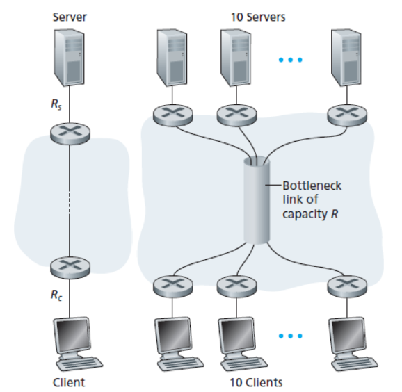
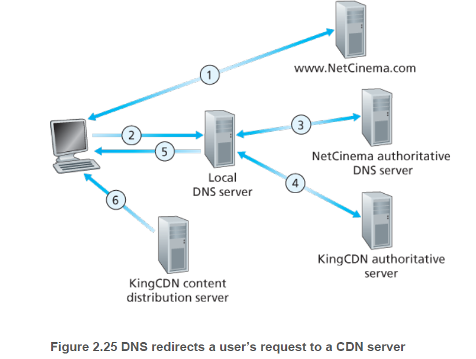
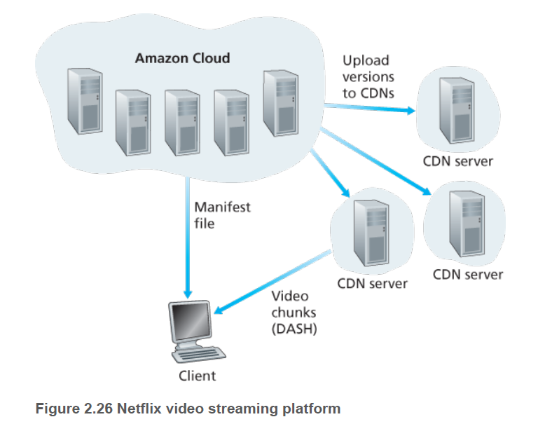

# 비디오 스트리밍과 CDN

- 녹화된 비디오를 스트리밍하면 북미 지역 주거용 ISP의 트래픽의 대부분을 차지
- 예) 넷플릭스와 유튜브 서비스는 2015년도에 주거용 ISP 트래픽이 각각 37%와 16% 사용
- 캐시와 같은 기능을 한느 응용프로그램 수준 프로토콜과 서버를 사용하여 구현

## 인터넷 비디오

- 스트리밍 비디오 어플리케이션에서는 녹화된 비디오가 서버에 저장되어 사용자가 비디오 시청을 **온디맨드(on-demand)**로 요청
- 비디오는 이미지의 연속 (초당 24개 또는 30개의 이미지) → 일정한 속도
- 압축되지 않은 디지털 인코딩된 이미지는 픽셀 단위, 각 픽셀은 여러 비트들로 인코딩
- 하지만 비디오는 **압축될 수 있음**
- 비디오 품질과 비트 전송률은 trade-off
- 오늘날의 상용 압축 알고리즘으로 원하는 모든 비트 전송률로 비디오 압축 가능
- 비디오의 가장 두드러진 특성: 높은 비트 전송률
- 압축된 인터넷 비디오는 고화질 동영상 스트리밍을 위해 100 kbps에서 300kbps 이상으로 구성
- 특히, 4K 스트리밍은 10 Mbps 이상의 비트전송율 → 트래픽 및 스토리지 용량이 엄청나게 필요
- 가장 중요한 성능 척도는 평균 종단간(end-to-end) 처리량
- 연속재생을 위해서 네트워크는 **압축된 비디오의 전송률 이상의 평균 처리량**을 제공해야함
- 압축을 통해 여러 버전의 품질을 만들 수 있음
- 여러 버전의 동영상 중에 사용 가능한 대역폭을 선택하여 보고 싶은 버전 결정 (예, 300 kbps, 1 Mbps, 3 Mbps 등)

---

## HTTP 스트리밍 및 대쉬(DASH)

- HTTP 스트리밍에서 비디오는 HTTP 서버 내의 특정 URL을 갖는 일반적인 파일로 저장
- 비디오 시청을 원하면 TCP 연결을 만들고 해당 URL에 대한 HTTP GET 요청
- 클라이언트 측은 응답 비디오 파일(바이트)을 **애플리케이션 버퍼**에 저장
- 버퍼의 바이트 수가 미리 정해진 임계값을 초과하면 클라이언트 애플리케이션이 재생 시작
- 특히 스트리밍 비디오 애플리케이션은 클라이언트의 버퍼에서 주기적으로 **비디오 프레임**을 가져와 프레임을 압축해제한 다음 사용자 화면에 표시
- →비디오의 후반 부분에 해당하는 프레임을 수신하고 버퍼링할 때 비디오를 표시

### HTTP 기반 스트리밍의 문제점

- 모든 클라이언트들이 그들 사이의 가용 대역폭의 차이에도 불구하고 **똑같이 인코딩된 비디오**를 전송받음
- 이 차이는 서로 다른 클라이언트 뿐만 아니라 동일한 클라이언트에서도 시간에 따른 차이 발생

### 해결책: DASH (Dynamic Adaptive Streaming over HTTP)

- 비디오가 여러 개의 서로 다른 버전으로 인코딩되며, 각 버전은 서로 다른 비트율과 품질 수준
- 클라이언트는 **동적으로** 서로 다른 버전의 비디오를 몇 초 분량의 길이를 가지는 **비디오 조각 단위(chunk)**로 요청
- 가용 대역폭이 충분할 때 → 높은 비트율의 비디오 버전 요청, 적을 때 → 낮은 비트율 버전 요청
- 클라이언트는 HTTP GET 요청으로 **다른 버전의 비디오 조각을 매번 선택**
    - 서로 다른 인터넷 접속회선을 가진 클라이언트들에게 선택할 수 있도록 함
    - 세션 유지 중에 **시간에 따라 변화하는 종단간 가용 대역폭에 적응**할 수 있도록 허용 → 이동 중에 접속하는 기지국의 상황에 따라 자주 변화
- 각 비디오 버전은 HTTP 서버에 서로 다른 URL을 가지고 저장
- 비트율에 따른 각 버전의 URL을 제공하는 **매니패스트(manifest) 파일**
    - 매니패스트 파일 요청 → 서버에서 제공되는 다양한 버전에 대해 알게됨
    - 매번 원하는 버전의 chunk를 선택해서 HTTP GET 메시지에 **URL과 byte-range**를 지정하여 요청
    - chunk를 다운로드하는 동안 수신 대역폭 측정
    - 비트율 결정 알고리즘으로 통해 다음에 선택할 chunk 버전 결정
- DASH는 클라이언트가 **서로 다른 품질 수준을 자유롭게 변화**시킬 수 있도록 한다.

---

## 콘텐츠 분배 네트워크(CDN)

### 단일한 거대 데이터 센터 아키텍처의 문제점

1. 클라이언트가 데이터 센터로부터 지역적으로 먼 지점에 있는 경우, 클라이언트로의 패킷 경로에 많은 다양한 통신 링크와 ISP가 존재

    이들 링크 중 하나라도 비디오 소비율보다 낮은 전송용량을 갖는다면 종단간 처리율이 낮아짐

    

2. 인기 있는 비디오는 같은 통신 링크를 통해 여러 번 반복적으로 전송
    - 네트워크 대역폭 낭비
    - 회선을 제공하는 ISP 들에게 동일한 바이트를 전송하는 것에 대한 중복 비용 지불
3. 한 번의 장애로 전체 서비스가 중단될 수 있음

### 콘텐츠 분배 네트워크

- 다수의 지점에 분산된 서버들을 운영
- 비디오 및 다른 형태의 웹 콘텐츠 데이터의 복사본을 분산 서버에 저장
- 사용자는 최선의 서비스와 UX를 제공할 수 있는 지점의 CDN 서버로 연결
    - 사설 CDN: 콘텐츠 제공자가 소유. ex) 구글의 CDN (유튜브)
    - 제3자가 운영하는 CDN ex) Akamai, Limelight, Level-3
- 서버의 위치에 따른 두 가지 철학
    - **Enter Deep**
        - Akamai에 의해 주창
        - 서버 클러스터를 **세계 곳곳의 접속 네트워크에 구축** → ISP의 접속 네트워크로 깊숙이 들어감
        - 목적: 서버를 최대한 사용자 가까이에 위치시켜 사용자와 CDN 서버 사이의 링크 및 라우터 수를 줄임 → 지연시간 및 처리율을 개선
        - 문제점: 고도로 분산된 설계로 **서버 클러스터 유지 관리 비용**이 커짐
    - **Bring Home**
        - Limelight와 다른 회사들에 의해 적용
        - 보다 적은 수의 핵심 지점에 큰 규모의 서버 클러스터 구축 → ISP를 Home으로 가져옴
        - 접속 ISP에 연결하는 대신, 클러스터를 **인터넷 교환지점 (IXPs)**에 배치
        - 관리 비용이 줄어들지만 사용자가 느끼는 지연시간과 처리율이 나빠짐
- CDN은 클러스터에 대해 **Pull 방식** 사용
    - 사용자가 지역 클러스터에 없는 비디오 요청
    - 해당 비디오를 중앙 서버나 다른 클러스터로부터 전송받아 사용자에게 서비스하는 동시에 복사본을 저장
    - 저장 공간이 가득 차면 자주 사용되지 않는 비디오 데이터는 삭제

### CDN 동작

- 사용자가 웹 브라우저가 URL로 비디오 재생 요청
- CDN이 그 요청을 가로챔
    1. 그 시점에서 클라이언트에게 가장 적당한 CDN 클러스터 선택
    2. 클라이언트의 요청을 해당 클러스터의 서버로 연결
- CDN은 사용자의 요청을 가로채고 다른 곳으로 연결할때 DNS 활용
    - (상황) NetCinema라는 콘텐츠 제공자가 KingCDN이라는 CDN 업체를 이용해 비디오를 분배
    - 각 비디오가 "video"라는 문자열과 고유한 ID를 포함하는 URL 할당
    - 예) 트랜스포머 7비디오는 http://video.netcinema.com/6Y7B23V 라는 URL 할당
        1. 사용자가 NetCinema 웹 페이지 방문
        2. 사용자가 URL을 클릭하면, 사용자의 호스트는 video.netcinema.com에 대한 DNS 쿼리 전송
        3. 사용자의 로컬 DNS 서버는 호스트 이름의 "video" 문자열을 감지하고, 해당 쿼리를 NetCinema의 책임 DNS 서버로 전달. 책임 DNS 서버는 KingCDN의 호스트 이름을 로컬 DNS 서버에 전송
        4. DNS 쿼리가 KingCDN의 사설 DNS 구조로 들어감. 사용자의 로컬 DNS는 KingCDN 호스트 이름에 대한 두 번째 쿼리를 보내고 이는 KingCDN의 DNS에게 IP 주소를 얻음. 이때, 클라이언트가 콘텐츠를 전송받게 될 서버 결정
        5. 로컬 DNS는 콘텐츠를 제공할 CDN 서버의 IP 주소를 사용자 호스트에게 알려줌
        6. 사용자 호스트는 해당 IP 주소로 직접 TCP 연결을 설정하고 비디오에 대한 HTTP GET 요청 전송 (DASH 기술이 적용될 수도 있음)

    

### 클러스터 선택 정책

- 클라이언트를 동적으로 어떤 서버 클러스터 또는 CDN 데이터 센터로 연결하는 방식
- DNS 서비스 과정에서 CDN은  클라이언트의 LDNS (로컬) 서버의 IP 주소를 알게됨
- 해당 IP 주소에 기초해 최선의 클러스터 선택
- 일반적으로 클라이언트의 **지리적으로 가장 가까운 클러스터**를 선택하는 방법이 있다.
- Quova나 Max-Mind와 같은 상용 지리정보 데이터베이스를 이용 → LDNS의 IP 주소가 지리적으로 매핑
- DNS 쿼리가 특정 LDNS로부터 도착 → CDN은 해당 LDNS에서 가장 가까운 클러스터 선택
- 단점
    - 지리적으로 가장 가까운 클러스터가 네트워크 경로의 길이 홉의 수로는 가장 가깝지 않을 수도 있음
    - 일부 사용자는 상당히 멀리 있는 DNS 서버를 LDNS로 사용하도록 설정할 수도 있음 → LDNS 기반이기 때문에 클러스터가 멀리 위치하게 될 수도 있음
    - 인터넷 경로의 지연이나 가용 대역폭의 변화 등은 무시하고 항상 같은 클러스터 할당
- 현재의 네트워크 트래픽 상황을 반영한 최선의 클러스터 선택을 위해 CDN은 주기적으로 클러스터와 클라이언트 간의 지연 및 손실 성능에 대한 **실시간 측정** 수행
    - CDN은 각 클러스터가 ping이나 DNS 쿼리 같은 프로브 메시지를 주기적으로 LDNS들에게 전송하게 할 수도 있음
    - 문제: 많은 LDNS들이 이 메시지에 응답하지 않도록 설정되어 있음

---

## Case Studies: NetFlix, Youtube

### NetFlix

- 두 가지 구성 요소: 아마존 클라우드, 자체 CDN 인프라
- 넷플릭스 웹 사이트는 아마존 서버 안에 있는 아마존 클라우드에서 모든 것이 실행

- 아마존 클라우드의 기능
    - **콘텐츠 수집 (Contents Ingestion)**: 영화를 수집하고 처리. 영화의 스튜디오 마스터 버전을 받아서 아마존 클라우드 시스템의 호스트에 업로드
    - **콘텐츠 처리 (Contetns Processing)**: 다양한 플레이어 기기 사양에 적합하도록 각 영화의 여러 가지 형식의 비디오 생성. DASH를 위해 각 형식별로 다양한 비트율의 버전 생성
    - **CDN으로의 버전 업로드**: 영화에 대한 다양한 버전이 생성되면 아마존 클라우드 시스템의 호스트는 이들 버전을 CDN으로 업로드
- 자체 프라이빗 클라우드 구축 (CDN 인프라)
    - [IXP](https://ko.wikipedia.org/wiki/%EC%9D%B8%ED%84%B0%EB%84%B7_%EC%9D%B5%EC%8A%A4%EC%B2%B4%EC%9D%B8%EC%A7%80_%ED%8F%AC%EC%9D%B8%ED%8A%B8) 및 거주용 ISP 자체에서 서버 랙 설치
    - 현재 IXP 위치에 50대 이상의 서버 랙
    - 서버 랙을 수용하는 수백 개의 ISP 장소 보유
    - 각 랙 서버에는 10 Gbps 이더넷 포트와 100 TB 이상의 스토리지 보유
    - IXP 설치에 수십 개의 서버와 DASH를 지원하는 여러 버전의 비디오를 포함한 전체 스트리밍 비디오 라이브러리 포함
    - 로컬 IXP는 하나의 서버만 가짐 → 가장 인기 있는 비디오만 포함
- Pull-caching을 사용해 IXP 및 ISP의 CDN 서버를 채움
- 사용량이 적은 시간에 비디오를 CDN 서버에 푸시하여 배포
- 사용자가 웹 사이트에서 비디오 라이브러리를 탐색하는 절차
    - 아마존 클라우드 서버 제공
    1. 사용자가 재생할 영화 선택
    2. 아마존 클라우드에서 실행 중인 넷플릭스 소프트웨어가 해당 영화 사본을 가지고 있는 CDN 결정
        - 클라이언트가 해당 ISP에 설치된 CDN 서버랙에 있는 로컬 ISP를 사용하고 있고, 이 랙에 요청된 사본이 있는 경우 일반적으로 이 랙 서버가 선택
        - 그렇지 않으면 근처에 잇는 IXP 서버 선택
    3. 클라이언트는 요청된 영화의 다른 버전에 대한 URL을 가진 매니페스트 파일과 특정 서버의 IP 주소를 보냄
    4. 클라이언트와 해당 CDN 서버는 독점 버전의 DASH를 이용하여 직접 상호 작용
- 대략 4초 분량의 비디오 조각 단위 데이터 사용
- 비디오만 배포하는 자체 CDN 사용 → CDN 디자인을 단순화하고 조정
    - 특정 클라이언트를 CDN 서버에 연결하기 위해 DNS 리디렉션 사용할 필요 x
    - 넷플릭스 소프트웨어는 클라이언트에게 **특정 CDN 서버를 사용하도록 알려준다.**
    - 풀 캐싱을 사용하지 않고 **Push-Cashing**을 사용한다.
    - 캐시 미스 중에 동적으로 사용되는 것이 아니라 사용량이 적은 시간 중 예약된 시간에 서버에 푸쉬

### Youtube

- 비디오의 분배에 CDN을 적극 활용
- 자체 비공개 CDN 사용 → 유튜브 동영상 배포
- 수백 가지의 서로 다른 IXP 및 ISP 위치에 서버 클러스터 설치 → 이 위치에서 거대한 데이터 센터가 직접 동영상 배포
- 사용자를 특정 서버 클러스터와 연결하는 데  DNS 사용
- 클러스터 선택 정책: 클라이언트 ~ 클러스터 간의 RTT가 가장 적은 곳
- 때로는 균형 있는 로드 밸런싱을 위해 멀리 있는 클러스터에 연결되기도 함
- HTTP 스트리밍
    - DASH가 아닌 사용자가 스스로 버전을 선택하게 함
    - 재생위치 조정과 조기 종료로 인한 대역폭과 서버 자원 낭비 → HTTP byte-range 헤더를 이용해 목표한 분량의 선인출 데이터 이후에 추가로 전송되는 데이터 흐름 제한
    - 사용자로부터 서버로의 비디오 업로드에도 HTTP 스트리밍 사용

### 구글의 네트워크 인프라

- 광범위한 클라우드 서비스 제공 → 막대한 private network과 CDN 운용
- 구글의 CDN 인프라는 3 계층의 서버 클러스터로 구성
    - 14개의 "메가 데이터 센터": 8개[미국], 4개[유럽], 2개[아시아]
        - 메가 데이터 센터는 수십만 개의 서버로 구성
        - 검색 결과, 지메일 메시지 등과 같은 동적이고 개인화된 콘텐츠에 대한 서비스 제공
    - 약 50개의 IXP
        - 각각 100~500개의 bring-home 클러스터를 갖고 세계 전역에 흩어져 있음
        - 유튜브 비디오와 같은 정적인 콘텐츠에 대한 서비스 제공
    - 수백 개의 "enter-deep" 클러스터
        - 접속 ISP 내에 위치
        - 수십 개의 단일 랙 서버로 구성
        - TCP 분할 및 검색 결과를 담은 웹 페이지 등 정적인 콘텐츠를 서비스
- 모든 데이터 센터 및 클러스터 지점들은 구글의 사설망을 통해 상호 연동
- 상세
    - 지역 ISP를 통해 enter-deep 클러스터로 보내짐
    - 정적인 콘텐츠에 대한 서비스는 enter-deep 클러스터 캐시에서 클라이언트로 전송

         질의어는 구글의 사설망을 통해 메가 데이터 센터로 보내져 개인화된 검색 결과 등은 데이터 센터로부터 서비스

    - 유튜브 비디오의 경우, 비디오 자체는 bring-home 클러스터 캐시에서 서비스

         관련된 웹 페이지 부분은 가까운 enter-deep 클러스터 캐시로부터, 비디오 관련 광고는 메가 데이터 센터로부터 서비