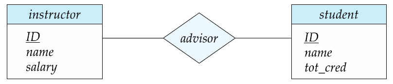

데이터베이스 응용 프로그램을 설계할 때, 응용 프로그램의 완벽한 데이터 요구조건을 이해할 수는 없다. 데이터베이스 설계자는 요구조건을 알아내기 위해 

- 응용 프로그램의 사용자들과 상호 작용한다.
- 그 사용자가 이해할 수 있도록 high-level 표현 방식으로 나타낸다.
- 요구조건을 설계의 하위 단계에 알맞게 변형한다.

 그리고 상위 데이터 모델은

- 어떤 것을 체계적으로 기술할 것인가
- 데이터베이스 사용자가 원하는 데이터가 어떤 것인가
- 이런 요구조건을 만족시키기 위해 데이터베이스가 어떻게 구성될 것인가

에 대한 개념적인 골격을 제공하여 데이터베이스 설계자들에게 도움을 준다.

## 데이터베이스 설계 절차

### 초기 단계

 미래 데이터베이스 이용자들이 필요로 하는 데이터를 충분하게 규정한다. → 그 분야의 전문가 및 사용자들과 광범위하게 상호 작용해야 한다.

 이 단계의 결과물로 **사용자 요구 명세서(specification of user requirements)**가 있다.

### 데이터 모델 선택 및 개념적 설계

 데이터 모델을 선택하고, 선택한 데이터 모델의 개념을 적용해서 이 요구들을 데이터베이스의 개념적인 스키마로 바꾼다.

 데이터 모델의 예시로 ER 모델이 있다. 이 단계의 결과물인 스키마로 기업의 상세한 overview를 제공한다. 데이터베이스의 모든 개체 집합, 개체의 속성들, 개체들 간의 관계, 개체와 관계에 대한 제약조건을 명시한다.

 또한 완전히 개발된 개념적 스키마는 실세계의 기능적인 요구사항을 보여준다. **기능적 요구사항 명세서(specification of functional requirement)** 에는 데이터에 적용될 연산(혹은 트랜잭션)들의 종류가 기술된다.

 위의 추상적 데이터 모델로부터 아래 두 단계를 걸쳐 실제 데이터베이스로 구현된다.

### 논리 설계 단계

개념적 스키마 → 데이터베이스 구현 데이터 모델 (관계형 스키마)

일반적으로, 구현 모델은 관계형 데이터 모델.  

### 물리 설계 단계

 논리 설계의 결과로 나온 데이터베이스 스키마를 물리적 속성들이 구체화 되도록 **물리 설계 단계(physical-design phase)**를 거친다.

 이런 속성들의 예로, **파일 구성(file organization) 형식**과 **인덱스 구조에 대한 형식**들이 있다.

---

# 개체 관계 모델 (Entity-Relationship Model)

 E-R 데이터 모델은 개체 집합, 관계 집합, 속성의 3가지 기본 개념을 가지며 E-R 다이어그램이라는 표현 방식도 갖는다.

## 개체 집합

 **개체(entity)**: 실세계에서 다른 모든 객체와 구별되는 유, 무형의 사물

 예) 대학에서 각 개인은 하나의 개체

 개체는 속성들의 집합을 가지며 속성들 중 일부 집합은 개체를 고유하게 구별한다. 개체는 구체적인 것일 수도 추상적인 것일 수도 있다.

 **개체 집합(entity set)**: 같은 속성을 공유하는 같은 유형의 개체들의 집합

 예) 어느 대학의 교수인 사람들의 집합을 개체 집합 instructor로 정의.

 **속성(attribute)**: 각 개체 집합의 각 구성원들이 가지는 기술적 특성

 각 개체는 속성들 각각에 대하여 **값(value)**를 가진다.

### ER Diagram

- **엔터티 집합**을 직사각형으로 표현
- 직사각형 내의 리스트된 **속성**
- **primary key 속성**을 나타내는 밑줄

## 관계 집합

**관계(relationship)**: 여러 개체들 사이의 연관성

**관계 집합(relationship set)**: 2개 이상의 엔터티 집합끼리의 수학적 관계

$\{(e_1, e_2,...,e_n)|e_1 \in E_1,e_2 \in E_2, ...,e_n \in E_n\}$ 에서 $(e_1,e_2,...,e_n)$는 관계

예) instructor와 student 개체 집합간의 **관계 집합 advisor**를 정의한다.

 ER Diagram에서 다이아몬드로 관계 집합을 표현할 수 있다.

관계 집합과 관련된 속성이 있을 수도 있다. advisor과 관련된 속성 date를 표시하

ER Diagram에서는 다음과 같다.

 

### 역할

 관계에서 엔터티 집합은 분리될 필요가 없다. 관계에서 엔터티 집합은 각각 어떠한 "역할"을 한다.

아래에서 course_id와 prereq_id가 역할을 의미한다.

### 차수

- 이진 관계 집합 (Binary relationship)

     어떤 하나의 관계 집합에 정확히 두 개의 엔터티 집합이 참여한다. 데이터베이스 내의 대부분의 관계는 이진 관계이다.

- 삼진 관계 집합 (Ternary relationship)

     대부분은 이진 관계이지만 비-이진관계로 표현할 때 편한 경우가 있다.

## 속성

  속성의 타입은 다음과 같이 구분된다.

- 단순 Simple / 복합 Composite 속성

    단순 속성은 더 이상 작은 단위로 나누어지지 않는 속성

    복합 속성은 더 작은 단위(다른 속성)로 나누어질 수 있는 속성

    

- 단일값 Single-valued / 다중값 multi-valued 속성

    단일값 속성은 특정 개체에 대하여 하나의 값만을 갖는 속성

    다중값 속성은 특정 개체에 대하여 속성이 값들의 집합을 갖는 경우

- 유도된 Derived 속성: 다른 속성들로부터 계산될 수 있는 속성

 도메인: 각 속성에 대해서 허용된 값들의 집합

 집합의 속성은 개체 집합에서 도메인으로 대응하는 함수이다.

---

# 제약조건

## 대응수(Mapping Cardinality)

- 관계 집합을 통해서 다른 개체와 관련될 수 있는 개체의 수를 나타낸다.
- 이진 관계 집합을 나타낼 때 가장 유용하다.
- 이진 관계 집합 R에 대해서 대응수는 다음 중 하나여야 한다.

    ER 다이어그램에서 "one"에 해당하는 관계는 화살표로, "many"에 해당하는 관계는 방향이 없는 선으로 표현한다.

    - 일대일

        

        - 하나의 학생은 최대 하나의 교수와 advisor 관계를 맺을 수 있고,
        - 하나의 교수도 최대 하나의 학생과 관계를 맺을 수 있다.
    - 일대다

        

        - 하나의 교수는 여러 명의 학생과 관계를 맺을 수 있고,
        - 하나의 학생은 최대 하나의 교수와 관계를 맺을 수 있다.

        

    - 다대일

        

        - 하나의 교수는 최대 한명의 학생과 관계를 맺을 수 있다.
        - 하나의 학생은 여러 명의 교수와 관계를 맺을 수 있다.
    - 다대다

        

        - 하나의 교수는 여러 명의 학생과 관계를 맺을 수 있다.
        - 하나의 학생은 여러 명의 교수와 관계를 맺을 수 있다.

        

## 참가 제약조건(Participation Constraints)

- **Total Participation(전체적 참가)**: 엔터티 집합의 모든 엔터티가 적어도 관계 집합의 하나의 관계에 참가한다.
- **Partial Participation(부분적 참가)**: 어떤 엔터티들은 관계 집합 내의 어떤 관계에도 참가하지 않을 수도 있다.

  예) student의 모든 개체는 적어도 한 명의 교수와 연결된다. (전체; ERD에 double line으로 표시)

 교수가 반드시 학생을 지도할 필요는 없으므로 오직 일부분만이 student 개체와 연결된다. (부분)

## 더 복잡한 제약 조건의 표기법

 관계를 나타내는 선에 최소 ~ 최대 대응수를 표기할 수 있다.

- total participation의 최소 대응수는 1이다.
- 최대 대응수 값이 1인 것은 엔터티가 최대 하나의 관계에만 참가한다는 의미이다.
- 최대 값이 *인 것은 한계가 없다는 의미이다.

예) instructor 개체 집합은 0명 이상의 student와 연결될 수 있다.

student 개체 집합은 오직 하나의 관계만 instructor의 개체들과 연결될 수 있다.

## 삼진 관계에서의 대응수 제약조건

- 삼진 관계에서는 대응수 제약조건을 나타내기 위해 최대 하나의 화살표를 허용한다.
- 예를들어, proj_guide에서 instructor로의 화살표는 각 학생이 어떤 프로젝트의 지도자로서 딱 한명의 교수를 가질 수 있다는 의미이다.

- 만약 화살표가 하나 이상이 있다면, 해석하는 두 가지 방법이 있다.
    - 예) 엔터티 집합 A, B, C와 그들간의 삼진 관계 R에서 B와 C로의 화살표 관계가 있다고 하자.
        1. 각 A 엔터티는 B와 C의 유일한 엔터티와 연관된다.
        2. (A, B)의 각 엔터티 쌍은 C의 유일한 엔터티와 연결되고, 각 (A,C) 쌍은 유일한 B와 연결된다.
    - 혼동을 피하기 위해 관계 집합에서 나가는 화살표는 **딱 하나만 허용**한다.

---

## 주 키(Primary Key)

 주 키는 엔터티와 관계 집합 내에서 각 엔터티나 관계들을 서로 구별하는 방법을 제공해준다.

### 엔터티 집합 내에서의 주 키

- 엔터티의 정의에서, 각 엔터티들은 구분된다.
- 데이터베이스 관점에서, 그들의 차이점은 속성이라는 측면에서 분명히 드러나야 한다.
- 엔터티의 속성 값의 값은 엔터티를 유일하게 식별하는 그런 것이어야 한다.
- 엔터티 집합의 어떤 두 개의 엔터티도 모든 속성들에 대해 정확히 같은 값을 갖도록 하지 않는다.
- 즉, 엔터티의 키란 **엔터티들을 서로 충분히 구분하는 속성 집합**이다.

### 관계 집합 내에서의 주 키

- 관계 집합에서 관계들을 구분하기 위해 관계 집합에 참여하는 엔터티의 각 주 키를 사용할 수 있다.
    - R을 관계 집합이라 하고 엔터티 집합 E1, E2, ..., En을 포함한다고 하자.
    - R의 주 키는 엔터티 집합 E1, E2, ..., En의 조합으로 구성된다.
    - 만약 관계 집합 R이 그와 관련된 속성 a1, a2, ...am을 갖는다면, R의 주 키는 속성 a1, a2, ..., am을 포함한다.
- 예) 관계 집합 "advisor"
    - 주 키는 instructor의 ID와 student의 ID로 구성된다.
- 관계 집합에서 주 키의 선택은 관계 집합의 대응수에 의존한다.

### 이진 관계에서 주 키의 선택 (연관 관계의 주인)

- **다대다 관계**: 참여하는 엔터티 집합 각각의 주 키의 합집합이 최소 슈퍼키이고 주 키로 선택된다.
- **일대다 관계**: "다" 쪽의 주 키가 최소 슈퍼키이고 곧 주 키로 사용된다.
- **다대일 관계**: "다" 쪽의 주 키가 최소 슈퍼키이고 곧 주 키로 사용된다.
- **일대일 관계**: 두 쪽 모두 주 키가 최소 슈퍼키가 될 수 있고, 두 쪽 모두 주 키로 사용될 수 있다.

### 약성 개체 집합 (Weak Entity Sets)

 대학 데이터베이스 시스템에서 section(분반)이라는 개체 집합을 예로 든다.

- 분반은 course_id(강의id), semester(학기), year(연도), sec_id(분반id)로 구별된다.
- 분반 개체들은 강의 개체들과 관계가 있다. 이러한 관계 집합 sec_course를 만든다고 가정한다.
- 분반은 이미 course_id 속성을 갖고 있기 때문에, sec_course의 정보들은 중복된다.
    1. 이 중복성을 해결하기 위해 관계 sec_course를 없애는 방법이 있다. 하지만 이럴 경우, 분반과 강의의 관계가 속성 내에서 암시적인 모습으로만 나타나고, 올바른 결과가 아니다.
    2. 분반 엔터티에 course_id를 저장하지 않음으로써 해결할 수 있다. 오직 남아있는 section_id, year, semester만 저장한다. → section 개체 집합이 어떤 특정 section 개체를 유일하게 식별할 수 있는 속성들을 충분히 갖고 있는 상태가 아니게 된다.
- sec_course 관계를, section 개체들을 유일하게 식별하는 데 요구되는 추가의 정보를 제공하는 특별한 관계로 간주한다. → **약성 개체 집합** (weak entity set)

즉, 주 키를 형성하기 위한 충분한 속성들을 지니고 있지 않는 개체 집합을 **약성 개체 집합**,

주 키를 가지고 있는 개체 집합을 강성 **개체 집합(strong entity set)**이라고 부른다.

- 모든 약성 개체는 식별 개체와 연관된다; 즉 약성 개체는 식별 개체 집합에 **존재 종속적**이다.
- 식별 개체 집합은 약성 개체 집합을 **소유한다**고 할 수 있다.
- 약성 개체 집합과 식별 개체 집합을 연관짓는 관계는 **식별 관계(identifying relationship)**라 한다.
- 식별 관계는 약성 관계 집합으로부터 식별 관계 집합으로의 다대일이고, 그 관계에서의 약성 관계 집합의 참가는 전체적이다.

     예) section에 대한 식별 개체 집합은 course이고, section 개체들을 상응하는 course 개체들에 연관짓는 sec_course 관계는 식별 관계이다.

- 약성 개체 집합이 주 키를 갖지 않지만, 그럼에도 불구하고 특정 강 개체에 종속하는 약성 개체 집합 내의 모든 개체들을 서로 구별할 수 있는 방법이 필요하다. → 약성 개체 집합의 **구별자 (discriminator)**

     예) 약성 개체 집합 section의 구별자는 sec_id, year, semester 속성들로 이루어진다.

- 약성 개체 집합의 구별자는 개체 집합의 **부분 키(partial key)**라고 불린다.
- 약성 개체 집합의 주 키는 식별 개체 집합의 주 키와 약성 개체 집합의 구별자를 합하여 만들 수 있다.

     예) section 개체 집합의 경우에 주 키는 { course_id, sec_id, year, semester } 이다.

ERD는 다음과 같이 나타낸다.

---

# 개체 집합에서의 중복된 속성 제거

 두 개의 개체 집합을 가정한다:

- student: { ID, name, tot_cred, dept_name }
- department: {dept_name, building, budget }

 student와 department를 연결하는 stud_dept 관계 집합을 이용하여 각각의 학생은 하나의 연관된 부서를 가져야 한다는 사실을 모델링한다.

 그러면 dept_name 속성은 두 개체 집합에 동시에 나타난다. 이 속성은 department 개체 집합에 대한 주 키이기 때문에 student 개체 집합에서는 중복되어 있으며, 따라서 제거될 필요가 있다.

## 대학 데이터베이스 전체 ERD

 개념적 설계가 끝난 모습이다.

---

# 릴레이션 스키마로의 축소

 

 엔터티 집합과 관계 집합은 일관된 방식인 **릴레이션 스키마**로 표현 가능하다. 릴레이션 스키마는 데이터베이스의 내용(요소)를 표현한다.

 즉, 데이터베이스 디자인의 각각의 개체 집합과 각각의 관계 집합을 위해 개체 집합이나 관계 집합의 이름을 붙인 고유한 릴레이션 스키마가 존재한다. 

 ER 모델과 관계형 데이터베이스는 둘 다  실세계의 추상적이고 논리적인 표현이다. 두 가지 모델이 서로 비슷한 설계 원리를 지니므로, E-R 설계를 관계형 설계로 바꿀 수 있다. 각각의 스키마는 수많은 컬럼들을 가지고 그 컬럼의 이름은 유일하다.

## 엔터티 집합 표현

### 단순 속성들을 지닌 강성 엔터티 집합 표현

 강성 개체인 student 개체 집합을 생각한다.

E라는 강성 개체 집합은 같은 개수의 속성들을 지닌 E라는 이름의 스키마로 표현할 수 있다.

즉, student 개체 집합은 *student(ID, name, tot_cred)* 라는 릴레이션 스키마로 표현된다.

다른 예)

- *classroom(building, room_number, capacity)*
- *department(dept_name, building, budget)*
- *course (course_id, title, credits)*
- *instructor (ID, name, salary)*
- *student (ID, name, tot_cred)*

### 약성 개체 집합의 표현

 A를 a1, a2, ..., am의 속성들을 가지는 약성 개체 집합이라 하고, B는 A가 의존하는 강성 개체 집합이라 하자. B의 주 키(primary key)가 b1, b2, ..., bn의 속성들로 이루어져 있다면 개체 집합 A는 다음 속성들에 하나씩 대응하는 컬럼들을 가진 A라는 릴레이션 스키마로 표현된다.

$\{ a_1,a_2,...,a_m\} \cup \{b_1,b_2,...,b_n\}$

 다시 말해서, 관계 집합의 모든 주 키와 약성 개체의 모든 속성들을 합친 속성들을 컬럼으로 나타낸 것이다.

즉, section과 course의 예에서 section은 다음과 같이 표현된다.

*section ( course_id, sec_id, semester, year)*

### 복합 속성을 지닌 강성 개체 집합의 표현

- 복합 속성 name에 대해 instructor를 위해 생성된 스키마는 first_name, middle_name, last_name 속성들을 가진다.
- 복합 속성 address에 대해 생성된 스키마는 street, city, state, zip_code를 가진다.
- street는 또 다시 street_number, street_name, apt_number로 대체된다.

이들을 고려하여 설계된 릴레이션 스키마는 다음과 같다. 다중값 속성은 포함되지 않는다.

 *instructor (ID, first_name, middle_name, last_name, street_number, street_name, apt_number, city, state, zip_code, date_of_birth)*

- 다중값 속성인 M을 위해서는 테이블 관계형 스키마 R을 만들어 주는데, R에서는 M에 대응하는 속성 A와 M이 속성으로 존재하는 개체 집합이나 관계 집합의 주 키에 대응하는 속성들을 가지게 된다.

 다중값 속성인 phone_number를 위한 릴레이션 스키마는 다음과 같다.

 *instructor_phone (ID, phone_number)*

## 관계 집합의 표현

 

 관계 집합에 대한 주 키를 선택하는 방법은 다음과 같았다.

- 이진 다대다 관계에서는 개체 집합에 참여하는 속성들 중에서 주 키의 합집합이 주 키가 된다.
- 이진 일대일 관계 집합에서는 한 쪽의 개체 집합의 주 키가 주 키로 선택된다. 이때 선택은 임의로 행해진다.
- 이진 다대일이나 일대다 관계 집합에서는 관계 집합의 "다(many)"인 부분의 개체 집합 주 키가 주 키로 제공된다.
- 간선에 어떤 화살표도 없는 n항 관계 집합에서는 참여하는 모든 개체 집합들의 주 키 속성들의 합집합이 주 키가 된다.
- 간선에 화살표가 있는 n항 관계 집합에서는 관계 집합에서 "화살표"가 없는 부분의 개체 집합의 주 키가 스키마의 주 키로 제공된다. 릴레이션 관계 밖으로는 오직 한 개의 화살표만 허용된다.

 예) 관계 집합 advisor를 위한 릴레이션 스키마:

*advisor(s_id, i_id)*

 advisor 관계 집합에서 student는 instructor로의 다대일 관계이기 때문에 advisor 스키마의 주 키는 s_id이다. 

 나머지 예들,

- *teaches (ID, course_id, sec_id, semester, year)*
- *takes (ID, course_id, sec_id, semester, year, grade)*
- *prereq (course_id, prereq_id)*
- *sec_course (course_id, sec_id, semester, year)*
- *sec_time_slot (course_id, sec_id, semester, year, time_slot_id)*
- *sec_class (course_id, sec_id, semester, year, building, room_number)*
- *inst_dept (ID, dept_name)*
- *stud_dept (ID, dept_name)*
- *course_dept (course_id, dept_name)*

### 스키마의 중복성

 약성 개체 집합과 그에 대응하는 강성 개체 집합을 연결하는 관계 집합은 특별하다.

 이 관계는 다대일 관계에 있고 설명 속성들을 갖지 않는다. 그리고 약성 개체 집합의 주 키는 강성 개체 집합의 주 키를 포함한다.

 예) 약성 개체 집합 section은 강성 개체 집합인 coruse에 sec_course라는 관계 집합으로 의존한다.

- section의 주 키는 { course_id, sec_id, semester, year }이고,
- course의 주 키는 { course_id } 이다.
- sec_course는 설명 속성을 가지지 않으므로 sec_course 스키마는 course_id, sec_id, semester, year 속성들을 가진다.

 sec_course 릴레이션의 모든 (course_id, sec_id, semester, year)의 조합은 section 스키마에 대한 릴레이션에도 존재하고,  그 역도 성립한다. 그러므로 sec_course 테이블은 불필요하게 중복되었다.

 일반적으로 약성 개체 집합을 그에 대응하는 강성 집합에 연결하는 **관계 집합을 위한 테이블은** 중복된 것이고, **테이블 표현에서 보일 필요가 없다.**

### 스키마의 조합

 개체 집합 A에서 개체 집합 B로 가는 다대일 관계 집합 AB를 생각하자.

 관계형 스키마 구축 알고리즘을 이용하면 A, B, AB의 3개의 스키마를 얻을 수 있다. **A가 관계 AB에 전체적으로 참가**한다고 가정하자. 즉, 개체 집합 A의 모든 개체 a는 관계 AB에 참가한다. 

 그러면 **스키마 A와 스키마 AB를 조합하여 두 스키마의 열들의 합집합으로 구성되는 하나의 스키마**를 만들 수 있다. 조합된 스키마의 주 키는 관계 집합 스키마가 통합되어 이루어진 그 스키마의 개체 집합의 주 키이다.

- inst_dept (AB), instructor (A), department (B)

    inst_dept 스키마는 instructor 스키마와 조합될 수 있다. instructor 스키마는 
    *{ ID, name, dept_name, salary }* 속성으로 이루어진다.

- stud_dept (AB), student (A), department (B)

    stud_dept 스키마는 student 스키마와 조합될 수 있다. 결과로 생성되는 student 스키마는 
    *{ ID, name, dept_name, tot_cred }* 속성으로 이루어진다.

 일대일 관계의 경우에도 관계 집합에 대한 릴레이션 스키마가 개체 집합의 한쪽의 스키마와 결합될 수 있다.

 참여가 부분적일지라도 null 값을 사용하여 스키마를 조합할 수도 있다. 다대일/일대다의 경우에도 마찬가지다. inst_dept가 만약 부분적이었다면, 연관된 부서가 없는 교수들에 대한 dept_name 속성에 대해 null 값을 저장한다.

 외래 키 제약조건에 대해 생각해보자.

 관계 집합에 참여하는 각각의 개체 집합들을 참조하는 외래 키 제약조건이 있었을 것이다. 릴레이션 집합 스키마가 합쳐지는 스키마의 개체 집합을 참조하는 제약조건을 삭제하고 조합된 스키마에 다른 외래 키 제약조건을 추가한다.

 예) inst_dept는 department 릴레이션을 참조하는 dept_name 속성의 외래 키 제약조건을 가지고 있다.이 외래 키 제약조건은 inst_dept에 대한 스키마가 instructor로 합쳐질 때 instructor 릴레이션에 추가된다.

---