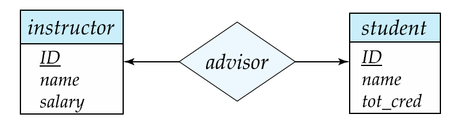

데이터베이스 응용 프로그램을 설계할 때, 응용 프로그램의 완벽한 데이터 요구조건을 이해할 수는 없다. 데이터베이스 설계자는 요구조건을 알아내기 위해 

- 응용 프로그램의 사용자들과 상호 작용한다.
- 그 사용자가 이해할 수 있도록 high-level 표현 방식으로 나타낸다.
- 요구조건을 설계의 하위 단계에 알맞게 변형한다.

 그리고 상위 데이터 모델은

- 어떤 것을 체계적으로 기술할 것인가
- 데이터베이스 사용자가 원하는 데이터가 어떤 것인가
- 이런 요구조건을 만족시키기 위해 데이터베이스가 어떻게 구성될 것인가

에 대한 개념적인 골격을 제공하여 데이터베이스 설계자들에게 도움을 준다.

## 데이터베이스 설계 절차

### 초기 단계

 미래 데이터베이스 이용자들이 필요로 하는 데이터를 충분하게 규정한다. → 그 분야의 전문가 및 사용자들과 광범위하게 상호 작용해야 한다.

 이 단계의 결과물로 **사용자 요구 명세서(specification of user requirements)**가 있다.

### 데이터 모델 선택 및 개념적 설계

 데이터 모델을 선택하고, 선택한 데이터 모델의 개념을 적용해서 이 요구들을 데이터베이스의 개념적인 스키마로 바꾼다.

 데이터 모델의 예시로 ER 모델이 있다. 이 단계의 결과물인 스키마로 기업의 상세한 overview를 제공한다. 데이터베이스의 모든 개체 집합, 개체의 속성들, 개체들 간의 관계, 개체와 관계에 대한 제약조건을 명시한다.

 또한 완전히 개발된 개념적 스키마는 실세계의 기능적인 요구사항을 보여준다. **기능적 요구사항 명세서(specification of functional requirement)** 에는 데이터에 적용될 연산(혹은 트랜잭션)들의 종류가 기술된다.

 위의 추상적 데이터 모델로부터 아래 두 단계를 걸쳐 실제 데이터베이스로 구현된다.

### 논리 설계 단계

개념적 스키마 → 데이터베이스 구현 데이터 모델 (관계형 스키마)

일반적으로, 구현 모델은 관계형 데이터 모델.  

### 물리 설계 단계

 논리 설계의 결과로 나온 데이터베이스 스키마를 물리적 속성들이 구체화 되도록 **물리 설계 단계(physical-design phase)**를 거친다.

 이런 속성들의 예로, **파일 구성(file organization) 형식**과 **인덱스 구조에 대한 형식**들이 있다.

---

# 개체 관계 모델 (Entity-Relationship Model)

 E-R 데이터 모델은 개체 집합, 관계 집합, 속성의 3가지 기본 개념을 가지며 E-R 다이어그램이라는 표현 방식도 갖는다.

## 개체 집합

 **개체(entity)**: 실세계에서 다른 모든 객체와 구별되는 유, 무형의 사물

 예) 대학에서 각 개인은 하나의 개체

 개체는 속성들의 집합을 가지며 속성들 중 일부 집합은 개체를 고유하게 구별한다. 개체는 구체적인 것일 수도 추상적인 것일 수도 있다.

 **개체 집합(entity set)**: 같은 속성을 공유하는 같은 유형의 개체들의 집합

 예) 어느 대학의 교수인 사람들의 집합을 개체 집합 instructor로 정의.

 **속성(attribute)**: 각 개체 집합의 각 구성원들이 가지는 기술적 특성

 각 개체는 속성들 각각에 대하여 **값(value)**를 가진다.

### ER Diagram

- **엔터티 집합**을 직사각형으로 표현
- 직사각형 내의 리스트된 **속성**
- **primary key 속성**을 나타내는 밑줄

## 관계 집합

**관계(relationship)**: 여러 개체들 사이의 연관성

**관계 집합(relationship set)**: 2개 이상의 엔터티 집합끼리의 수학적 관계

$\{(e_1, e_2,...,e_n)|e_1 \in E_1,e_2 \in E_2, ...,e_n \in E_n\}$ 에서 $(e_1,e_2,...,e_n)$는 관계

예) instructor와 student 개체 집합간의 **관계 집합 advisor**를 정의한다.

 ER Diagram에서 다이아몬드로 관계 집합을 표현할 수 있다.

관계 집합과 관련된 속성이 있을 수도 있다. advisor과 관련된 속성 date를 표시하

ER Diagram에서는 다음과 같다.

 

### 역할

 관계에서 엔터티 집합은 분리될 필요가 없다. 관계에서 엔터티 집합은 각각 어떠한 "역할"을 한다.

아래에서 course_id와 prereq_id가 역할을 의미한다.

### 차수

- 이진 관계 집합 (Binary relationship)

     어떤 하나의 관계 집합에 정확히 두 개의 엔터티 집합이 참여한다. 데이터베이스 내의 대부분의 관계는 이진 관계이다.

- 삼진 관계 집합 (Ternary relationship)

     대부분은 이진 관계이지만 비-이진관계로 표현할 때 편한 경우가 있다.

## 속성

  속성의 타입은 다음과 같이 구분된다.

- 단순 Simple / 복합 Composite 속성

    단순 속성은 더 이상 작은 단위로 나누어지지 않는 속성

    복합 속성은 더 작은 단위(다른 속성)로 나누어질 수 있는 속성

    

- 단일값 Single-valued / 다중값 multi-valued 속성

    단일값 속성은 특정 개체에 대하여 하나의 값만을 갖는 속성

    다중값 속성은 특정 개체에 대하여 속성이 값들의 집합을 갖는 경우

- 유도된 Derived 속성: 다른 속성들로부터 계산될 수 있는 속성

 도메인: 각 속성에 대해서 허용된 값들의 집합

 집합의 속성은 개체 집합에서 도메인으로 대응하는 함수이다.

---

# 제약조건

## 대응수(Mapping Cardinality)

- 관계 집합을 통해서 다른 개체와 관련될 수 있는 개체의 수를 나타낸다.
- 이진 관계 집합을 나타낼 때 가장 유용하다.
- 이진 관계 집합 R에 대해서 대응수는 다음 중 하나여야 한다.

    ER 다이어그램에서 "one"에 해당하는 관계는 화살표로, "many"에 해당하는 관계는 방향이 없는 선으로 표현한다.

    - 일대일

        

        - 하나의 학생은 최대 하나의 교수와 advisor 관계를 맺을 수 있고,
        - 하나의 교수도 최대 하나의 학생과 관계를 맺을 수 있다.
    - 일대다

        

        - 하나의 교수는 여러 명의 학생과 관계를 맺을 수 있고,
        - 하나의 학생은 최대 하나의 교수와 관계를 맺을 수 있다.

        

    - 다대일

        

        - 하나의 교수는 최대 한명의 학생과 관계를 맺을 수 있다.
        - 하나의 학생은 여러 명의 교수와 관계를 맺을 수 있다.
    - 다대다

        

        - 하나의 교수는 여러 명의 학생과 관계를 맺을 수 있다.
        - 하나의 학생은 여러 명의 교수와 관계를 맺을 수 있다.

        

    ## 참가 제약조건(Participation Constraints)