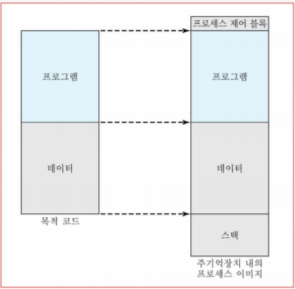
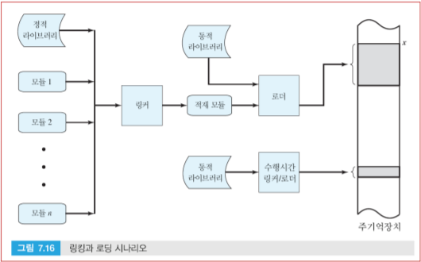
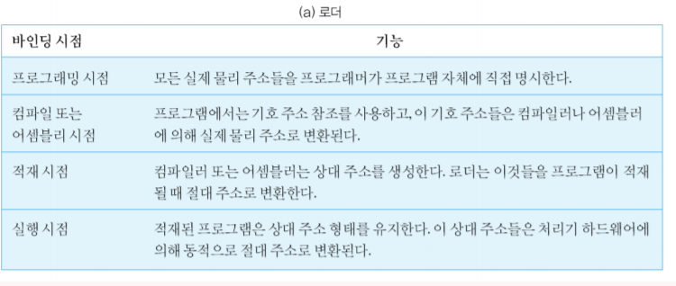
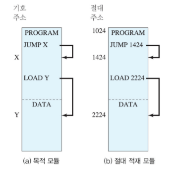
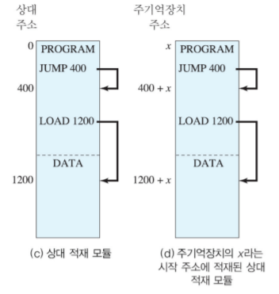
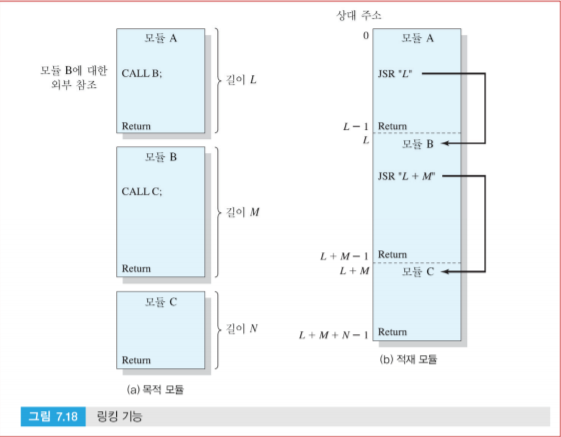
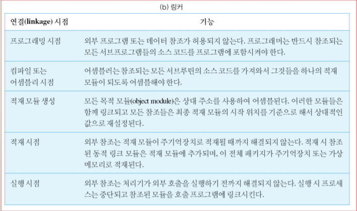

# Overview

 활성 프로세스를 생성하는 첫 단계는 프로그램을 메인 메모리로 적재하고 프로세스 이미지를 만드는 것이다. 응용 프로그램은 목적 코드 형태로 존재하면 **컴파일 또는 어셈블 된 다수의 모듈**로 구성된다. 이 모듈들은 모듈 상호 참조를 해결할 수 있도록 링크(link) 된다.

- 로더: 프로그램을 모듈 단위로 메인 메모리에 적재
- 링킹: 모듈 간 상호 참조가 가능하도록 링크하는 과정

# Loading

 로더가 적재 모듈을 메인 메모리의 주소 x의 위치로 적재한다고 하자.

 주소 지정 요구 조건을 해결하기 위해 세 가지 접근 방법이 있다.

 로더가 주소 바인딩을 언제하느냐에 달려 있다.

### 절대 로딩 (Absolute Loading)

 절대 로더는 적재 모듈을 메인 메모리 상에서 항상 같은 위치에 적재되도록 한다. 로더에 전달된 절대 로더의 모든 참조는 **메인 메모리의 특정 또는 절대 주소를 가리킨다.** 예를 들면, x의 위치가 1024번지라면, 적재 모듈의 첫 번째 워드는 메모리 1024번지에 적재된다.

 프로그램 상의 메모리 참조가 메인 메모리의 특정 주소 (물리 주소)를 접근하도록 지정하는 작업은 프로그래밍 시점이나 컴파일 혹은 어셈블 과정에서 이뤄져야 한다. 

 후자는 프로그램 메모리 참조를 **기호(symbol)을 이용하여 표현**하고 어셈블이나 컴파일 시간에 해당 기호 참조를 해결하는 데에 반해, 전자는 프로그래머가 모듈을 적재할 때 사용하는 주소 배정 정책에 알고 있어야 함은 물론 프로그램이 수정되어 모듈 중간에 삭제나 삽입이 일어나면 모든 주소들을 바꿔줘야 하니 상당히 불편하다.

 위와 같이 절대 로더에 의해 생성된 적재 모듈은 컴파일/어셈블 시간 이후에는 이미 모든 주소가 절대 주소로 확정되어 있다.

### 재배치 로딩 (Relocatable Loading)

 절대 로더의 단점은 적재 모듈이 **메인 메모리의 한 영역 이외에는 적재될 수 없다**는 것이다. 여러 프로그램이 메인 메모리를 공유하는 경우, 적재될 위치를 미리 정해놓는 것은 바람직하지 않다. 따라서 적재 모듈이 메인 메모리 상의 어디든지 위치하도록 만드는 것이 필요하다.

 따라서 어셈블러나 컴파일러가 메모리 참조를 표현할 때의 주소를 프로그램의 시작과 같은 지점을 기준으로 계산한 상대적인 위치로 표현하고 적재 시에 모든 참조를 해결한다.

 모든 메모리 참조를 상대 주소로 표현함으로써 로더는 모듈을 원하는 장소에 쉽게 적재할 수 있다. 이러한 로딩을 위해 적재 모듈은 로더에게 주소 참조들이 어디에 있고, 어떻게 해석 되어야 하는지에 대한 정보를 준다. 이러한 정보를 **재배치 사전(relocation dictionary)**라고 하는데 컴파일러나 어셈블러에 의해 생성된다.

### 동적 수행시간 로딩 (Dynamic Run-Time Loading)

 멀티 프로그래밍 환경에서 프로세서 이용률을 극대화하기 위해 프로세스를 스왑인-아웃 할 수 있어야 한다. 하지만 재배치 로더는 메모리 참조가 처음 적재 시에 절대주소로 확정되기 때문에 스왑 아웃 됐다가 다른 위치에 스왑인 되는 경우를 수행할 수는 없다.

 이를 해결하기 위해 절대주소를 계산하는 작업을 실행 중에 실제로 필요한 시점까지 뒤로 연기하는 것이다. 적재 모듈은 모든 메모리 참조가 **상대주소로 표현된 채로 메인 메모리로 적재**되고 **실제 명령어가 실행되기 전까지** 절대 주소로 계산되지 않는다. 이러한 변환 작업은 성능에 영향을 주어서는 안되므로 특별한 하드웨어에 의해 수행되어야 한다.

# Linking

 링커의 기능은 여러 목적 모듈을 입력으로 로더에게 넘겨주기 위한 적재 모듈을 생성하는 것이다. 링커는 모든 목적 모듈을 연속적으로 합한 하나의 적재 모듈을 생성한다. 각 모듈 간의 참조는 기호 주소에서 전체 적재 모듈 내에서의 위치를 가리키는 참조로 변환돼야 한다.

 이러한 주소 연결 작업은 연결이 이루어지는 시점과 생성되는 적재 모듈의 유형에 따라 결정된다.

### 연결 편집기 (Linkage Editor)

 재배치 적재 모듈을 생성하는 연결 작업은 다음과 같이 이루어진다.

1. 각 컴파일 또는 어셈블된 목적 모듈에서의 참조는 그 목적 모듈의 시작 지점으로부터 상대적인 위치를 가리킨다.
2. 이 모듈들은 합쳐져 하나의 재배치 적재 모듈로 만들어지고 모든 참조들은 새로 생성된 적재 모듈이 시작 지점으로부터 상대적인 위치를 가리키도록 변환된다.
3. 이 모듈은 재배치 가능 적재나 동적 수행시간 적재 작업의 입력으로 사용될 수 있다.

 이와 같이 재배치 가능 적재 모듈을 생성하는 링커를 **연결 편집기**라고 한다.

### 동적 링커 (Dynamic Linker)

 동적 링킹이란 몇몇 외부 모듈의 연결 작업을 적재 모듈이 생성된 이후 시점까지 미루는 관행을 가리킨다. 따라서 적재 모듈에는 다른 프로그램을 참조하는 부분이 해결되지 않은 채 존재한다.

 **적재 시간 동적 링킹**

1. 적재 모듈 (응용프로그램 모듈)이 메인 메모리로 읽혀진다.
2. 외부 모듈에 대한 참조가 해결되지 않은 채로 남아 있다면 로더가 목표 모듈을 찾아 그것을 로드한다.
3. 각 참조를 응용프로그램 모듈이 적재된 메모리 시작 위치를 기준으로 한 상대주소로 변경한다.

 이러한 접근방법은 정적 링킹에 비해 다음과 같은 이점을 갖는다.

- 목표 모듈이 수정되거나 버전이 업그레이드된 경우 응용프로그램에서 이 변경된 기능을 사용하는 것이 쉬워진다. 정적 링킹을 사용했을 경우 그런 응용프로그램 지원 모듈이 수정되면 응용프로그램 모듈 전체를 다시 링킹해야 한다.
- 목표 코드를 동적 링크 파일로 유지하면 자동적인 코드 공유를 가능하게 한다. 운영체제는 하나 이상의 응용프로그램이 같은 목표 코드를 사용하는 것을 인식할 수 있기 때문에 하나의 목표 코드 복사본만 가지고 두 개의 응용프로그램을 링크하게 할 수 있다.
- 독립적인 소프트웨어 개발자가 널리 사용되는 운영체제의 기능을 확장하는데 더 용이하다. 개발자는 새로운 기능을 개발하여 이를 동적 링크 모듈로 패키징 할 수 있다.

**수행시간 동적 링킹**

 링킹 작업의 일부를 수행시간까지 연기하는 방식으로 적재된 프로그램 안에는 목표 모듈로의 외부 참조가 그대로 남아 있다. 부재 모듈에 대한 호출이 일어나면 운영체제가 그때 모듈의 위치를 확인하고 적재하여 호출 모듈과 링크한다.

 이와 같은 모듈들은 일반적으로 공유 가능하며 윈도우 환경에서는 이 모듈들을 **동적 링크 라이브러리 (DLL)**라고 부른다. 만약 하나의 프로세스가 이미 동적으로 링크된 공유 모듈을 사용하고 있으면 그 모듈은 메인 메모리에 존재하기 때문에 새로운 프로세스는 단순히 이미 로드된 모듈과 연결만 하면 된다.

 DLL의 사용은 **DLL hell** 이라는 문제점이 발생할 수 있다. 이는 두 개 이상의 프로세스가 하나의 DLL 모듈을 공유하지만 다른 버전의 모듈을 원할 때 발생한다.

 하지만 동적 링킹의 사용은 다음과 같은 이점을 준다.

- 동적 로딩이 적재 모듈 전체를 이동시키고 모듈의 구조 자체는 정적이어서 프로세스의 실행을 통해 변하지 않는다. 하지만 어떤 경우에는 실행하기 전에 어떤 목적 모듈이 요구될지를 알기는 불가능하다. (트랜잭션 프로세싱 어플리케이션에서 자주 발생)
- 이때 동적 링킹은 어떤 프로그램 유닛에 대해 참조가 일어나기 전까지는 메모리를 미리 할당할 필요가 없다.
- 어플리케이션이 호출되는 모든 모듈의 이름이나 시작점을 알아야할 필요가 없다.