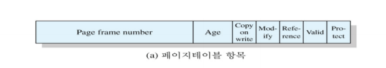
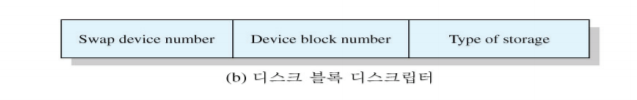
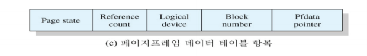
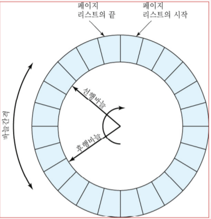
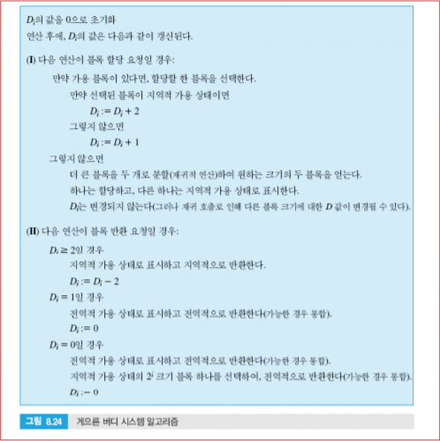
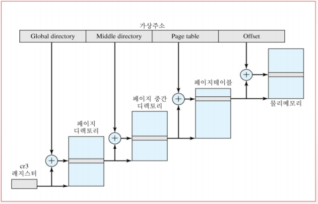
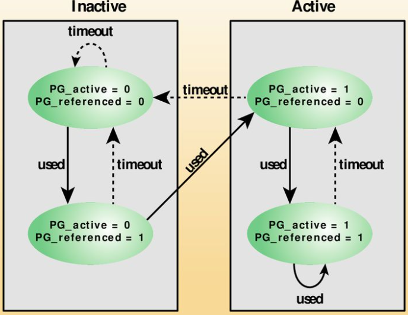

# UNIX와 Solaris의 메모리 관리

 UNIX와 Solaris의 현재 구현은 페이징 기반 가상메모리를 활용하고 있다.

 SVR4와 Solaris에는 실질적으로 두 가지의 서로 다른 메모리 관리 기법이 있다.

- **페이징 시스템 (paging system)**

     프로세스들과 디스크 블록 버퍼를 대상으로 메모리의 페이지프레임을 할당해 주는 가상메모리 기능을 제공한다. → **사용자 프로세스나 디스크 입출력에 대해서는 효과적**

- **커널 메모리 할당자 (kernel memory allocator)**

     앞선 페이징 시스템이 커널용 메모리 관리에는 적합하지 않아 커널용 메모리 관리를 위해 도입되었다.

## 페이징 시스템 (Paging System)

### 자료구조

 페이징 기반 가상메모리를 사용하는 자료구조는 기계 독립적이다.

- **페이지테이블 (page table)**

    전형적으로 프로세스마다 하나의 페이지테이블이 있으며, 각 테이블 항목은 해당 프로세스의 페이지 하나와 대응된다.

    

    - **Page frame number:** 실메모리를 참조하기 위한 프레임 번호
    - **Age:** 페이지가 참조되지 않고 얼마나 경과되었는지를 나타내며 이 필드의 길이나 내용은 프로세서에 따라 다름.
    - **Copy on write:**

         두 개 이상의 프로세스가 복사해야 할 페이지를 복사하지 않고 원본 페이지를 공유하고 있을 때 설정됨. 한 프로세스가 페이지에 쓰기 작업을 시도하면, 그 페이지를 공유하고 있는 다른 프로세스들을 고려해 별도의 복사본을 만들고 거기에 쓰기 작업이 행해지게 해야 한다. 이 기능은 **실질적 필요가 발생할 때까지 복사 작업을 연기**함으로써, 필요치 않을 경우 복사 작업을 하지 않아도 되게 한다.

    - **Modify:** 페이지가 변경되었음을 나타냄.
    - **Reference:** 페이지가 참조되었는지를 나타냄. 처음 적재될 때 0으로 초기화되고, 주기적으로 페이지 교체 알고리즘에 의해 0으로 설정
    - **Valid:** 페이지가 메모리에 있는지를 나타냄
    - **Protect:** 쓰기 작업이 허용되어 있는지를 나타냄

- **디스크블록 디스크립터 (disk block descriptor)**

     프로세스의 각 페이지에 대해 그 디스크 저장본 (disck copy)을 기술해 준다.

    

    - **Swap device number:** 해당 페이지가 저장되어 있는 보조기억장치의 논리적 장치 번호. 이는 다수의 장치가 스와핑 용으로 사용될 수 있게 한다.
    - **Device block number:** 스왑 장치 상에서 페이지의 블록 위치
    - **Type of storage:** 저장 장소는 스왑 유닛이거나 수행파일일 수 있다. 후자의 경우 초기화시 할당된 가상메모리를 지워야 하는지를 나타내는 표시가 있다.

- **페이지 프레임 데이터 테이블 (page frame data table)**

     메모리의 각 프레임마다 한 항목이 대응되고, 프레임 번호로 인덱싱된다. 교체 알고리즘에 의해 사용된다.

    

    - **Page state:** 해당 프레임이 가용 상태인지 혹은 연관된 페이지가 있는지를 나타냄
    - **Reference counter:** 해당 페이지를 참조하고 있는 프로세스의 수
    - **Logical device number:** 해당 페이지의 복사본을 포함한 논리적 장치
    - **Block number:** 논리적 장치 상에 있는 해당 페이지 복사본의 블록 위치
    - **Pfdata pointer:** 가용 페이지 리스트와 페이지 해시 큐 상에 있는 다른 Pfdata 테이블 항목에 대한 포인터

- **스왑-사용 테이블 (swap-use table)**

     스왑 장치별로 하나의 스왑-사용 테이블이 있으며, 각 테이블 항목은 장치 상의 페이지 하나와 대응된다.

    

    - **Reference counter:** 스왑 장치 상의 해당 페이지를 가리키는 페이지테이블 항목의 수
    - **Page/storage unit number:** 저장유닛 상의 페이지 식별자

### 페이지 교체

 모든 가용프레임들은 페이지 반입용으로 활용될 수 있도록 가용프레임 리스트에 연결된다. 가용프레임 수가 특정 임계치보다 작아지면 커널은 그것을 보충하기 위해 사용 중인 페이지프레임들 중 일부를 회수한다.

**SVR4의 '두 바늘' 클록 알고리즘 (two-handed clock algorithm)**

---

- 처음 적재된 페이지의 참조 비트는 0, 참조될 때 1
- '선행바늘 (fronthand)'은 프레임들을 스캔하면서 각 페이지의 참조비트를 0으로 만들고, 어느 정도의 시간이 지난 후, '후행 바늘 (backhand)'이 동일 페이지들을 스캔하면서 참조비트 값 조사
- 참조비트 값이 1인 프레임은 교체 대상에서 제외하고, 0이면 해당 페이지를 **반출될 페이지들의 리스트**로 이동

 알고리즘의 동작을 결정하는 두 인자: 스캔속도, 바늘간격

시스템이 부팅될 때 물리메모리의 양을 근거로 정한 초기값을 가지며,
 **스캔 속도** 인자는 변화되는 조건을 충족시키기 위해 변경될 수 있다. 가용메모리의 양이 줄어들면 보다 빨리 많은 페이지를 보충하기 위해 바늘의 속도를 증기시킨다.

 **바늘간격** 인자는 두 바늘 사이의 간격을 조절, 스캔속도 인자와 결합되어 각 페이지에 대한 '페이지가 참조되지 않더라도 반출되지 않고 메모리상에 유지되는 기간' (재사용 기회의 윈도우)를 결정한다.

### 커널 메모리 할당자(Kernel Memory Allocator)

 커널은 수행 도중에 **작은 테이블과 버퍼 등을 자주 생성하고 제거**하는데, 이는 동적인 메모리 할당을 요구한다.

예시:

- 경로명 변환 라우팅은 사용자 영역으로부터 경로명을 복사하기 위해 버퍼할당 요청
- allocb() 루틴은 임의 크기의 STREAMS 버퍼 할당
- 좀비 구조를 할당하여 죽은 프로세스의 종료 상태나 자원 사용 정보 등을 유지

 **이들 블록의 크기는 전형적인 기계의 페이지 크기에 비해 훨씬 작으며**, 이로 인해 페이징 기법을 동적인 커널 메모리 할당에 적용하는 것은 비효율적이다.

→ SVR4의 경우, 버디 시스템을 변형하여 사용

**게으른 버디 시스템 (Lazy buddy system algorithm)**

---

 UNIX가 커널 메모리 요구에 있어 종종 안정 상태의 행동양식을 보인다는 것 관찰

→ 특정 크기의 블록에 대한 요구량이 시간적으로 완만하게 변한다.

→ $2^i$  크기의 블록이 반납되면 곧 $2^i$ 크기의 블록이 다시 요구될 가능성이 크다.

→ 반납된 후 즉시 그 버디와 통합시켜 새로운 블록을 만들면 그 블록을 다시 분할해야할 가능성이 크다.

→ 필요하다고 판단될 때까지 통합을 미뤄서, 불필요한 통합/분할 작업을 피한다.

 

인자들은

$N_i$ = 현재 $2^i$ 크기 블록들의 수

$A_i$ = 현재 할당된 $2^i$ 크기 블록들의 수

$G_i$ = 현재 전역적으로 가용상태의 $2^i$ 크기 블록들의 수

$L_i$  = 현재 지역적으로 가용상태의 $2^i$ 크기 블록들의 수

$N_i$ = $A_i+G_i +L_i$ 의 식이 성립한다.

 지역 가용블록의 집합소를 유지하며, 지역 가용블록의 수가 특정 임계치를 넘으면 통합 작업을 수행한다.

- 블록이 반납될 때 대부분의 경우 통합이 수행되지 않아서 최소의 기록 및 작업 비용이 든다.
- 블록이 할당될 경우 지역 가용블록과 전역 가용블록 간의 구별이 없는데, 기록 비용을 최소화해준다.

 통합에 사용되는 기준은 특정 크기의 지역 가용블록의 수가 동일 크기의 할당 블록의 수보다 많지 않아야 한다는 것이다.

→ 이를 구현하기 위해 다음의 지연 변수 (delay variable)를 정의하였다.

$D_i = A_i - L_i=N_i-2L_i-G_i$

---

## Linux의 메모리 관리

 UNIX 구현과 많은 공통점이 있지만, 고유의 특성을 가지고 있다. 

### Linux 가상 메모리

  3단계 페이지테이블 구조를 사용하는데 각 테이블의 크기는 페이지 크기와 동일하다.

- **페이지 디렉토리(page directory)**: 각 프로세스는 페이지 크기의 페이지 디렉토리 하나를 가진다. 페이지 디렉토리의 각 항목은 페이지 중간 디렉토리 중 한 페이지를 가리킨다.
- **페이지 중간 디렉토리(page middle directory)**: 페이지 중간 디렉토리는 여러 개의 페이지로 구성될 수 있다. 페이지 중간 디렉토리의 각 항목은 페이지테이블 중 한 페이지를 가리킨다.
- **페이지테이블 (page table)**: 페이지테이블 역시 다수의 페이지로 구성될 수 있다. 페이지테이블의 각 항목은 프로세스의 가상페이지 하나를 참조한다.

 3단계 페이지테이블 구조를 위해 가상주소는 4개의 필드로 구성된다.

 Linux 페이지테이블 구조는 **플랫폼 독립적**이며, 3단계 페이징 지원 하드웨어를 제공하는 64비트 Alpha 프로세서를 고려하여 설계되었다.

→ 64비트 주소를 사용하는 Alpha에서 2단계 페이징을 적용하면 페이지테이블과 디렉토리의 크기가 엄청나게 커질 것이기 때문

→ Linux SW는 페이지 중간 디렉토리의 크기를 정의할 수 있게 해서 2단계 체계도 수용한다.

### 페이지 할당

 페이지 반입/반출의 효율을 높이기 위해, Linux는 **연속된 페이지 블록들을 연속된 페이지프레임 블록들로 사상**시켜 다루는 기법을 정의한다.

→ 버디시스템이 사용되며, 커널은 연속 페이지프레임의 그룹들을 크기별 리스트로 유지한다.

→ 페이지에 대해 메모리가 할당/반납될 때, 버디 알고리즘에 의해 가용 그룹이 분할되거나 통합된다.

### 페이지 교체 알고리즘

 Linux 릴리즈 2.6.28 기준, 클록 알고리즘에 기반한다.

 Linux는 사용비트를 8비트의 변수 age로 대체한다. 페이지가 참조될 때마다 변수 age의 값은 증가되고, 주기적으로 전체 페이지를 훑어가며 각 페이지와 연계된 변수 age 값을 감소시킨다.

 age 값이 0인 페이지는 '오래된' 페이지로 간주되어 최적이 교체 후보다. 반면, age의 값이 큰 페이지일수록 최근에 더 자주 참조된 것이므로 교체 대상이 아니다.

→ **Least Frequently Used** 정책 범주

 

 Linux 릴리즈 2.6.28 이후, 메모리 용량이 커감에 따라 메모리 상의 전체 페이지를 주기적으로 훑어가며 각 페이지의 age 값을 처리하는데 소요되는 프로세서 시간도 커져서 **분할 LRU 알고리즘**으로 대체했다.

 PTE에 추가된 두 플래그 (PG_active와 PG_referenced)를 사용한다. 모든 물리적 메모리는 자신의 주소를 기반으로 "영역(zone)"으로 구분되며, **페이지 재활용**을 위해 두 가지 연결리스트 (활성 리스트, 비활성 리스트)가 메모리 관리자에 의해 **각 영역에서 사용**된다.

1. 비활성화 리스트에 있는 페이지가 처음 참조되면, 해당 페이지의 PG_referenced 플래그가 설정된다.
2. 이후 해당 페이지가 다시 참조되면 **활성 리스트**로 옮겨진다. 
→ 커널 데몬 kswapd가 주기적으로 페이지 스캔 작업을 반복/수행 과정에서 참조된 페이지로 두 차례 확인되어야 활성 상태의 페이지가 된다.
3. 페이지가 두 번째 참조되었다는 사실이 충분히 짧은 시간 내에 확인되지 않으면, PG_referenced 플래그는 다시 0으로 설정된다.
4. 위와 유사한 과정을 통해, 두 차례 시간이 만료(timeout)되면 해당 활성 페이지는 비활성 리스트로 옮겨진다.

### 커널 메모리 할당

 리눅스 커널은 메모리를 페이지프레임들로 분할하여 관리하는데, 기 기본 기능은 **특수한 사용 요구들에 대해 프레임들을 할당/회수**하는 것이다.

 프레임의 소유자가 될 수 있는 부류에는 사용자 공간의 프로세스, 동적으로 할당된 커널 데이터, 정적 커널 코드, 페이지 캐시 등이 있다.

 

 가상메모리 체계에서처럼, 커널용 메모리가 페이지 배수 크기의 단위로 할당/회수될 수 있도록 **버디 알고리즘**이 사용된다. 이런 방식으로 할당되는 메모리의 최소량이 한 페이지이기 때문에, 커널이 단기간 사용할 **다양한 크기의 작은 메모리 블록들**을 요구하기 때문에, 페이지 할당자 하나만으로는 비효율적이다.

 리눅스는 할당된 페이지 내에서 슬랩할당 (slap allocation)이라 알려진 방식을 사용한다. Pentium/x86의 경우 페이지 크기가 4KB이며, 페이지 내에서 32, 64, 128, 252, 508, 2040, 4080 바이트 크기의 블록들이 할당된다.

 리눅스는 블록의 크기 당 하나씩 연결리스트를 유지하는데 각 블록은 버디 알고리즘에서와 유사하게 분할/통합될 수 있으며, 그에 따라 다른 리스트로 이동될 수도 있다.