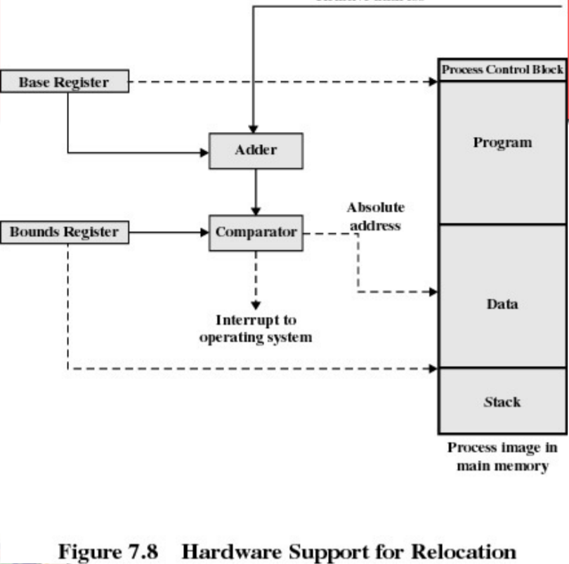

# Overview

### Uniprogramming system

 메인 메모리를 두 파트로 나누는데, 운영체제가 사용하는 커널 공간과 사용자 프로그램이 실행되고 있는 나머지 공간이다. 

### Multiprogramming system

  다수의 프로그램이 하나의 메모리를 가지고 concurrent하게 실행되기 때문에 운영체제의 메모리 관리가 필수적인데 운영체제는 이때 단일 프로그래밍 시스템에서 나누었던 사용자 프로그램 공간을 더 나눈다.

 I/O 작업은 상당히 오래 걸리는 작업이기 대문에 프로세스 실행 시간의 대부분은 이 작업을 기다리는데 소요한다. 따라서 운영체제는 가능한한 많은 프로세스들이 프로세서에서 처리될 수 있도록 메모리를 적절히 할당하는 것이 메모리 관리의 최종 목표이다.

# Requiremets

### Relocation

  프로세서의 사용률 (Utilization rate)을 극대화하기 위해 프로세스는 디스크로 스왑인, 스왑아웃 된다. 하지만 처음 적재될 때 사용했던 똑같은 메모리 주소 공간을 그 다음 time-unit에 그대로 사용될 것이라는 보장이 없다. 따라서 다음에 스왑인 될 때는 메모리의 다른 공간으로 **재배치**할 필요가 있다.

 즉 프로그램이 적재되기 전에는 그 위치를 미리 알 수는 없고, 스와핑 시에 메인 메모리에서 프로그램 위치가 변경될 수 있도록 해야 한다.

### Protection

 프로세스는 다른 프로세스에 속한 프로그램들을  허가 없이 읽기나 쓰기를 위해 메모리 참조를 해서는 안 된다. 하지만 컴파일 시간에 어떤 메모리 주소가 다른 프로세스에 의해 사용되고 있는지 알 수는 없기 때문에 (앞서 다룬 재배치 문제나 동적 메모리 할당 등) 이 보호에 대한 요구사항을 만족시키기는 쉽지 않다.

 이를 해결하기 위해 한 프로세스가 생성하는 모든 메모리 참조가 오직 그 프로세스에게 할당된 메모리 공간만을 참조한다는 것을 **실행 시간에** 검사받아야 한다.

 예를 들어서 사용자 프로세스는 운영체제의 프로그램, 데이터 등 어떤 부분도 접근할 수 없다. 다시 말해 한 프로세스의 프로그램은 다른 프로세스의 명령어로 분기할 수도 없으며, 허가 없이 다른 프로세스의 데이터 영역을 접근할 수 없다. 만약 이런 상황이 발생하면 **프로세서(하드웨어)가** 그 명령어를 중단시켜야 한다.

### Sharing

 보호 메커니즘이 메인 메모리 내의 같은 부분을 접근하려는 여려 개의 프로세스들을 융통성 있게 허용할 수 있어야 한다.

 만약 여러 개의 프로세스들이 동일한 프로그램을 실행중이라면 각 프로세스들이 프로그램 사본을 각각 가지고 있는 것보다는 사본 하나를 가지고 모든 프로세스가 참조하도록 하는 것이 바람직하다.

### Logical organization

 일반적으로 메인 메모리는 연속적인 바이트나 워드로 이루어진 선형의 주소공간인데 프로그래머가 작성하는 프로그램들은 전혀 그렇지 않다. 대부분의 프로그램들은 모듈 단위로 구성되기 때문에 서로 일치하지 않는다. 또한 모듈별로 접근 권한이 다르게 주어지는 문제도 생긴다.

 따라서 운영체제와 컴퓨터 하드웨어는 모듈로 구성된 사용자 프로그램과 데이터를 효과적으로 처리할 수 있어야 한다. 이러한 요구사항을 충족시킬 솔루션으로 세그먼테이션 (Segmentation) 기법이 있다.

### Physical Organization

 컴퓨터 메모리는 주기억장치와 보조기억장치의 2-계층 아키텍처를 이룬다. 이러한 구조에서 시스템은 각 장치 사이의 정보 흐름을 어떻게 구성하느냐가 중요하다. 이러한 책임을 프로그래머에게 전가하는 것은 비현실적이다.

# Memory Partitioning

 메모리 관리의 주된 작업은 프로세서에 의해 실행될 프로세스를 메인 메모리로 가져오는 것이고, 궁극적인 목표는 프로세서 사용률을 극대화하는 것이다. 거의 모든 운영체제는 가상 메모리 기술을 사용하여 메모리 관리를 하는데 이 기술은 **세그먼테이션**과 **페이징** 기법에 기반을 둔다.

 우선 가상 메모리를 고려하지 않은 상태에서 페이징과 세그먼테이션에 대해 설명을 한다.

### Fixed Partitioning

  메모리를 일정한 크기로 분할하는 방식이다. 분할 크기에 따라 균등 분할과 비균등 분할로 나눌 수 있다.

1. 균등 분할: 한 프로세스의 크기가 분할의 크기보다 작거나 같으면 사용 가능한 파티션 중 하나에 적재된다. 하지만 모든 파티션이 사용중이라면 한 파티션의 프로세스를 스왑아웃하고 다른 프로세스를 적재한다.
    - 프로그램이 파티션보다 클 경우: 
     프로그래머가 **오버레이**를 사용하는 프로그램을 설계하여 특정 순간에 프로그램의 필요한 부분만 메인메모리에 있게 해야 한다.
    - 파티션의 크기보다 매우 작은 프로그램인 경우: 
     파티션 내부 공간이 낭비가 발생하는데 이를 **내부 단편화**라고 한다.
2. 비균등 분할: 내부 단편화 현상을 해결하기 위해 작은 파티션 크기부터 큰 파티션까지 서로 다른 크기로 분할한다. 이때 프로세스의 크기에 따라 **어떻게 배치**하는가가 중요한데 두 가지 모델이 존재한다.
    - 파티션당 하나의 프로세스 큐를 갖는 경우: 
     각 프로세스의 용량에 맞는 가장 작은 파티션을 할당해준다. 이때 사용중이던 프로세스를 스왑아웃하여 유지하는 스케줄링 큐가 있다. 여유가 있는 다른 파티션에 할당 가능한 경우에도 최적의 파티션에 할당하려 하기 때문에 비효율적인 경우가 있다.
    - 하나의 큐로 모든 프로세스를 처리하는 경우: 
     더 일반적인 경우로써 프로세스를 메모리에 적재할 시점에 사용 가능한 파티션 중 프로세스를 적재할 수 있는 가장 작은 크기의 파티션에 적재된다. 프로세스를 스왑할 때 우선순위를 고려할 수도 있다.

        

**장점**: 간단하여 운영체제의 기능을 최소로 하고 오버헤드도 최소로 한다.

**단점**: 

- 미리 정해진 파티션 수에 따라 시스템 내에서 활성화된 프로세스들의 개수가 제한을 받는다.
- 미리 정해진 파티션 크기 때문에 크기가 매우 작은 프로그램일 경우 파티션 공간이 비효율적이다.

### Dynamic Partitioning

  파티션의 크기와 개수가 가변적이다. 프로세스가 메인 메모리로 적재될 때 정확히 요구된 만큼만 메모리를 할당받는다. 

 운영체제가 끝난 곳으로부터 적재되기 시작해서 각 프로세스들에게 꼭 맞는 공간만을 차지한다.


 (d) 상황에서 새로운 프로세스가 적재돼야 한다면 세 개의 프로세스 중에 하나는 스왑아웃 될 것이다. 모든 프로세스가 준비 상태가 아닌 시점에 프로세스4가 할당될 가장 작은 메모리인 프로세스2를 스왑아웃 할 수 있다. 이때 (f) 처럼 6M의 또 다른 구멍이 발생한다. 

 이와같이 처음에는 잘 작동하다가 결국 메인 메모리에 작은 "구멍"들이 다수 만들어지는 상황이 발생하는데 파티션 영역 이외의 메모리가 점차 사용할 수 없는 조각으로 변하는 이러한 현상을 **외부 단편화**라고 한다.

 외부 단편화를 극복하는 방법으로 **메모리 집약**이 있다. 운영체제는 프로세스가 사용하는 파티션을 이동시켜 각 파티션이 연속적이 되도록 인접하게 만든다. 하지만 메모리 집약은 많은 시간이 걸려 프로세서 시간을 낭비한다. 메모리 집약을 위해서 **동적 재배치 기능**을 활용한다.

### 배치 알고리즘

 동적 분할의 경우에 적재하려는 프로세스보다 크거나 같은 메인 메모리의 자유 블럭들 중 어떤 블럭을 선택하여 배치하는가가 중요했다. 이 알고리즘에는 세 가지가 있다.

- **최적적합**:
 요청된 크기와 가장 근접한 크기의 메모리를 선택한다.
- **최초적합**:
 메모리의 처음부터 검사해서 크기가 충분한 첫 번째 사용 가능한 메모리 블럭을 선택한다.
- **순환적합**: 
 가장 최근에 배치되었던 메모리 위치에서부터 검사를 시작해 크기가 충분한 다음 위치의 사용 가능한 메모리 블럭을 선택한다.

 이 방법들 중 어느 것이 가장 적합한지는 발생하는 프로세스 스와핑의 실제 순서와 프로세스들의 크기에 의존한다.

 하지만 일반적으로 최초적합이 가장 간단하며 대부분의 경우 최적이고 빠르다. 반면 순환적합은 약간 더 나쁜 결과를 내는 경향이 있다. 또한 최적적합은 가장 성능이 나쁘다. 너무 작은 블럭들을 여기저기 만들어서 메모리 집약 작업이 가장 자주 수행되기 때문이다.

### 버디(Buddy) 시스템

 메모리 블록이 $2^K, L\leq K\leq U$의 크기를 갖는데 이 때 각 L과 U는

- $2^L$= 할당된 가장 작은 크기의 블록
- $2^U$= 할당된 가장 큰 키기의 블록, 보통 할당 가능한 전체 메모리 크기와 같다.


 가장 처음에는 $2^U$인 하나의 블록으로 간주한다. 만약 $2^{U-1}< s\leq 2^U$인 요청이라면 전체 블록이 할당되고 그렇지 않으면 블록을 $2^{U-1}$ 크기의 두 개의 버디로 나눈다.

 이렇게 s 이상의 크기를 가진 가장 작은 버디가 만들어져 할당이 이루어질 때까지 두 개의 버디로 나누는 과정이 반복된다. 항상 2의 제곱수의 구멍들이 만들어지기 때문에 이 구멍들은 의미가 있다. 그래서 버디 시스템은 크기가 $2^i$인 구멍들의 리스트를 유지한다.

 크기가 $2^{i+1}$인 구멍은 반으로 쪼개지면 $(i+1)$-리스트에서 제거되고 $i$-리스트에 두 개의 버디가 만들어진다. 만약 크기가 $2^i$인 버디 두 개가 동시에 할당되어 있지 않으면, 이 둘은 $2^{i+1}$인 하나의 블록으로 합쳐진다.

 한편 크기 k, $2^{i+1} < k \leq 2^{i+1}$에 대한 요청이 오면 다음의 알고리즘을 이용해 크기가 $2^i$인 구멍을 찾을 수 있다.

```jsx
void get_hole(int i)
{
	if (i==(U+1))
		<실패>;
	if (<i_list가 비었음>)
	{
		get_hole(i+1);
		<구멍을 두 개의 버디로 나눈다.>
		<버디를 i_list에 포함시킨다.>
	}
	<i_list의 첫 번째 구멍을 선택한다.>
}
```


 버디 시스템은 병렬 프로그램의 할당과 해제를 위한 효율적인 수단으로 병렬시스템의 응용 프로그램에서 사용되기도 한다. 특히 수정된 형태의 버디 시스템이 **UNIX 커널 메모리 할당 방법**으로 사용되고 있다.

### 재배치

 프로세스가 실행을 종료할 때까지 특정 메모리 공간에 고정되어 실행되는 경우는 없다. 즉 스왑아웃되는 경우가 거의 대부분인데 이 때문에 프로세스에 의해 참조된 (명령어와 데이터의) 위치는 고정되지 않느다. 이 위치는 스왑인되거나 이동될 때마다 변경된다.

 따라서 프로세스 생성이나 실행에 사용되는 주소를 몇 가지 유형으로 구분한다.

1. **논리주소** 
 현재 데이터가 적재된 메모리와는 독립적인 메모리 위치에 대한 참조. 이 주소는 실제 메모리 접근을 위해 물리주소로 변환되어야 한다.
2. **상대주소**
  논리 주소의 특별한 예로써 어떤 알려진 지점, 주로 프로세서의 한 레지스터의 값으로부터 상대적인 위치를 말한다.
3. **물리주소** 
 메인 메모리 안에서의 실제 위치.

 일반적으로 적재된 프로세스의 모든 메모리 참조는 프로그램의 시작 주소로부터 상대적이다. 그러므로 특정 부분을 참조하는 명령어를 실행할 때 그 상대주소를 메인 메모리의 물리주소로 변환시켜주기 위한 하드웨어 장치가 필요하다. → **MMU**



 실행 상태가 되면 프로세서의 특정 레지스터에 프로그램이 적재되어 있는 메인 메모리의 시작주소가 적재되는데 이 레지스터를 **베이스 레지스터(Base Register)**라고 한다. 또한 프로그램의 마지막 위치를 가리키는 **경계 레지스터(Bounds Register)**가 존재한다.

 이 레지스터 값들은 프로그램이 메모리로 처음 적재되거나 프로세스 이미지가 스왑인될 때 올바른 값으로 설정돼야 한다. 실행중에는 상대 주소가 이용된다.

 실행되는 과정은 상대 주소가 프로세서에 도달하면 베이스 레지스터 값에 더해져서 절대주소로 변환되고 경계 레지스터 값과 비교된다. 만약 이 주소가 경계 범위 안에 있으면 명령이 실행되고 그렇지 않으면 운영체제로 인터럽트가 발생한다.

# Paging

  메인 메모리를 동일한 작은 크기의 파티션으로 나누고 프로세스를 같은 크기로 나눈다고 하면 전자를 **프레임**, 후자를 **페이지**이라고 한다. 그러면 페이지는 빈 프레임 조각에 저장될 수 있다. 이때 내부단편화가 발생할 수도 있는데 각 프로세스의 마지막 페이지에서만 발생한다.


 운영체제는 빈 프레임 목록을 유지한다. (e)의 상황에서 5개의 프레임을 요구하는 프로세스 D가 적재된다면 논리 주소 개념을 활용하여 연속되지 않은 프레임이라도 적재할 수 있다.

 따라서 고정 분할, 동적 분할 개념에서와는 다르게 하나의 베이스 레지스터만을 가지고 있지 않고 운영체제는 각 프로세스마다 하나의 **페이지 테이블(page table)**을 유지한다.

- 프로세스 내 각 페이지들에 해당하는 프레임 위치를 가지고 있다.
- 메모리 주소는 페이지 번호와 페이지 내의 오프셋으로 구성된다.

 논리주소가 (페이지 번호, 오프셋)으로 주어지면 프로세서는 페이지 테이블을 이용하여 물리주소(프레임 숫자, 오프셋)를 생성한다.

### 페이지 크기를 2의 거듭 제곱으로 해야 하는 이유

 프로그램의 시작 위치로 부터의 상대 주소와 페이지 번호와 오프셋으로 표현되는 논리 주소가 같아진다.

- 논리 주소의 구조가 프로그래머, 어셈블러, 그리고 링커에게 투명하다. 왜냐하면 프로그램의 논리 주소(페이지 번호, 오프셋)는 상대 주소와 동일하기 때문이다.
- 수행 중에 동적 주소 변환을 담당할 하드웨어 기능을 구현하기가 쉽다. 즉 물리 주소로 변환하기가 쉽다.

# Segmentation

 프로그램과 관련 데이터들을 여러 세그먼트로 나눈다. 페이징에서와 같이 세그먼테이션을 사용할 때의 논리 주소도 세그먼테이션 번호와 오프셋으로 구성된다.

 세그먼테이션의 경우 프로그램이 하나 이상의 파티션을 차지할 수 있고 이 파티션들이 연속적일 필요는 없다. 동적 분할과 마찬가지로 외부 단편화의 가능성도 있다.

 

### 페이징과의 비교

 페이징은 크기가 일정하기 때문에 프로그래머에게 투명한 것에 비하여 세그먼테이션은 보통 프로그래머가 각 세그먼트를 지정할 수 있으며 **프로그램과 데이터를 편의대로 나누기 위한 수단**으로 제공된다.

 일반적으로 프로그래머나 컴파일러는 프로그램과 데이터를 다른 세그먼트들로 할당한다. 프로그램 또는 데이터는 더 세분화된 여러 세그먼트로 나눌 수도 있다. 하지만 세그먼테이션의 가장 불편한 점은 **프로그래머가 세그먼트의 최대 크기를 알고 있어야 하는 점**이다.

### 물리주소로의 변환

 또 다른 단점은 논리주소와 물리주소 간에 복잡한 관계가 존재한다. 물론 페이징과 유사하게 단순 세그먼테이션 기법은 각 프로세스마다 **세그먼트 테이블**을 이용하고 메인 메모리의 사용 가능한 블록들의 리스트를 유지한다.

 하나의 프로세스가 실행 상태가 될 때 그 프로세스가 사용하는 세그먼트 테이블 주소가 메모리-관리 하드웨어가 사용하는 지정된 레지스터로 지정된다.

 가장 왼쪽의 n비트는 세그먼트 번호이고 가장 오른쪽의 m비트는 오프셋인 n+m 비트들로 이루어진 주소를 예로 들면,  

- 논리 주소의 왼쪽 n 비트를 세그먼트 번호로 추출한다.
- 이 세그먼트 번호를 프로세스 세그먼트 테이블의 인덱스로 사용하여 세그먼트의 시작물리주소를 찾는다.
- 오른쪽 m 비트로 표현된 오프셋을 세그먼트의 길이와 비교한다. 만약 오프셋이 그 길이보다 크거나 같다면 그 주소는 유효하지 않다.
- 접근하고자 하는 물리주소는 세그먼트의 시작 물리주소와 오프셋의 합이다.