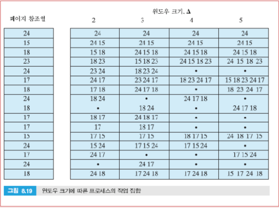

# Overview

 운영체제 메모리관리 부분의 설계는 다음 기본 선택 영역에 의존한다.

1. 가상메모리 기술을 사용할지 여부
2. 페이징, 세그먼테이션, 혹은 세그먼테이션/페이징 결합의 사용
3. 메모리 관리와 관련된 알고리즘

 1번과 2번 영역에서의 선택은 하드웨어 플랫폼에 의존한다. 따라서 운영체제의 가상메모리 제공 관련 기술은 기반 하드웨어 지원이 없을 경우 실용성이 없다. 하지만 최근 모든 주요 운영체제들이 가상메모리를 제원하고, 순수세그먼테이션 시스템은 거의 없어져 간다.

 세그먼테이션이 페이징과 결합될 경우, 시스템 설계자들이 직면하는 **메모리 관리 이슈 대부분이 페이징과 관련**된다.

 가상메모리 관리 정책에 있어 주요 이슈는 **성능**이다. → 페이지폴트가 초래하는 오버헤드가 매우 크기 때문. 가상메모리를 위한 운영체제의 정책은 다음과 같다.

- 반입정책 (Fetch Policy)
- 배치정책 (Placement Policy)
- 교체정책 (Replacement Policy)
- 적재집합 (Resident Set) 관리
- 클리닝정책 (Cleaning Policy)
- 부하제어 (Load Control)

 중요한 것은 어떤 영역과 관련해서도 최고의 정책은 없다. 페이징 환경에서 메모리 관리 작업은 엄청나게 복잡하기 때문에 최종 답안이 없다. 

 특정 정책 집합의 성능은 메인메모리의 크기, 메인메모리와 보조기억장치의 속도, 자원 경쟁 프로세스들의 크기나 수, 개별 프로그램의 수행 행태 등에 의존한다.

 시스템의 크기에 따라 시스템 관리자와 운영체제 설계자에게 책임이 따른다.

- 작은 시스템들의 경우 그 당시 알려진 상황들을 근거로 넓은 범위의 조건들에 대해 '좋을 것 같은' 정책들의 집합을 선택해야 한다.
- 큰 시스템들의 경우, 시스템 관리자에게 운영체제 모니터링 도구와 제어 도구를 제공하여, 실제 시스템 운영 환경에서 운영체제를 조율함으로써 '좋은 결과'가 산출될 수 있게 해야 한다.

# Operating System Software

## 반입정책 (Fetch Policy)

 각 페이지를 **언제** 메모리로 적재할지 결정하는 정책이다.

### 요구페이징 (Demand paging)

 페이지가 메모리로 반입되는 시점을 해당 페이지의 일부가 참조될 때로 한정한다. 요구페이징은 다음과 같은 상황이 전개될 것으로 예측하고 설계된 것이다: 프로세스가 생성되고 충분한 시간동안 수행되면 지역성의 원칙에 의해 대부분의 참조 대상은 최근에 반입된 페이지들이 될 것이라 예측한다.

→ 어느 정도의 시간이 지나 안정 상태가 되면 페이지폴트 회수는 매우 낮은 수준으로 떨어진다.

### 선페이징 (Prepaging)

 탐색시간, 회전 지연 등 디스크와 같은 대부분의 보조 기억장치들이 가진 특성을 이용하여 페이지폴트에 의해 요구된 페이지들 이외의 페이지들도 반입된다.

 한 프로세스의 페이지들이 보조기억장치에 연속적으로 저장되어 있다면 일련의 연속된 페이지들을 한꺼번에 반입하는 것이 효율적이라고 예측하지만 지금까지 선페이징의 유용성은 입증되지 못하고 있다.

---

## 배치정책 (Placement Policy)

 적재될 블록이 메인메모리의 **어디에** 위치할 것인지를 결정하는 정책이다.

 순수 세그먼테이션 시스템의 경우에 중요한 설계 이슈 (선택 대안: 최적적합, 최초적합 등)지만, 순수 페이징이나 세그먼테이션과 결합된 페이징을 사용하는 시스템의 경우, 일반적으로 배치는 문제가 되지 않는다.

 특별히 NUMA (Non-Uniform Memory Access) 구조의 다중처리기의 경우 각 페이지를 그것을 참조할 프로세서와 가까운 메모리 모듈에 배치하는 전략이 필요하긴 하다.

 

---

## 교체정책 (Replacement Policy)

 교체 정책은 여러 개념들과 관련되어 있고 이들 또한 서로 연계되어 있어 설명하기 어렵다.

- 활동 중인 프로세스에 얼마나 많은 프레임을 할당할 것인가
- 교체 페이지로 고려될 대상을, 페이지폴트를 발생시켜 페이지를 반입하게 한 프로세스의 페이지들로 한정할 것인가, 아니면 메인메모리 상의 모든 프레임으로 확대할 것인가
- 고려 대상 페이지들 중에 어떤 페이지를 교체 대상으로 선택할 것인가

 처음 두 개념은 **적재집합 관리** 면에서 더 관련이 있고, 세번째 개념을 집중적으로 **교체정책**과 관련하여 다룬다. 모든 교체정책은 교체되는 페이지가 **가까운 미래에 참조될 가능성이 적은 페이지**이어야 한다는 것을 목표로 한다.

 따라서 교체정책은 과거 행태를 근거로 미래의 행태를 예측하려 한다. 교체정책이 정교할수록 그 구현에 소요되는 HW나 SW 비용이 더 커진다는 점은 고려하여 절충해야 한다.

### 프레임 잠금 (Frame Locking)

 OS는 일부 페이지 프레임을 잠가 둘 수 있는데, 이는 해당 프레임에 적재된 페이지가 교체되지 않도록 표시해 두는 것이다. 잠금 기능은 프레임 테이블이나 페이지 테이블에 각 프레임과 연계된 **잠금 비트를 유지**하는 방식으로 구현될 수 있다. 

 실제로 주요 제어 구조를 비롯해 운영체제 커널 중 많은 부분이 잠긴 프레임에 유지되고 입출력 버퍼와 시간임계 영역 (time-critical areas) 등도 메모리의 프레임들에 잠가 둘 수 있다.

### 기본 알고리즘

- **최적 정책:** 미래에 참조될 때까지의 시간이 가장 긴 페이지를 교체 대상으로 선택한다.

     가장 이상적인 정책으로 가장 적은 페이지폴트를 발생시킨다. 하지만 운영체제가 미래에 일어날 사건들에 대해 완벽하게 알 수 없기 때문에 이 정책의 구현은 현실적으로 불가능하다.

    → 실제 구현 가능한 알고리즘들을 **평가하는 기준**이 된다.

- **LRU 정책**: 가장 오랫동안 참조되지 않은 메모리 상의 페이지를 교체한다.

     지역성의 원리에 따르면 가까운 미래에 참조될 가능성이 가장 적을 것으로 예상되는 페이지가 분명하지만 **구현이 어렵다**는 것이 문제다.

    1. 각 페이지에 대한 최종 참조 시간을 페이지의 태그로 설정한다.

         명령어나 데이터가 참조될 때마다 해당 페이지의 태그 값이 갱신되어야 하므로, HW 지원이 있다해도 오버헤드가 크다.

    2. 페이지 참조들에 대해 스택을 유지한다. → 마찬가지로 비용이 크다.
- **FIFO (First-in-first-out)**: 프로세스에 할당된 페이지프레임들을 순환버퍼처럼 다루어, 라운드로빈 스타일로 프레임 상의 페이지들을 제거한다.

     가장 오래 전에 반입된 페이지는 이제 사용되지 않을 것이라는 논리를 근거로 들지만 프로그램 수행 과정 내내 집중적으로 이용되는 코드나 데이터 영역이 존재해서 잘 맞지 않는다. 
    → 성능이 떨어진다.

     하지만 페이지들을 원형으로 연결하는 포인터만 있으면 구현이 가능하므로 간단하다.

- **클록 (Clock)**: 각 프레임에 대해 사용비트 (use bit)라는 한 비트를 연계하고 처음 반입될 때나 참조될 때마다 사용비트가 1로 설정된다.

    **구현**

    ---

    - 페이지를 적재한 프레임들이 환형으로 배치되어 있다고 간주하고, 첫 교체후보를 가리키는 포인트(시계바늘)를 설정한다.
    - 시계 방향으로 포인터를 이동시키면서 포인터가 가리키는 프레임 중 사용비트가 0인 첫 프레임 상의 페이지를 교체한다. 탐색 중에 사용비트가 1인 프렝미을 만나면 그 값을 0으로 바꾸고 다음 프레임으로 진행한다.
    - 사용비트가 1인 프레임을 건너뛴다는 점을 제외하면 FIFIO와 유사하다.

    **예시**

    ---

**각 클록 정책의 행태**

---

**각 알고리즘 성능 비교**

---

 한 프로세스에 할당된 페이지프레임 수가 고정되어 있다고 가정, 256워드의 페이지 크기 사용:
FORTRAN 프로그램이 $0.25 \times 10^6$번 의 참조

### 클록 알고리즘의 개선

 클록 알고리즘은 그것이 사용하는 비트 수가 증가함에 따라 보다 강력해질 수 있다. 한 예로 페이징에서 다루었던 변경비트가 메모리의 모든 프레임과 연계된다.

사용비트 u와 변경비트 m에 따라 4가지 경우를 생각할 수 있다.

- 최근에 참조되지 않았으며, 변경되지 않음 (u=0; m=0)
- 최근에 참조되었으며, 변경되지 않음 (u=1; m=0)
- 최근에 참조되지 않았으며, 변경됨 (u=0; m=1)
- 최근에 참조되지 않았으며, 변경되지 않음 (u=1; m=1)

 이를 기반으로 작동하는 방식은

1. 반입된 후 변경되지 않고 최근에 참조되지 않은 페이지 (u=0; m=0)를 찾아 버퍼 상의 모든 페이지들을 훑어가며 순환한다. 
2. 첫 번쨰 순환에서 그런 페이지를 찾지 못하면, 최근에 참조되지 않은 변경된 페이지 (u=0; m=1)를 찾아 페이지 버퍼를 다시 순환한다. 이때, 지나쳐 가는 모든 프레임의 사용비트를 0으로 설정한다.
3. 두 번째 순환에서 실패할 경우, 다시 단계 1과 2를 반복한다.

### 페이지버퍼링(Page Buffering)

 LRU와 클록 정책이 FIFO보다 우수할지라도 두 정책은 모두 FIFO가 갖지 않은 복잡성과 오버헤드를 갖는다. 페이지버퍼링이 이 오버헤드를 해결해줄 수 있다.

 교체 대상으로 선택된 페이지를 즉시 교체하지 않고 가용페이지 리스트 뒤쪽에 연결시켜 어느 정도 기간 동안 메인메모리 상에 유지한다. 특히 변경된 페이지인 경우 변경페이지 리스트에 연결시킨다.

→ 페이지가 메인메모리 상에서 물리적으로 이동하는 것이 아니라, **해당 페이지에 대한 사상 정보**가 PTE로부터 제거되고 관련 정보가 가용페이지 리스트나 변경페이지 리스트에 연결된다.

 일정 범위의 가용페이지 수를 유지하고, 실제 새로운 페이지를 적재해야 할 때 가용페이지 리스트 상의 첫 페이지를 교체한다. → 변경페이지 리스트 상의 페이지가 디스크에 기록될 경우 가용페이지 리스트로 이동한다.

 **장점**

- 실제로 교체되기 이전에 참조될 경우 적은 비용으로 페이지폴트 해결 가능
- 변경페이지들에 대한 클러스터 입출력 가능 → 입출력 연산의 횟수와 디스크 접근 시간이 줄어든다.

---

## 적재집합 관리

### 적재집합의 크기

 운영체제는 얼마나 많은 페이지를 반입할지, 즉 프로세스에게 얼마나 많은 메모리를 할당할지 결정해야 한다. 고려해야할 인자들은 다음과 같다.

- 한 프로세스에게 할당된 메모리의 양이 적을수록, 임의 시점에 메모리에 존재 가능한 프로세스가 많아진다. → 스와핑으로 인한 시간적 손실 절감
- 메모리 상에 적재된 한 프로세스의 페이지 수가 상대적으로 작으면, 페이지폴트 발생률이 높아진다.
- 적재된 페이지 수가 어느 정도 이상이 되면, 해당 프로세스에게 메모리를 추가 할당하더라도 지역성의 원리에 의해 그 프로세스의 페이지폴트 발생률에 큰 영향이 없을 것이다.

 이러한 인자들을 고려하여 두 종류의 정책을 적용한다.

- **고정할당 (fixed allocation)**: 각 프로세스에게 고정 개수의 페이지프레임을 주고 수행시킨다.

     그 프레임 수는 초기 적재 시점(프로세스 생성 시점)에 결정되는데, 프로세스의 타입(대화식, 일괄처리식, 응용의 유형 등)이나 프로그래머 혹은 시스템 관리자의 지침 등이 결정의 근거가 된다.

- **가변할당 (variable-allocation)**: 프로세스 생존 기간 동안 각 프로세스에 할당된 페이지프레임 수의 변경을 허용한다.

     지속적으로 높은 수준의 페이지폴트 발생률을 보이고 있는 프로세스에게는 페이지프레임을 추가 할당하여 페이지폴트 발생률을 줄이고, 현저히 낮은 페이지폴트 발생률을 보이는 프로세스로부터는 페이지폴트 발생률이 크게 증가되지 않을 정도로 할당량을 줄인다.

### 교체범위

- **지역교체 정책 (local replacement policy):** 페이지폴트를 발생시킨 프로세스의 적재 페이지들 중에서 교체 대상 페이지를 선택한다.
- **전역교체 정책 (global replacement policy)**: 어떤 프로세스가 소유한 것인지에 상관없이 메모리 상의 잠기지 않은 모든 페이지를 교체 후보로 고려한다.

 교체범위와 적재집합의 크기 간에는 관련성이 있다. 고정된 적재집합은 지역교체 정책을 함축하는데, 이는 적재집합의 크기를 고정하려면 메모리에서 제거되는 페이지를 동일 프로세스의 또 다른 페이지로 교체해야 하기 때문이다.

### 고정할당, 지역범위

 메모리 상에서 수행 중인 프로세스는 고정된 개수의 프레임을 가진다. 페이지폴트가 발생할 경우 OS는 해당 프로세스의 적재 페잊지들 중 한 페이지를 교체 대상으로 선택해야 한다. (앞서 설명한 교체정책과 통한다.)

고정할당 정책의 경우 한 프로세스에 대한 할당량을 미리 결정할 필요가 있으며, 응용의 타입이나 프로그램에 의해 요구된 수량 등이 그 근거가 될 수 있다. 하지만 취약점은 다음과 같다.

- 할당량이 너무 적을 경우, 높은 페이지폴트 발생률
- 할당량이 많아질 경우, 다중 프로그래밍의 차수가 적어져 처리기 유휴시간이나 스와핑 시간 증가

### 가변할당, 전역범위

 구현이 쉬워 많은 OS들에 의해 채택되었다.

구현 전략은

- OS가 가용프레임 리스트를 유지한다.
- 페이지폴트 발생시 해당 프로세스의 적재집합에 가용프레임을 추가한다.
- 가용프레임이 없을 경우, 잠긴 프레임 이외의 모든 프레임을 대상으로 교체 대상 페이지를 선택하여 교체한다. 문제는 어떤 프로세스를 선택하여 그 적재집합 중 한 페이지를 잃게 할 것인지 결정하는 규칙이 없어 → 적재집합의 크기가 줄어든 프로세스가 최적이 아닐 수 있다.

 잘못된 페이지 선택 문제 해소 방안으로 **페이지버퍼링**을 이용할 수 있다.

### 가변할당, 지역범위

 전역범위 전략의 문제점을 극복하기 위해 다음 방식을 사용한다.

- 새로운 프로세스가 메모리로 적재될 때, 응용의 타입이나 프로그램의 요구, 혹은 또 다른 척도들에 근거하여 어느 정도의 페이지프레임들을 적재집합으로 할당한다.
- 페이지폴트가 발생할 경우, 그것을 발생시킨 프로세스의 적재집합 중에서 교체할 페이지를 선택한다.
- 수시로, 프로세스에 대한 할당량을 재평가하고 전체적 성능 개선이라는 측면에서 **할당량을 증감**시킨다.

 가장 중요한 부분이 **적재집합 증감에 대한 결정**이며, 활성 프로세스의 미래를 평가하여 그것을 근거로 한다. 이 결정에 대한 대표적 전략들은 다음과 같다.

- **작업집합 전략 (Working Set Strategy)**

     진정한 작업집합 전략을 구현하기는 어렵지만, **비교 기준**으로서 검토할만 하다.

    특정 프로세스 (페이지 수 N)에 대한 **작업집합 $W(t, \Delta)$ →** 변수 $\Delta$는 프로세스를 관찰하기 위한 가상시간 상의 윈도우.

    - 해당 프로세스가 가상시간 (매 가상주소 참조에 대해 1씩 증가) 상의 시점 $t-\Delta$ 부터 $t$ 까지 참조한 페이지들의 집합
    - $W(t,\Delta+1) \supseteq W(t,\Delta)$, $1\leq \left\vert W(t,\Delta) \right\vert \leq min(\Delta, N)$

      **작업집합 관리 방법**은

    1. 각 프로세스의 작업집합을 모니터링한다.
    2. 주기적으로 프로세스의 적재집합 중 작업집합에 있지 않은 페이지들을 제거한다. (기본적으로 LRU 정책)
    3. 프로세스는 메모리에 그 작업집합이 있을 때 (적재집합이 작업집합을 포함할 때)만 수행된다.

     하지만 **문제점**도 존재하는데

    - 과거가 항상 미래를 예측하지 않는다.
    - 정의에 충실하게 작업집합을 측정하는 것은 비현실적이다.
    - 최적의 $\Delta$ 값이 알려져 있지 않고 어떤 경우라도 가변적이다.

    **윈도우 크기에 따른 프로세스 Working Set 변화**

    ---

    

    **작업집합 크기의 변화**

    ---

    

- **PFF (Page Fault Frequency)**

- **VSWS (Variable-interval Sampled Working Set)**