# Overview

 페이징과 세그먼테이션 기법을 이용해서 다음과 같은 이점을 얻었다.

- 프로세스가 메인 메모리의 어디에나 적재될 수 있고,
- 필요에 따라 위치 변경도 가능하게 해준다.
- 프로세스가 여러 개의 블록으로 분할될 수 있게 해주고
- 이 블록들이 연속적으로 위치할 필요도 없으며 한꺼번에 적재되어 있을 필요도 없게 해준다.

 

 하지만 메모리의 크기는 한정되어 있기 때문에 각 프로세스가 요구하는 페이지가 많다면 동시에 실행시킬 수 있는 프로세스의 양이 상당히 한정적이다. 가상 메모리는 이와 같은 단점을 해소하기 위해 등장했다.

# Hardware And Control Structures

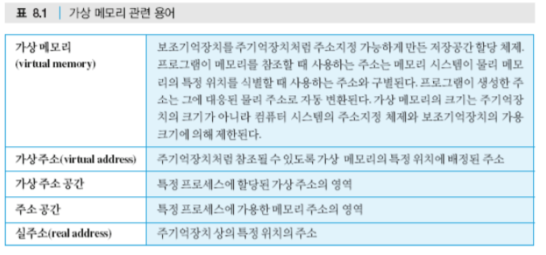

### 배경

 프로세스는 다음에 수행할 명령을 포함한 블록과, 그 명령에 의해 참조될 데이터가 포함된 블록이 메모리 상에 있다면, 적어도 약간의 시간 동안은 해당 프로세스의 수행이 진행될 수 있다.

 프로세스의 코드나 데이터 중 임의 시점에 메인 메모리에 적재되어 있는 부분을 해당 프로세스의 **적재집합(resident set)**이라 하는데 세그먼트테이블이나 페이지테이블을 이용하여 프로세스의 참조 주소가 적재 집합에 포함되어 있는지 판단할 수 있다. 

 만약 메인 메모리에 적재되지 않은 논리주소가 참조되면 다음과 같이 처리된다.

1. 프로세서가 메모리 접근 오류(memory access fault)를 의미하는 인터럽트를 발생시킨다.
2. 운영체제가 인터럽트 당한 프로세스를 블록 상태에 두고 제어를 넘겨받는다.
3. 해당 논리주소를 포함한 프로세스의 블록을 메모리로 적재하기 위해 디스크 입출력 요청을 한다.
4. 다른 프로세스에게 CPU를 넘겨 디스크 입출력이 진행되는 동안 수행하게 한다.
5. 요청된 디스크 입출력이 끝나면 입출력 인터럽트가 발생하고 이를 통해 운영체제는 제어를 돌려받는다.
6. 이전에 메모리 접근 오류를 발생시켜 블록 되었던 프로세스를 준비상태로 전환시킨다.

  이와 같은 처리를 활용하여 프로세서는 프로세스의 일부 블록만을 적재한 채 수행할 수 있고 다음과 같은 이점을 얻는다.

- **보다 많은 프로세스를 메모리에 유지할 수 있다.**
- **메인 메모리보다 큰 프로세스를 수행할 수 있다.**

 특히 두 번째의 경우 지원되지 않는다면 프로그래머는 얼마나 많은 메모리 공간을 사용할 수 있는지 정확히 인식해야 하고, 오버레이와 같은 기법을 적용하여 분할 적재할 수 있도록 프로그램을 여러 블록으로 구조화할 수 있는 방법을 모색해야 한다. → 이를 운영체제와 하드웨어로 위임한 것이다.

### 가상 메모리의 원리

 가상 메모리의 이점이 확실해도 수많은 인터럽트를 발생시키기 때문에 성능에 의구심이 든다. 하지만 여러 운영체제에서의 경험으로 의심이 해소되었다.

---

**지역성의 원리 (principle of locality)**

 큰 프로세스라고 해도 임의의 짧은 기간만을 고려한다면, 프로세스의 메모리 접근은 작은 영역 (서브루틴)의 코드 수행과 데이터 배열 참조로 한정될 수 있다. 만약 그렇다면, 보류되거나 스왑아웃되기 전에 단지 몇 블록만 사용될 프로그램을 위해 많은 블록들을 적재하는 것은 비경제적인 일이다.

 지역성의 원리란 프로세스 내의 명령어 및 데이터에 대한 참조가 **군집화 경향**이 잇음을 말한다. 그러므로 짧은 기간 동안 프로세스의 블록 몇 개만 필요할 것이라는 가정이 유효하다.

**쓰레싱 (thrashing)**

 하지만 운영체제가 이 같은 방식의 블록 관리를 지능적으로 수행해야 효율적인 처리가 가능하다. 안정 상태에서는 메인 메모리 전체가 프로세스 블록들로 채워져 있어서 한 블록을 반입하려면 다른 블록 하나를 반출해야 한다. 만약, 특정 블록이 사용되기 직전에 반출되었다면 그 블록은 거의 곧바로 다시 반입된다.

 이러한 일이 과도하게 발생하면 쓰레싱이 발생하여 시스템이 명령어 수행이 아니라 블록 교체에 대부분의 시간을 소비하게 된다.

 이 문제는 운영체제가 최근의 참조 이력을 근거로 가까운 미래에 사용될 가능성이 가장 적은 블록을 추정할 수 있기 때문에 피할 수 있게 되었다. → 가까운 미래에 어떤 블록이 필요할 것인지에 대한 예측

### 페이징 기반 가상 메모리

 가상 메모리를 사용하더라도 페이징이나 세그먼테이션이 사용되는데 페이징의 경우 각 프로세스 별로 페이지테이블이 필요하다.

  하지만 단지 몇 페이지만 적재되기 때문에 가상 메모리의 페이지테이블 항목은 더 복잡하다. 기존 항목은 페이지에 해당하는 프레임 번호와 오프셋만 필요했다면, 해당 페이지가 메모리에 적재되어 있는지 구분하는 **존재비트 P**와 해당 페이지가 메모리에 적재된 후 그 내용이 변경되었는지 나타내는 **변경비트 M**을 가진다. 만약 교체되었다면 그 페이지가 변경될 때 디스크에 기록한다.

 이외에도 보호와 공유를 다루기위해 다른 제어 비트들이 플요하다.

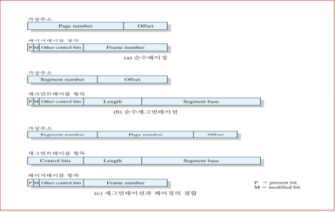

### 페이지테이블 구조

 페이지테이블은 프로세스의 크기에 따라 그 크기가 달라지므로 레지스터에 넣을 수 없어서 메모리에 저장된다.

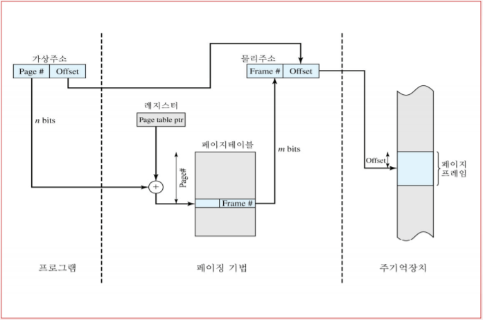

 프로세스가 수행되고 있을 때, 그 프로세스를 위한 페이지테이블의 주소가 레지스터에 저장된다. 페이지 번호를 테이블의 인덱스로 사용하여 페이지테이블 항목을 선정하고, 그 항목으로부터 페이지가 적재된 프레임 번호를 얻는다. 이 프레임 번호가 가상주소의 오프셋과 결합하여 물리주소를 얻는다.

 일반적으로 페이지 번호 필드가 프레임 번호 필드보다 길다. $(n > m)$
→ 메모리에 적재할 수 있는 전체 페이지보다 프로세스의 페이지테이블이 더 크다.

### 페이지테이블의 메모리 점유

 각 프로세스는 페이지 테이블을 갖기 때문에 각 프로세스가 엄청나게 큰 가상메모리를 가질 수 있는 점이 문제가 된다.

 예를 들어 VAX의 경우 각 프로세스는 최고 2GB 크기의 가상메모리를 가질 수 있는데 $2^9$ 바이트의 페이지를 사용한다고 가정하면, 프로세스 당 $2^{22}$ 개의 항목을 가진 페이지테이블이 필요하다. 

이를 해결하기 위해 다양한 해결 방법이 제시된다.

1. **페이지테이블 자체를 가상메모리에 적재**

      페이지테이블을 실제 메모리가 아닌 **가상메모리에 저장**한다. 페이지테이블을 가상메모리에 저장하고 프로세스가 수행 중일 때 **그 프로세스의 페이지테이블 중 일부만**을 메모리에 둔다. 그러면 현재 사용 중인 페이지의 테이블 항목만이 포함된다.

2. **페이지테이블을 n-단계 계층구조로 작성**

     선형 구조가 아니므로 전체 가상주소공간 중 실제 참조할 페이지들이 존재하는 영역에 대해서만 단계별 페이지테이블을 설정한다. 

     즉, 기존에 페이지테이블을 참조하기 위해서 20비트를 사용하고 그 크기가 $2^{20}$ 바이트였다면, 2단계 계층 구조를 사용해 $2^{10}$ 바이트 크기의 1차 테이블과 $2^{10}$ 바이트 크기의 2차 테이블을 두어 $2^{11}$ 바이트만을 사용할 수 있다.

    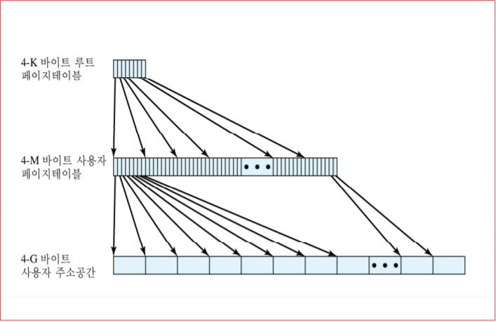

     32비트 주소 체계에 적용한 2단계 기법을 나타낸 것이다. 바이트 수준의 주소지정과 4K 바이트 크기의 페이지를 가정하면, $2^{20}$ 개의 페이지로 구성된 4G 바이트 크기의 가상주소공간이 설정된다. 이들 페이지가 각각 4바이트 크기의 PTE (Page Table Entry)에 의해 사상되면, 4M 바이트 크기의 페이지테이블을 만들 수 있다.

      $2^{10}$ 개의 페이지를 차지하는 이 페이지테이블은 $2^{10}$개의 PTE로 구성된 4K 바이트 크기의 루트 페이지테이블에 사상되어 가상메모리 상에 유지된다.

    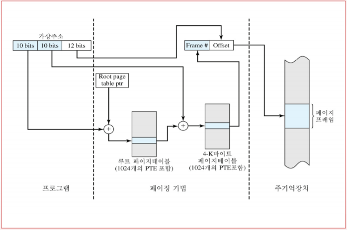

     루트 페이지테이블만이 메모리에 상주한다. 가상 주소의 처음 10비트가 루트 페이지에 대한 인덱스로 쓰이고 사용자 페이지테이블이 저장된 페이지를 위한 PTE를 찾아 준다. → **페이지테이블을 위한 페이지테이블**

     만약 그 페이지가 메인 메모리에 없다면 페이지폴트가 발생한다. 그 페이지가 메모리에 있다면, 가상주소는 그 다음 10비트를 사용자 페이지테이블에 대한 인덱스로 쓰여 가상주소에 의해 참조될 실제 페이지를 위한 PTE를 찾게 해 준다.

3. **역페이지테이블(inverted-page table) 이용**

     페이지테이블의 단점은 그 크기가 가상주소공간의 크기에 비례한다는 점이기 때문에 그 비례되는 대상을 바꾼 것이 역페이지테이블의 핵심이다.

    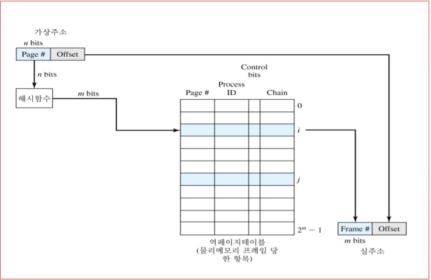

     일반적으로 페이지 번호를 위해 할당된 비트 수가 프레임 번호를 위해 할당된 비트 수보다 많기 때문에 $(n>m)$, 가상주소 중 페이지 번호 부분을 간단한 해시 함수를 통해 특정 해시 값으로 사상시킨다. 해시값은 역페이지 테이블에 대한 인덱스로 쓰이고, 역페이지테이블은 페이지테이블 항목들로 구성된다. 

     페이지테이블 항목이 가상메모리의 페이지 당 하나씩이 아니라 **실기억장치의 페이지프레임당 하나씩 설정**되기 때문에, 프로세스의 수나 지원되는 가상 페이지 수와 상관없이 메모리의 일정 부분만이 테이블 저장에 쓰인다.

     즉 각 프레임에 어떤 페이지가 적재되어 있는지 사상시키므로, 역페이지테이블의 크기는 메인 메모리의 크기에 비례한다.

     하나의 프레임에 여러 페이지가 사상될 수 있기 때문에 충돌 문제를 해결하기 위해 한두 개의 항목 간에 짧은 체인을 만드는 연결 (chaining) 기법을 사용한다.

### TLB (Translation Lookaside Buffer) - 메모리 참조 시간 단축

 모든 가상메모리 참조는 두 번의 물리메모리 참조를 수반한다. 한 번은해당 PTE를 참조하기 위함이고, 다른 한 번은 PTE를 이용하여 요구된 데이터를 접근하기 위함이다. 이 과정을 최소화하기 위해 **PTE에 대한 특수 고속 캐시인 TLB**를 사용한다. → 가장 최근에 사용한 PTE들을 유지.

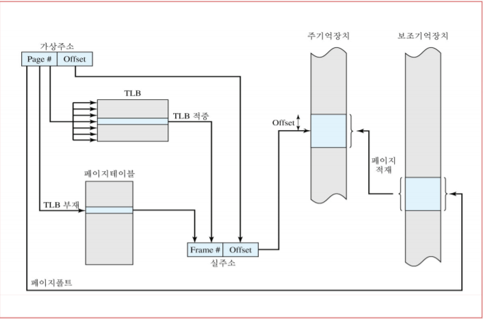

 처음에 가상주소가 주어지면 처음에 TLB를 찾아보고 있으면 (TLB hit) 바로 프레임 번호가 추출되어 실주소가 구성된다. 만약에 없으면 (TLB miss) 페이지 번호로 페이지테이블을 인덱싱하여 PTE를 참조한다.

 PTE의 존재비트가 1일 경우 해당 페이지가 메모리에 존재하므로, PTE에 저장된 프레임 번호를 이용하여 실주소를 구성하고 TLB는 해당 PTE를 포함하도록 갱신된다. 존재비트가 0일 경우, 해당 페이지가 메모리에 없으므로 **페이지 폴트 (page fault)**라 불리는 메모리 접근 오류가 발생된다. 이 시점에 하드웨어의 역할은 끝나고 OS가 필요한 페이지를 적재하고 페이지테이블을 갱신한다.

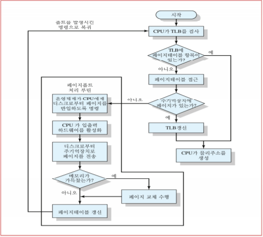

 TLB는 페이지테이블의 일부 항목들만 포함하고 있어서 페이지 번호를 TLB의 인덱스로 사용할 수는 없다. 대신에 TLB의 PTE는 내용뿐만 아니라 페이지 번호를 포함해야 한다. 프로세서에는 특정 페이지 번호와 일치하는 TLB 항목이 있는지 결정하기 위해 **다수의 TLB 항목들을 동시에 조사하는 HW**가 장착된다. 이 기법을 **연관 사상 (associative mapping)** 이라 한다.

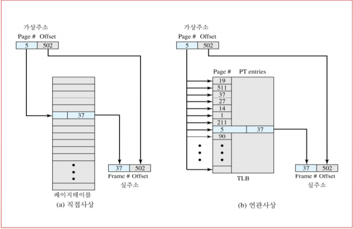

 어떤 하드웨어 캐시를 설계하든 고려되어야 할 사항과 마찬가지로 TLB 항목들을 어떻게 구성할지와, 새로운 항목을 반입하기 위해 어떤 항목을 교체할지를 고려해야 한다.

### 가상메모리와 메인메모리 캐시 시스템의 상호작용

 최종적으로 가상메모리 기법은 메인메모리의 캐시 시스템과 상호작용해야 한다.

 우선, 메모리 시스템은 PTE가 TLB 상에 존재하는지 조사한다. 

- 존재한다면, 그 프레임 번호와 오프셋이 결합된 물리주소가 생성된다.
- 존재하지 않는다면, 페이지테이블 상의 해당 항목이 접근된다. → 두 번의 메모리 접근

 태그와 나머지 부분으로 구성된 실주소가 생성되면, 해당 워드를 포함한 블록이 캐시 상에 존재하는지 조사한다. 

- 그 블록이 캐시 상에 존재할 경우, 캐시 상의 해당 워드가 CPU에게 보내진다.
- 그렇지 않을 경우 해당 워드는 메모리로부터 읽히게 된다.

 참조된 워드는 캐시나 메모리, 혹은 디스크 어디에든 있을 수 있는데 참조될 워드가 단지 디스크에만 잇다면, 그것을 포함한 페이지는 메모리에 적재되어야 하고 그것을 포함한 블록은 캐시에 적재되어야 한다. 또한 해당 페이지에 대한 PTE는 갱신되어야 한다.

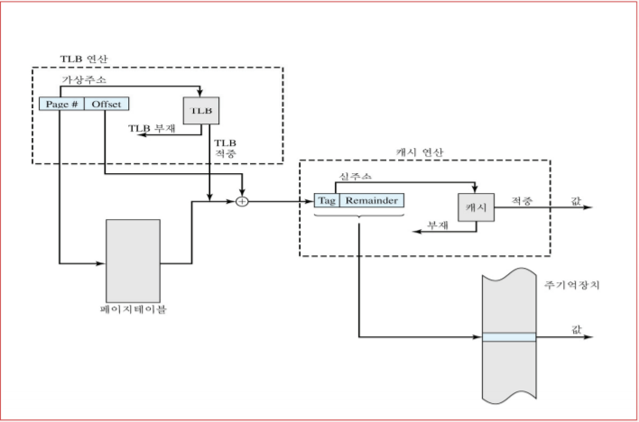

### 페이지 크기

  페이지의 크기는 하드웨어 설계의 주요 결정 사항이다.

관련 고려 사항은 다음과 같다.

---

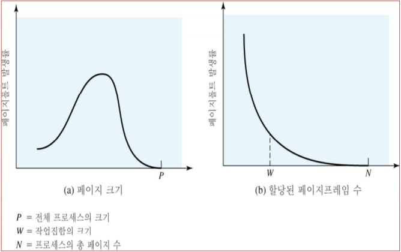

1. **내부단편화**

     페이지의 크기가 작을수록 내부단편화의 양이 적어진다. 메모리의 사용을 최적화하려면 내부단편화를 줄여야 하지만, 페이지가 작을수록 프로세스당 필요한 페이지의 수가 많아지고, 이로 인해 보다 큰 페이지테이블이 요구된다. 

     이 경우, 페이지테이블의 일부가 가상메모리에 존재하게 되고 한 번의 메모리 참조에 대해 두 번의 페이지폴트가 발생 가능하다. → 전체 페이지폴트 발생률 증가

2. **보조 기억 장치의 데이터 전송 효율**

     대부분의 회전식 보조 기억 장치가 그 물리적 특성 상 보다 큰 페이지에 대해 데이터 전송 효율이 좋다.

3. **지역성의 원리**

     페이지 크기가 매우 작을 경우, 메모리 상에서 한 프로세스가 사용할 수 있는 페이지들이 상대적으로 많아진다. 어느 정도의 시간이 지나면 메모리에 적재된 페이지들이 프로세스가 최근에 참조한 인접 부분을 모두 포함하고, 페이지 폴트 발생률이 낮아진다.

     페이지 크기가 커질수록 개별 페이지들의 최근의 참조로부터 보다 멀리 떨어진 위치를 포함하고, 지역성의 원리에 따른 효과가 약해져 페이지폴트 발생률이 높아진다. 하지만 프로세스 전체 크기에 근접하게 커지면 페이지폴트 발생률은 급격하게 떨어진다. [**그림 (a)**]

4. **한 프로세스에 할당된 프레임의 개수**

     **페이지 크기가 고정되어 있을 때** 메모리에 유지되는 페이지의 개수가 늘어날수록 폴트 발생률이 떨어지는 현상을 보인다. 따라서 소프트웨어 정책 (**각 프로세스에 할당된 메모리 양**)은 하드웨어 설계시의 결정 사항 (**페이지의 크기**)과 상호작용 한다. [**그림(b)**]

5. **메모리나 프로그램의 크기**

     메인메모리가 점점 커지고 있고, 응용이 사용하는 주소공간도 커지고 있다. 또한 큰 프로그램을 개발할 때 사용되는 현대의 프로그래밍 기술들은 **프로세스 내에서 참조 지역성을 감소**시키고 있다.

    - OOP 기술은 다수의 작은 프로그램과 데이터 모듈을 사용하도록 조장함으로써, 상대적으로 짧은 시간 내에 이루어지는 참조들이 상대적으로 많은 객체들을 대상으로 **분산**되게 한다.
    - 멀티 쓰레드 응용은 명령어 스트림이나 분산된 메모리 참조에 대해 급작스런 변화를 초래한다.

     TLB 크기가 고정되어 있다고 할 때 프로세스의 메모리 크기가 커지면, 지역성은 줄어들고 TLB에 대한 적중률도 떨어진다. 이 경우 TLB가 성능의 병목지점이 된다.

     이에 대한 개선 방법은

    - 보다 많은 항목을 가진 TLB를 사용한다:

         TLB의 크기는 메모리 캐시나 명령어 수행 사이클 당 메모리 참조 회수 등 하드웨어 설계의 다른 측면들과 연관되어 있어 메인메모리 용량이 급속히 커지는 만큼 **TLB 크기가 쉽게 커지지 못한다**.

    - 페이지의 크기를 키운다:

         TLB 상의 페이지테이블 항목 각각이 보다 큰 메모리 블록을 가리키게 한다. 하지만 앞서 큰 페이지를 사용할 경우 성능이 떨어질 수 있다고 했다.

 수많은 고려 사항들 때문에 하드웨어 설계자들은 결국 **다양한 페이지 크기를 사용**하는 방식을 제시했다. 

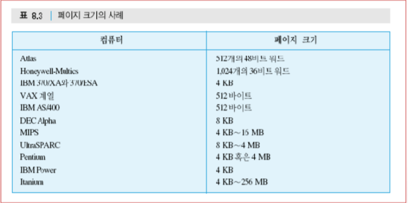

 다수의 페이지 크기가 지원될 경우, TLB를 효과적으로 사용하는데 필요한 유연성이 생긴다. 예를 들어, 프로그램 코드와 같이 프로세스 주소공간 상의 큰 연속 영역들은 많은 수의 작은 페이지들보다 적은 수의 큰 페이지에 사상될 수 있는 반면, 쓰레드 스택은 작은 크기의 페이지들로 사상될 수 있다.

 하지만 많은 상용 운영체제에서는 기반 하드웨어가 다수 크기의 페이지 기능을 지원하더라도 페이지 크기가 운영체제의 많은 부분에 영향을 주고 있어 그 변경의 복잡성 때문에 여전히 단 하나의 페이지 크기만을 지원한다.

## 세그먼테이션 기반 가상메모리

 

 프로세스의 주소공간을 동적으로 설정되는 가변 크기의 블록들로 분할한다. 이 때문에 프로그래머는 메모리를 다수의 주소공간들 (혹은 세그먼트들)의 조합으로 볼 수 있게 해준다.

### 세그먼테이션의 이점

 세그먼테이션은 프로그래머에게 다음과 같은 이점을 준다.

1. **확장성 자료구조에 대한 처리 단순화**

     특정 자료구조가 얼마나 커질지 미리 알지 못한다면, 세그먼트 크기의 동적 설정이 허용되지 않는 한 그 크기를 추정해야 한다. 하지만 세그먼트 기반 가상메모리의 경우 자료구조에 특정 세그먼트를 배정하여, 필요에 따라 운영체제가 그 세그먼트를 확장/축소하게 할 수 있다. (예, c++의 std::vector) 

     만약 인접한 영역에 충분한 메모리 공간이 없다면 보다 큰 가용 공간으로 이동시켜 세그먼트를 확장할 수 있다. 그런 가용공간이 없다면 일단 해당 세그먼트를 스왑-아웃시켜 두었다가 나중에 확장된 형태의 세그먼트를 스왑인 시킬 수 있다.

2. **프로그램 전체에 대한 재연결(relink)이나 재적재(reloading) 없이, 세그먼트 각각을 독립적으로 변경하거나 재컴파일 할 수 있다.**
3. **프로세스들이 세그먼트를 공유/보호할 수 있다.**

     유틸리티 코드나 유용한 데이터 테이블 등을 한 세그먼트로 설정하여 다른 프로세스들이 참조하게 할 수 있다. 또한 적절히 정의된 코드와 데이터 집합을 포함하도록 각 세그먼트를 구성할 수 있어, 프로그래머나 시스템 관리자가 자신에게 용이한 방식으로 접근 권한을 부여할 수 있다.

### 세그먼트테이블 항목 (Segmentation Table Entry) 구성

---

 페이징 기법에서와 마찬가지로 프로세스별 세그먼트테이블이 설정된다. 또한 그 항목들은 기존 단순 세그먼테이션의 테이블 항목보다 더 복잡하다.

 기존 메모리 영역의 시작 주소와 길이에 추가로 세그먼트가 메모리에 적재되어 있는지를 나타내는 **존재 비트**와 해당 세그먼트가 적재된 이후 그 내용이 변경되었는지를 나타내는 **변경 비트**(modify bit), 그리고 그 외에 세그먼트 수준의 **보호나 공유 기능을 지원**하기 위한 제어 비트들이 존재한다.

 존재 비트에서 적재 사실을 나타낼 경우, 테이블 항목에 저장된 세그먼트의 시작주소와 길이 정보가 유효성을 갖는다.

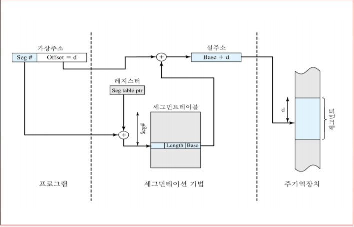

 세그먼트테이블이 프로세스의 크기에 따라 가변 길이를 갖기 때문에, 레지스터가 아니라 메모리의 참조 가능 영역에 세그먼트테이블을 유지한다.

 위의 그림에서 하드웨어에서 **특정 레지스터**를 지원하여 **현재 수행 중인 프로세스의 세그먼트테이블**을 가리키는데 가상주소의 세그먼트 번호를 세그먼트테이블의 인덱스로 사용하여, 적재된 세그먼트의 시작 위치에 해당하는 메인메모리의 주소를 찾는다. 이 주소에 가상주소의 오프셋이 더해져 실주소(real address) 값이 생성된다.

## 페이징과 세그먼테이션의 결합

 

 페이징과 세그먼테이션이 제공하는 이점은 분명하게 존재하기 때문에 일부 프로세서와 운영체제 소프트웨어는 두 기법 모두를 제공하기도 한다.

 결합된 세그먼테이션/페이징 시스템의 경우, 사용자의 주소공간은 프로그래머 재량에 의해 몇 개의 세그먼트로 나누어지며, 이는 다시 메모리의 프레임 크기와 동일한 고정 크기의 페이지들로 분할된다.

 프로세스마다 하나의 세그먼트테이블, 세그먼트마다 하나의 페이지테이블이 각각 연계된다. 특정 레지스터가 있어 현재 수행 중인 프로세스의 세그먼트테이블을 가리킨다.

 가상주소를 실주소로 변환하는 작업은 다음과 같다.

1. 한 가상주소가 주어지면, 세그먼트 번호 부분을 현재 세그먼트테이블의 인덱스로 사용하여 해당 세그먼트에 대한 페이지테이블을 찾는다.
2. 가상주소의 페이지 번호 부분, 찾아낸 페이지테이블에 대한 인덱스로 사용하여 대응된 페이지프레임 번호를 얻는다.
3. 이를 가상주소의 오프셋과 더하여 실주소를 얻어낸다.

 세그먼트테이블 항목 부분을 살펴보면 베이스 필드 (base field)가 마찬가지로 존재하는데 이는 세그먼트 자체가 아니라 해당 세그먼트에 대한 페이지테이블을 가리킨다. 적재나 변경과 관련된 사항들은 페이지 수준에서 다뤄지기 때문에 존재 비트나 변경 비트는 PTE에만 존재한다. 하지만 다른 제어비트들의 경우 공유나 보호 등을 위해 사용될 수 있다.

## 보호와 공유

 세그먼테이션은 보호나 공유 정책을 구현하기에 적합하다.

 세그먼트테이블의 각 항목에는 시작 주소와 길이가 포함되어 있기 때문에, 프로그램은 의외의 경우라 해도 세그먼트 범위 밖의 메모리에 접근할 수 없다. 공유를 위해, 다수의 세그먼트테이블이 특정 세그먼트를 참조하게 할 수 있다.

 더 정교한 기법의 하나로 **링-보호 구조(ring-protection)**를 사용한다. 낮은 번호(혹은 안쪽)의 링들이 높은 번호(혹은 바깥 쪽)의 링보다 더 큰 권한이 주어진다. 전형적으로 0번 링이 OS의 커널 기능을 위해 사용되고, 보다 높은 번호의 링이 응용을 위해 사용된다.

 기본 원리는 다음과 같다.

- 프로그램은 동일한 링이나 그 보다 높은 번호(작은 권한)의 링에 있는 데이터를 **참조**할 수 있다.
- 프로그램은 동일한 링이나 그 보다 낮은 번호(큰 권한)의 링에 있는 서비스를 **호출**할 수 있다.

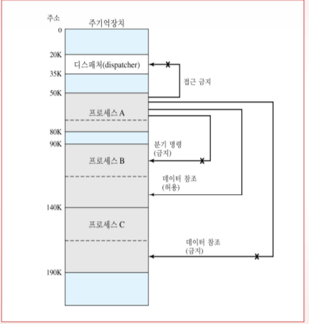