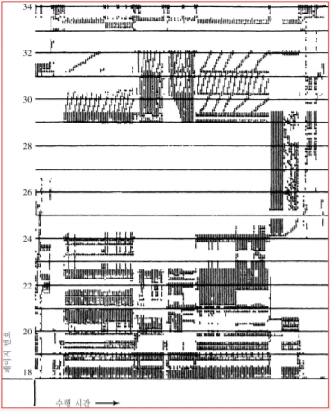

# Overview

 페이징과 세그먼테이션 기법을 이용해서 다음과 같은 이점을 얻었다.

- 프로세스가 메인 메모리의 어디에나 적재될 수 있고,
- 필요에 따라 위치 변경도 가능하게 해준다.
- 프로세스가 여러 개의 블록으로 분할될 수 있게 해주고
- 이 블록들이 연속적으로 위치할 필요도 없으며 한꺼번에 적재되어 있을 필요도 없게 해준다.

 

 하지만 메모리의 크기는 한정되어 있기 때문에 각 프로세스가 요구하는 페이지가 많다면 동시에 실행시킬 수 있는 프로세스의 양이 상당히 한정적이다. 가상 메모리는 이와 같은 단점을 해소하기 위해 등장했다.

# Hardware And Control Structures

### 배경

 프로세스는 다음에 수행할 명령을 포함한 블록과, 그 명령에 의해 참조될 데이터가 포함된 블록이 메모리 상에 있다면, 적어도 약간의 시간 동안은 해당 프로세스의 수행이 진행될 수 있다.

 프로세스의 코드나 데이터 중 임의 시점에 메인 메모리에 적재되어 있는 부분을 해당 프로세스의 **적재집합(resident set)**이라 하는데 세그먼트테이블이나 페이지테이블을 이용하여 프로세스의 참조 주소가 적재 집합에 포함되어 있는지 판단할 수 있다. 

 만약 메인 메모리에 적재되지 않은 논리주소가 참조되면 다음과 같이 처리된다.

1. 프로세서가 메모리 접근 오류(memory access fault)를 의미하는 인터럽트를 발생시킨다.
2. 운영체제가 인터럽트 당한 프로세스를 블록 상태에 두고 제어를 넘겨받는다.
3. 해당 논리주소를 포함한 프로세스의 블록을 메모리로 적재하기 위해 디스크 입출력 요청을 한다.
4. 다른 프로세스에게 CPU를 넘겨 디스크 입출력이 진행되는 동안 수행하게 한다.
5. 요청된 디스크 입출력이 끝나면 입출력 인터럽트가 발생하고 이를 통해 운영체제는 제어를 돌려받는다.
6. 이전에 메모리 접근 오류를 발생시켜 블록 되었던 프로세스를 준비상태로 전환시킨다.

  이와 같은 처리를 활용하여 프로세서는 프로세스의 일부 블록만을 적재한 채 수행할 수 있고 다음과 같은 이점을 얻는다.

- **보다 많은 프로세스를 메모리에 유지할 수 있다.**
- **메인 메모리보다 큰 프로세스를 수행할 수 있다.**

 특히 두 번째의 경우 지원되지 않는다면 프로그래머는 얼마나 많은 메모리 공간을 사용할 수 있는지 정확히 인식해야 하고, 오버레이와 같은 기법을 적용하여 분할 적재할 수 있도록 프로그램을 여러 블록으로 구조화할 수 있는 방법을 모색해야 한다. → 이를 운영체제와 하드웨어로 위임한 것이다.

### 가상 메모리의 원리

 가상 메모리의 이점이 확실해도 수많은 인터럽트를 발생시키기 때문에 성능에 의구심이 든다. 하지만 여러 운영체제에서의 경험으로 의심이 해소되었다.

---

**지역성의 원리 (principle of locality)**

 큰 프로세스라고 해도 임의의 짧은 기간만을 고려한다면, 프로세스의 메모리 접근은 작은 영역 (서브루틴)의 코드 수행과 데이터 배열 참조로 한정될 수 있다. 만약 그렇다면, 보류되거나 스왑아웃되기 전에 단지 몇 블록만 사용될 프로그램을 위해 많은 블록들을 적재하는 것은 비경제적인 일이다.

 지역성의 원리란 프로세스 내의 명령어 및 데이터에 대한 참조가 **군집화 경향**이 잇음을 말한다. 그러므로 짧은 기간 동안 프로세스의 블록 몇 개만 필요할 것이라는 가정이 유효하다.

**쓰레싱 (thrashing)**

 하지만 운영체제가 이 같은 방식의 블록 관리를 지능적으로 수행해야 효율적인 처리가 가능하다. 안정 상태에서는 메인 메모리 전체가 프로세스 블록들로 채워져 있어서 한 블록을 반입하려면 다른 블록 하나를 반출해야 한다. 만약, 특정 블록이 사용되기 직전에 반출되었다면 그 블록은 거의 곧바로 다시 반입된다.

 이러한 일이 과도하게 발생하면 쓰레싱이 발생하여 시스템이 명령어 수행이 아니라 블록 교체에 대부분의 시간을 소비하게 된다.

 이 문제는 운영체제가 최근의 참조 이력을 근거로 가까운 미래에 사용될 가능성이 가장 적은 블록을 추정할 수 있기 때문에 피할 수 있게 되었다. → 가까운 미래에 어떤 블록이 필요할 것인지에 대한 예측

### 페이징 기반 가상 메모리

 가상 메모리를 사용하더라도 페이징이나 세그먼테이션이 사용되는데 페이징의 경우 각 프로세스 별로 페이지테이블이 필요하다.

  하지만 단지 몇 페이지만 적재되기 때문에 가상 메모리의 페이지테이블 항목은 더 복잡하다. 기존 항목은 페이지에 해당하는 프레임 번호와 오프셋만 필요했다면, 해당 페이지가 메모리에 적재되어 있는지 구분하는 **존재비트 P**와 해당 페이지가 메모리에 적재된 후 그 내용이 변경되었는지 나타내는 **변경비트 M**을 가진다. 만약 교체되었다면 그 페이지가 변경될 때 디스크에 기록한다.

 이외에도 보호와 공유를 다루기위해 다른 제어 비트들이 플요하다.

### 페이지테이블 구조

 페이지테이블은 프로세스의 크기에 따라 그 크기가 달라지므로 레지스터에 넣을 수 없어서 메모리에 저장된다.

 프로세스가 수행되고 있을 때, 그 프로세스를 위한 페이지테이블의 주소가 레지스터에 저장된다. 페이지 번호를 테이블의 인덱스로 사용하여 페이지테이블 항목을 선정하고, 그 항목으로부터 페이지가 적재된 프레임 번호를 얻는다. 이 프레임 번호가 가상주소의 오프셋과 결합하여 물리주소를 얻는다.

 일반적으로 페이지 번호 필드가 프레임 번호 필드보다 길다. $(n > m)$
→ 메모리에 적재할 수 있는 전체 페이지보다 프로세스의 페이지테이블이 더 크다.

### 페이지테이블의 메모리 점유

 각 프로세스는 페이지 테이블을 갖기 때문에 각 프로세스가 엄청나게 큰 가상메모리를 가질 수 있는 점이 문제가 된다.

 예를 들어 VAX의 경우 각 프로세스는 최고 2GB 크기의 가상메모리를 가질 수 있는데 $2^9$ 바이트의 페이지를 사용한다고 가정하면, 프로세스 당 $2^{22}$ 개의 항목을 가진 페이지테이블이 필요하다. 

이를 해결하기 위해 다양한 해결 방법이 제시된다.

1. **페이지테이블 자체를 가상메모리에 적재**

      페이지테이블을 실제 메모리가 아닌 **가상메모리에 저장**한다. 페이지테이블을 가상메모리에 저장하고 프로세스가 수행 중일 때 **그 프로세스의 페이지테이블 중 일부만**을 메모리에 둔다. 그러면 현재 사용 중인 페이지의 테이블 항목만이 포함된다.

2. **페이지테이블을 n-단계 계층구조로 작성**

     선형 구조가 아니므로 전체 가상주소공간 중 실제 참조할 페이지들이 존재하는 영역에 대해서만 단계별 페이지테이블을 설정한다. 

     즉, 기존에 페이지테이블을 참조하기 위해서 20비트를 사용하고 그 크기가 $2^{20}$ 바이트였다면, 2단계 계층 구조를 사용해 $2^{10}$ 바이트 크기의 1차 테이블과 $2^{10}$ 바이트 크기의 2차 테이블을 두어 $2^{11}$ 바이트만을 사용할 수 있다.

    

     32비트 주소 체계에 적용한 2단계 기법을 나타낸 것이다. 바이트 수준의 주소지정과 4K 바이트 크기의 페이지를 가정하면, $2^{20}$ 개의 페이지로 구성된 4G 바이트 크기의 가상주소공간이 설정된다. 이들 페이지가 각각 4바이트 크기의 PTE (Page Table Entry)에 의해 사상되면, 4M 바이트 크기의 페이지테이블을 만들 수 있다.

      $2^{10}$ 개의 페이지를 차지하는 이 페이지테이블은 $2^{10}$개의 PTE로 구성된 4K 바이트 크기의 루트 페이지테이블에 사상되어 가상메모리 상에 유지된다.

    

     루트 페이지테이블만이 메모리에 상주한다. 가상 주소의 처음 10비트가 루트 페이지에 대한 인덱스로 쓰이고 사용자 페이지테이블이 저장된 페이지를 위한 PTE를 찾아 준다. → **페이지테이블을 위한 페이지테이블**

     만약 그 페이지가 메인 메모리에 없다면 페이지폴트가 발생한다. 그 페이지가 메모리에 있다면, 가상주소는 그 다음 10비트를 사용자 페이지테이블에 대한 인덱스로 쓰여 가상주소에 의해 참조될 실제 페이지를 위한 PTE를 찾게 해 준다.

3. **역페이지테이블(inverted-page table) 이용**

     페이지테이블의 단점은 그 크기가 가상주소공간의 크기에 비례한다는 점이기 때문에 그 비례되는 대상을 바꾼 것이 역페이지테이블의 핵심이다.

    

     일반적으로 페이지 번호를 위해 할당된 비트 수가 프레임 번호를 위해 할당된 비트 수보다 많기 때문에 $(n>m)$, 가상주소 중 페이지 번호 부분을 간단한 해시 함수를 통해 특정 해시 값으로 사상시킨다. 해시값은 역페이지 테이블에 대한 인덱스로 쓰이고, 역페이지테이블은 페이지테이블 항목들로 구성된다. 

     페이지테이블 항목이 가상메모리의 페이지 당 하나씩이 아니라 **실기억장치의 페이지프레임당 하나씩 설정**되기 때문에, 프로세스의 수나 지원되는 가상 페이지 수와 상관없이 메모리의 일정 부분만이 테이블 저장에 쓰인다.

     즉 각 프레임에 어떤 페이지가 적재되어 있는지 사상시키므로, 역페이지테이블의 크기는 메인 메모리의 크기에 비례한다.

     하나의 프레임에 여러 페이지가 사상될 수 있기 때문에 충돌 문제를 해결하기 위해 한두 개의 항목 간에 짧은 체인을 만드는 연결 (chaining) 기법을 사용한다.

    ### TLB (Translation Lookaside Buffer) - 메모리 참조 시간 단축