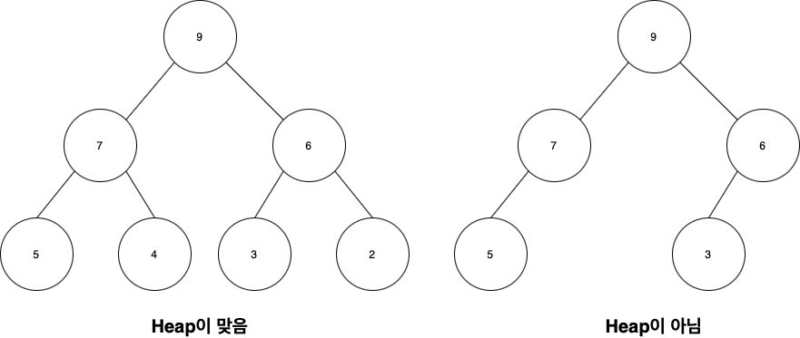

# 우선순위 큐
원래 큐라고 하면은 FIFO 입출력 형식을 가지고 있는 자료구조이다  
하지만 실세계에서는 우선순위를 가지고 일을 처리할 경우가 존재한다  
그래서 우선순위를 부여한 큐를 만들었는데 그 큐를 우선순위 큐라고 부른다  
|자료구조|삭제되는 요소|
|---|---|
|스택| 가장 최근에 들어온 데이터|
|큐| 가장 먼저 들어온 데이터|
|우선순위 큐| 가장 우선순위가 높은 데이터|  

## 우선순위 큐 구현
우선순위 큐라는 것은 다양한 구현체를 가지고 구현을 할 수 있다  
대표적인 것이 `ArrayList`, `LinkedList`, `Heap`등...을 이용할 수 있다  
보통은 `Heap`을 이용하여 구현하는 것이 보편적이고 효율이 좋기 때문에 `Heap`을 통한 구현을 알아볼 것이다  
추상 메서드에 대해서 알아보도록 하겠다
```java
push(type data) //데이터를 우선순위 큐에 삽입한다
pop() //우선순위가 제일 높은 데이터를 반환하고 삭제한다
peek() //우선순위가 제일 높은 데이터를 반환만한다
isEmpty() //우선순위 큐가 비었는지 확인하다
isFull() //우선순위 큐가 가득찼는지 확인한다
```

## 힙(Heap)이란
완전 이진트리 기반의 더미형 자료구조를 의미하며  
부모 노드의 키 값이 자식 노드의 키 값보다 항상 큰 형태를 취하게 된다  
Heap로 만들어진 이진트리에서는 데이터의 중복을 허용한다
  


2번째 트리는 완전 이진트리가 아니기 때문에 Heap이 아니라고 볼 수 있다  

### 최대 힙
부모 노드의 키값이 자식 노드의 키값보다 항상 `큰거나 같은 값`을 가지는 힙을 이야기 한다

### 최소 힙
부모 노드의 키값이 자식 노드의 키값보다 항상 `작거나 같은 값`을 가지는 힙을 이야기 한다

