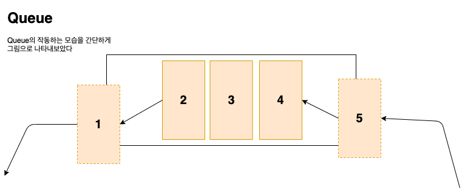

# Queue
자바에서는 추상 자료형으로 Queue를 지원한다 
하지만 여기서는 동작 방식이나 원리를 이해하는 것이 목적이기 때문에 직접 구현할 것이다 

## Queue란...
LIFO 구조를 가진 스택이라는 다르게 **FIFO**(First In First Out) 이라는 구조를 가진다

Queue가 사용된 곳 중에서는 많이 알려진것은 버퍼이다

### Queue 내부 데이터 저장 방법
Queue에서는 내부 데이터 저장 방법을 구현하는 여러가지 방법이 존재한다 
실제 자바에서 제공하는 Queue는 LinkedList로도 구현할 수 있다 
여기서는 List를 사용하지 않고 배열로만 구현을 하려고 한다  
배열로 구현하게 되면 두가지가 존재한다 
1. 선형 큐 
2. 원형 큐 -> 여기서는 이것으로 구현하겠다

## Queue Interface
~~~java
isFull() //가득찼는지 확인하는 메서드 
        
isEmpty() //비었는지 확인하는 메서드
        
push() //Queue에 데이터를 삽입하는 메서드
        
poll() //Queue에 데이터를 빼내는 메서드
        
peek() //Queue의 제일 먼저 빠져야할 데이터를 확인하는 메서드
~~~

### 번외) 왜 Queue 구현체로 ArrayList를 쓰지 않을까? :monocle_face:
Stack은 ArrayList로 구현 할 수 있다 
왜 Queue에서는 ArrayList로 구현하지 못하는 것일까? 라는 의문을 가질 수 있다 
왜 ArrayList를 지원하지 않는가에 대한 필자의 의견을 얘기해 보자면 
시간복잡도를 줄이기 위해서 그런것이지 않을까라고 생각이 든다 
왜냐하면 Queue는 FIFO 구조를 가지고 있기때문에 앞에서 데이터를 빼면 앞에가 비게 되는데 
ArrayList로 구현할 경우에는 빈곳을 채우기 위해서 데이터를 앞으로 움직이는데 O(N)의 시간복잡도가 발생하게된다 
하지만 LinkedList로 구현하면 포인터로 데이터를 연결하기 때문에 O(1)의 시간복잡도가 발생하게 된다 
그러므로 ArrayList를 지원하지 않는것이 아닐까라고 조심스럽게 추측해본다