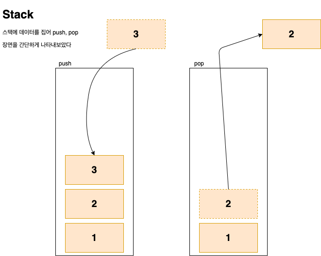

# Stack
여기서는 스택을 직접 구현할 것이다 
하지만 java 자체에서 Stack 자료형을 지원하니 그것을 사용하면 된다 

## Stack이란...
스택이라는 것은 **LIFO(Last In First Out)** 이라는 입출력 형태를 가지는 자료구조이다 
쉽게 말해서 제일 나중에 들어온 데이터가 제일 처음으로 나가는 것이다 
 

 
 
개발자들이 흔히 보는 콜스택도 스택 구조로 이루어져 있는 것을 볼 수 있다

## Stack Interface

스택을 구성하는데 있어서 필요한 메서드들을 작성해보도록 하겠다 
여기서는 구현상의 편의를 위해 스택 내부의 크기를 정해놓고 하겠다

~~~ java
isFull() - 현재 스택이 가득찼는지 확인

isEmpty() - 현재 스택이 비었는지 확인

push(<T> item) - 스택에 데이터를 넣겠다

pop() - 스택에 데이터를 빼겠다 (제거 O)

peek() - 스택에 제일 상단의 데이터를 확인 (제거는 X)
~~~
