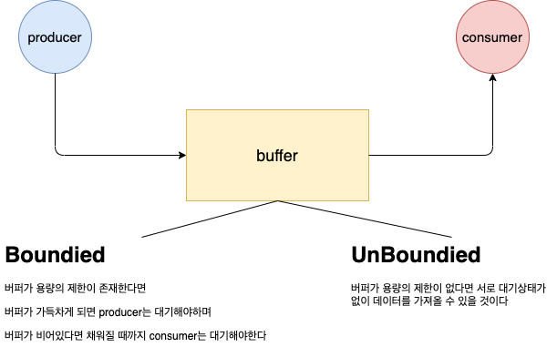
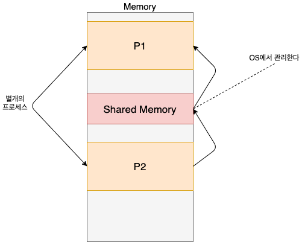

# Process-communication
여기서는 IPC에 관해서 알아볼 것이다

## IPC란...
IPC는 interProcess Communication의 약자이다 
말 그래도 프로세스간의 통신이라고 볼 수 있다 
통신이기 때문에 `send data`와 `receive data`로 나뉘어져 있다 

프로세스끼리 독립적으로 실행이 된다면 IPC를 전혀 고려할 필요가 없다 
`독립적`: 서로 데이터 공유가 없으며 간섭하지 않는다는 뜻이다 
프로세스끼리 협력적인 관계라면 IPC가 필요하다 
`협력적`: 영향을 주고받으며 서로 데이터를 공유한다

## Shared Memomry (공유 메모리)
공유 메모리 방식은 가장 흔한 패러다임인 Producer-Consumer 방식으로 볼 수 있다 
`Producer` : 데이터를 생성하는 곳이다 
`Cosumer` : 생성된 데이터를 소비하는 곳이다 
예를 들어서 브라우저와 웹서버의 관계로 볼 수 있다 
왜냐하면 브라우저는 웹페이지를 `요청(consume)`하고 웹 서버는 html 파일을 `생성(producer)`해서 보내주기 때문이다

물론 그림에 나와있는것 처럼 가운데에 위치하지 않을 수도 있지만 
메모리 위에 존재함으로써 프로세스에서 접근이 가능하다고 보면 될것 같다

`문제점` : 공유메모리를 만들어 통신을 하게된다면 
        프로그래머가 직접 생성해주고 관리해주어야해서 프로그래머의 책임이 커진다

## Message Passing (메시지로 주고받기)
위에서 얘기한 shared memory인 경우에는 사용자가 직접 생성해주어야한다 
버퍼 처리등 프로그래머가 책임을 지고 있었다면 
Message Passing 방식을 사용한다면 **OS에서 필요한 기능을 다 제공해주고** 
프로그래머는 제공해주는 함수를 가져다가 사용하기만 하면 된다

### Message Passing에 제공되는 함수
- `send(message)` : system call로써 메세지를 보낼 수 있다
- `receive(message)` : system call로써 메세지를 받을 수 있다

## 보내는 방식을 구현하는 방법
메세지를 전달하는 방식을 `direct vs indirect` 또는 `sync vs async` 방식으로 나눌 수 있다

### direct
direct 방식을 이용해서 메세지를 전달하는 경우에는 전달자가 수신자가 누군지 정확하게 알고 있어야한다 
direct 방식을 이용한 경우 상대방을 정확히 알고 하는 것이기 때문에 
정확히 둘 사이의 연결이 자동적으로 1:1 매칭이 보장된다

### indirect
indirect 방식을 이용해서 메세지를 전달하는 경우에는 `mailbox` 또는 `port`에 보관을 한다 

**특징**
- mailbox또는port에는 프로세스에 의해서 생산 소비 된다
- 누구한테 받았고 누구한테 보내는지 프로세스가 몰라도 된다
- direct와 달리 두개의 프로세스가 하나의 port를 공유할때 링크가 형성된다
- 그리고 하나의 port에 두쌍 이상의 프로세스들이 연결되어 있을 수 있다

OS에서 제공하는 message passing을 사용하기 위해서는
- `create`
- `send`
- `receive`
- `delete`

4가지만 알고있다면 가능하다

## blocking / non-blocking / sync / async 
강의에서는 blocking == sync / non-blocking == async 라고 한다  
하지만 다른 글들을 찾아 보았을 떄에 각각 다른개념이라는 글이 많아 정리해볼려고한다 
거의 비슷하긴한데 미묘한 차이가 존재하는 듯 하다  
- `sync` : 작업을 요청후 `끝이든 덜되었든 간`에 결과를 받기전까지 대기
- `async` : 작업을 요청후 끝났다는 피드백을 받으면 언제든지 처리하지만 끝났다는 
  피드백을 받기 전까지 `남은 작업을 처리할지 안할지는 모름`
- `blocking` : 프로세스가 시스템 호출을 하고나서 결과가 반환될때까지 대기 `(제어권이 없음)`
- `non-blocking` : 프로세스가 시스템 호출을 한 뒤 남은 작업을 처리할 수 도 있음 `(제어권이 있음)`

**조합**
- `sync & blocking` : 결과가 나올때까지 대기하며 그 결과가 `blocking`에 의해서 끝난 결과를 받게 된다
- `sync & non-blocking` : 결과가 나올때까지 대기하는데 `non-blocking`에 의해서 덜 끝난 결과를 받게 되므로 수시로 끝났는지 체크하게 된다
- `async & blocking` : 작업을 요청후 끝났다는 피드백을 os로 부터 받게 되면 처리하지만 `blocking`에 의해서 다음 작업으로 넘어가지는 못한다
- `async & non-blocking` : async & blocking이랑 비슷하지만 피드백을 받기 전까지 다른 작업을 진행할 수 있다는게 다르다

