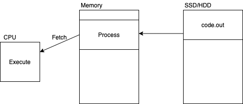
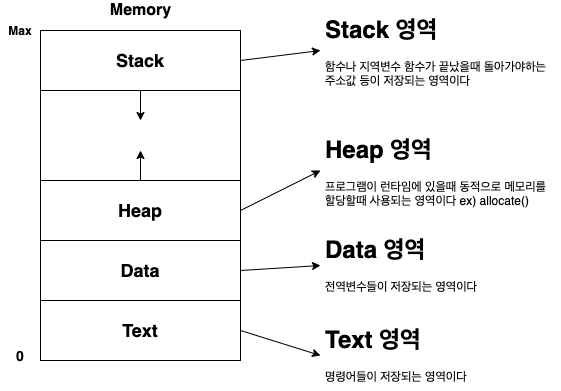
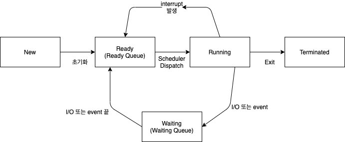

# Process Concept

## :thinking: Process란 무엇인가...
- 실행중인 프로그램 (메모리에 올라간 상태)
- OS에서 작업의 단위

**프로세스**

위에 흐름도에서도 볼 수 있듯이 프로세스가 작업을 마치기 위해서는
- `CPU`
- `memeory`
- `files`
- `I/O Devices`

것들이 필요하다

## :classical_building: Process의 메모리 구조

## :stopwatch: Process의 5단계 생명주기
1. `New` : 새로운 프로세스가 만들어지는 시점
2. `Running` : 프로세스가 실행되는 시점
3. `Waiting` : I/O가 발생하거나 Event가 발생하면 끝날때 까지 대기하는 공간
4. `Ready` : 프로세서를 할당받기 전까지 기다리는 공간
5. `Terminated` : 프로세스가 완전히 끝났을 시점

## :thinking: PCB(Process Control Block)란...
`PCB`라는 것은 Prcess가 가져야하는 정보를 저장하는 공간이다 
이것을 통하여서 CPU에게 정보를 전달한다
`PCB` 정보 목록
- **`Process State`**  
- **`Program counter`** : CPU에서 fetch할때 PC를 가지고 명령문을 읽어온다
- `CPU register`
- `CPU-scheduling information`
- `Memory-management information`
- `Accounting information`
- `I/O status information`

### 프로세스의 실행 
프로세스는 하나의 (thread)실처럼 실행을 진행한다 
전통적인 운영체제는 한번에 하나의 작업을 진행 
현대적인 운영체제는 multiple threads를 진행을 허용한다 

>여기서의 `thread`는 **실행흐름**을 나타내는 것으로  
>**프로세스보다 작은 단위**를 가리키는 `thread`랑은 다르다
