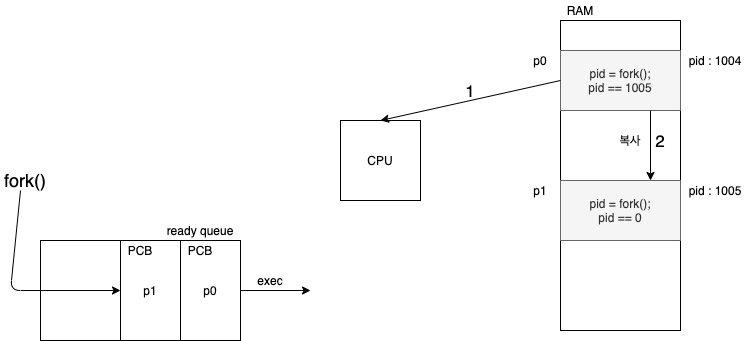
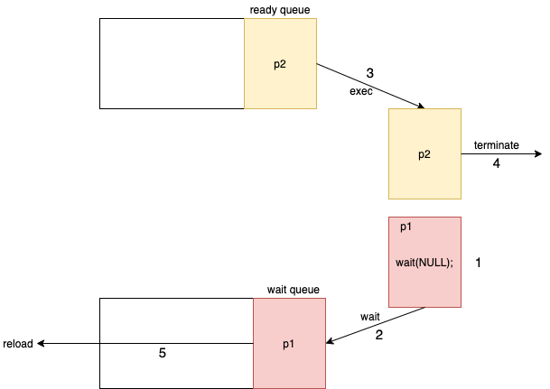

# Process Operation
OS는 프로세스의 시작과 마침 기능을 제공해야 한다

## :hammer_and_wrench: 새로운 프로세스의 생성
프로세스는 새로운 프로세스들을 생성할 수 있다</br>
생성한 프로세스는 부모 프로세스가 되면 생성되어진 프로세스는 자식 프로세스가 된다</br>

>C언어에서는 fork() 명령어로 가능하다</br>
>새로운 프로세스를 생성하게 되면 `tree` 형태로 표현되어진다</br>

## :bulb: 멀티프로세싱의 이해
멀티프로세싱에는 2가지 `실행 방법`이 있다
1. 부모 프로세스와 자식 프로세스가 **동시에** 실행되는 것이다
2. 부모 프로세스는 자식 프로세스가 마치면 다시 실행되는 것이다

멀티프로세싱에는 2가지 `주소공간 할당 방법`이 있다
1. 자식 프로세스가 부모 프로세스와 같이 사용하는 것이다
2. 자식 프로세스에게 새로운 주소공간을 할당해 주는 것이다

## :heavy_multiplication_x: 프로세스 종료
프로세스가 종료되는 2가지 이유
1. 프로세스가 마지막 명령을 실행한 경우 **(자연 종료)**
2. `exit()` system call이 불린 경우 **(강제 종료)**

>2가지 이유중 하나로 프로세스가 종료되었다면</br>
>OS에서는 할당된 메모리와 자원(I/O buffers, file... etc)을 해체하고 회수한다

## :imp: :cry: 좀비와 고아 프로세스
프로세스를 생성하고 종료하다보면 `좀비 프로세스`와 `고아 프로세스`가 생기게 된다
- `zombie` : 자식 프로세스가 종료되었는데 부모 프로세스가 `종료 상태를 회수하지 않은` 경우</br>
-> **메모리 유출을 야기**할 수 있으니 조심해야 한다
- `orphan` : 부모 프로세스가 자식 프로세스보다 `먼저 종료`된 경우</br>
-> ex) daemon process

## `fork()`를 통한 멀티프로세싱 이해
```c
int main(void) {
  pid_t pid;
  pid = fork();
  printf("Hello Process!");
}
```
위와 같은 코드가 있다고 하면은</br>


`fork()` 명령어가 실행되면 부모 프로세스의 주소값이 복사되서 자식프로세스를 만들기 때문에</br>
부모 프로세스와 자식 프로세스는 별개의 메모리 공간을 할당 받는다 </br></br>
보통은 부모 프로세스가 먼저 `Hello Process`가 출력되고</br>
자식 프로세스의 `Hello Process`가 출력되는데</br>
**스케줄러에 따라서 변경 될수도 있다**

>`fork()`를 실행할 경우 fork의 횟수를 n이라고 한다면</br>
> 생성되는 프로세스의 개수는 2^n 만큼 생성된다

## `wait()`의 사용
```c
int main(void) {
  pid_t pid;
  pid = fork();
  if(pid == 0){
    //child process
    printf("child process end!!\n");
  }
  else if(pid > 0){
    //parent process
    wait(NULL);
    printf("parent process end!!\n");
  }
}
```
`wait()` 시스템 콜을 사용하게 된다면
</br>

위의 그림과 같이</br>
1. p1 프로세스가 `wait()`을 부른다
2. p1 프로세스가 `wait queue`로 들어간다
3. p2 프로세스가 `fork()` 다음 명령을 실행한다
4. p2 프로세스가 종료된다
5. p2가 끝났다는 interrupt를 받고난 뒤 실행된다

순서대로 진행된다

## 최근 멀티프로세싱
멀티프로세싱에 관련해서 공부를 하였지만</br>
현재 동시성 프로그래밍에서는 뒤에서 배울 멀티쓰레딩으로 대부분 처리를 한다고 한다</br>
현재에 멀티프로세싱은 `execlp()` 시스템 콜을 이용해서</br>
현재 프로세스에서 **다른 프로세스를 생성할 때** 사용한다고 한다

