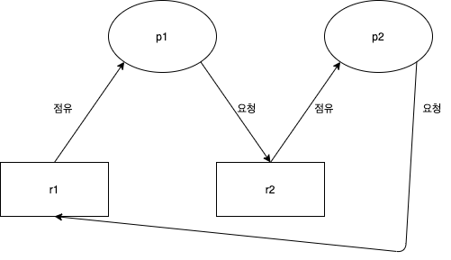

# 데드락

## 데드락 이란...
다중 프로그래밍 시스템에서 프로세스가 결코 일어나지 않을 이벤트를 기다리는 상태가 되면 데드락 상태에 빠졌다고 한다  
좀 더 쉽게 이해하기 위해p1이라는 프로세스와 p2라는 프로세스와 자원 R1과 R2가 있다고 가정하겠습니다  

위에 그림을 보시면 아시겠지만  
p1은 r1을 점유중(락걸린상태) p2는 r2를 점유중 하지만 여기서 p1이 r2에 자원을 요청 p2가 r1에 자원을 요청  
이런 상태가 되어버리면 서로서로 락을 걸린 자원에 요청을 하기 때문에 절대로 일어나지 않을 상황에 놓이게 되었습니다  
이런 상태를 보면 데드락 상태라고 보면 됩니다  

## 데드락 발생 조건 4가지
1. Mutual Exclusion  
    모두가 공유상태의 자원을 가진다면 발생하지 않지만 한 자원이라도 비공유 자원형태를 가진다면  
      상호배제를 실행해야 하기에 데드락이 발생할 수 있다
2. Hold and Wait  
   한 프로세스가 자원을 잡고 있으면서 방출하지 않고 다른 프로세스가 점유중인 다른 자원을 요청할 경우 발생한다
3. No Preemption  
   만약 프로세스가 비선점형 방식이라면 발생할 수 있다
4. Circular Wait  
   의존형 그래프가 순환 참조가 되어버리는 순간 발생하게 된다

  
## 데드락 해결방안
- 데드락의 문제를 무시하자
- 데드락을 예방하거나 피하자  
  (예방은 구현이 불가능하고 피하는 방법은 뱅커의 알고리즘이 존재하지만 비용이 비쌈으로 일반 서비스에서 구현되기는 어렵다)
- 데드락상태가 된다면 빠르게 탐지하고 빠르게 복구하는 시스템을 구축

현실적인 방안은 3번째가 되겠다  

