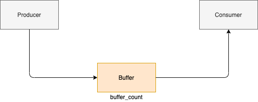

# Synchronization-concept
이번에는 프로세스의 공유 데이터를 다룰때 발생하는 동기화 문제에 대해서 다뤄보고자 한다

## :monocle_face: 동기화란...
나의 경우에는 동기화를 이해하는데 있어서 producer consumer관계로 보았을때에 이해가 잘되었다  

  
위의 그림에서 buffer count 부분에 producer가 `넣으면 +1` consumer가 `가져가면 -1`  
이런 구조로 buffer-count가 증가했다 감소했다 한다  
동기화라는 것은 count = 5 라면 producer가 먼저 넣으면 count = 6 다시 consumer가 소비하면 count = 5 이런식으로 순서대로 명령이 처리되는 것을 말한다  

## :mag: 동기화 문제가 발생하는 이유
위에서 보았던 저 producer consumer 형태가 동시성 또는 병렬성을 가지고 있다고 하겠다  
병렬성이라면 producer consumer가 동시에 메모리에 접근하게 됨으로써 동기화문제가 발생한다는 것은 쉽게 알 수 있다  
하지만 동시성이라면 조금 말이 안될 수 도 있다  
왜냐하면 병렬성과 다르게 동시성은 context switch에 의해서  
하나의 프로세서를 두개의 프로세스가 번갈아가며 사용하기 때문이다  
위와 같은 이유로 동시성 문제가 발생 안하지 않을까? 라고 생각할 수 도있다  
하지만 context switch를 하는 과정으로 인해서 동시성 문제가 발생하게 된다  
```c
//producer
buffer[in] = next_produced;
in = (in+1)%BUFFER_SIZE;
count++;
```
```c
//consumer
next_consumed = buffer[out];
out = (out+1)%BUFFER_SIZE;
count--;
```
위와 같이 두개의 코드가 있다고 하겠다  
producer가 `넣으면 count++` consumer가 `소비하면 count--` 이다  
별 문제가 없을 것 같이 보이지만  
++문은 `regiser = count` -> `register2 = register + 1` -> `count = register2`  
이러한 순서로 3번에 걸쳐서 이루어진다  
그러므로 2번째 순서를 진행하다가 context switch가 일어나게 되면  
consumer는 +1이 되지않은 count에 count--를 진행함으로써 전혀 다른값을 출력하게 된다  
이렇게 진행되다보면 count가 제대로 되지 않는다는 것을 알 수 있다  
이 과정 속에서 동기화 문제가 발생하게 된다  

우리는 저 과정으로인해 동기화 문제가 발생하게 되었고  
그 문제의 원인이 되는 부분을 `critical section`으로 부르기로 했다

우리는 이 영역을 기준으로 코드를 4개의 영역으로 나누기도 한다
- `entry section` : critical section으로 들어가기전 영역을 말한다
- `critical section` : entry 영역 바로 뒤에 위치한다
- `exit section` : critical section이 끝나고 바로 뒤의 영역을 말한다
- `remainder section` : 나머지 영역을 말한다


## Critical Section 문제
이 문제를 해결하기 위해서 특정활동에서는 `동기화적`으로 처리한다

### Mutual Exclusion 상호배제
`상호배제` : 어떤 프로세스 p가 critical section부분을 수행하고 있다면  
다른 프로세스가 critical section을 실행하지 못하고 기다려야한다

### avoid deadlock 교착상태 피하기
`교착상태` : A프로세스 B프로세스가 있다고 한다면  
A프로세스가 스캐너를 이용중이고 B프로세스가 CD레코더를 이용중인데  
서로 자신의 점유를 포기하지 않고 B -> 스캐너 A -> 레코더 를 이용할려 한다면  
서로 무한정 기다리게 되는것이 교착상태라고 볼 수 있다

### avoid starvation 기아상태 피하기
`기아상태` : 자원을 할당받을려고 프로세스가 무한정 기다리는 것을 기아상태라고 한다

위의 3가지를 다 이루면은 Critical section 문제를 해결했다고 본다


