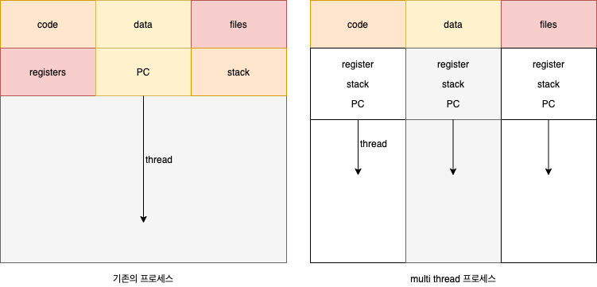

# Thread
기존의 배운 방식에 의하면 하나의 실행 흐름(thread)를 가지고 있는 프로세스들을 fork() 함으로써
  CPU에서 PCB를 Context Switch를 함으로써 동시성 처리를 하도록 만들었다 
하지만 멀티프로세싱을 하는 경우에는 데이터 공유를 위해서 메모리 공유나 메세지 전달 방식을 OS에게 부탁해서 진행했어야 하는 번거러움이 존재헀다 
그래서 생각한 것이 프로세스내에 존재하는 하나의 thread를 여러개로 나눠서 진행하자는 것이다 

## Thread란...
- `lightweight process` 
- `cpu 사용률의 기본단위`
- `별도의 threadID, Program Counter, register set, stack를 가진다`

쉬운 이해를 위해서는 우리가 흔히 사용하는 웹서버를 생각하면 된다 
웹서버에는 새로운 사용자가 들어올때마다 새로운 쓰레드를 생성함으로써 다중 사용자를 처리할 수 있다 

### TCB
프로세스는 `PCB`를 통하여서 프로세스를 스케줄링하거나 필요한 정보들을 담고 있었다 
하지만 thread도 한개 이상이 생길 수 있게 되면서 관리가 필요하게 되었다 
그래서 `Thread Control Block` 즉 `TCB`가 생겨났고  
PCB에서는 TCB를 가리키게 되었다

### 장점
- `응답성` : multi thread를 통하여 non-blocking을 구현할 수 있다
- `자원 공유` : `data` `code` `files`영역을 공유함으로써 통신을 따로 할필요가 없다
- `경제성` : 프로세스를 새로 생성하는 것보다 적은 비용이 든다
- `확장성` : multiprocessor 아키텍쳐의 이점을 이용할 수 있다

## Multicore Programming
요즘 프로세서에는 하나의 cpu에 코어가 여러개 존재함으로써 
하나의 코어에 하나의 쓰레드를 작동함으로써 병렬처리가 가능해졌다 
여러개의 코어를 이용하는 것이 multicore programming으로 보면 된다 

- `singlecore` : time sharing을 이용하여 쓰레드를 사이사이에 끼워넣는다
- `multicore` : 코어수 만큼 쓰레드를 배치해주고 그래도 쓰레드가 생성된다면 time sharing을 이용한다

### 코어가 많으면 많을 수록 성능이 좋을까?
멀티 코어를 사용하니깐 당연히 속도가 싱글 코어에 비해서는 빠르다 
하지만 2개라고 해서 1개에 비해서 2배가 빠른것은 아니다 
왜냐하면 모든 데이터가 완벽히 병렬처리가 가능한 데이터들이 아니기 때문이다 
분명히 일부의 데이터는 순차적으로 처리해야만 하는 데이터가 조금이라도 존재한다 
이 순차적으로 처리해야하는 데이터로 인해 코어가 많다고 해서 속도가 이상적으로 빨라지지는 못한다

## Multithreading Models
멀티 쓰레딩을 할때에는 두가지의 유형이 존재한다
1. `user type` 
    보통 우리가 쓰레드 라이브러리로 생성하는 것이 user type 쓰레드 이다 
    이것은 운영체제의 영역이 아니라 프로세스 내에서만 흐름의 분기가 일어난 것이다 
    그러므로 cpu core의 멀티쓰레딩을 이용할 수 는 없다

2. `kernel type` 
    user type과는 다르게 kernel type은 운영체제가 직접 생산하는 쓰레드로써 
    cpu core에 직접적으로 접근이 가능하고 프로세스의 쓰레드를 cpu의 멀티쓰레딩 환경에 
    연결이 가능하게 만들어 준다

두개로 나뉘어져 있지만 요즘에는 쓰레드를 생성하면 kernel type까지 고려해서 만들어진다

### user type 과 kernel type의 관계성
- `Many to One` 
   여기서는 운영체제에서 쓰레드로 보는게 아니라 프로세스의 단위로 본다 
   그러므로 사실상 cpu core할당은 프로세스 단위로 할당 받게된다 
   `확장성`이나 `시스템 동시성`에서 불편한 부분이 생기지만 
   대신 커널과 따로 통신을 하지 않아도 되기 때문에 `오버헤드`를 줄일 수 있다

- `Many to Many` 
   일대일이나 다대일과는 다르게 좀 더 복잡한 구조로 이루어져 있다 
   사용자 수준과 커널 수준 사이에 경량 프로세스가 생김으로써 
   사용자 수준과 경량프로세스가 다대다 경량 프로세스와 커널 수준이 1:1로 매핑이 된다 
   결론적으로는 사용자 수준과 커널 수준이 다대다 매핑이 된다

- `One to One` 
   일대일에서는 다대일과는 다르게 사용자 수준의 쓰레드를 커널 수준의 쓰레드에서 일대일로 매핑이 가능하다 
   그러므로 커널의 쓰레드가 대기상태에 있더라도 사용자 수준 쓰레드에 맞게 커널 쓰레드가 생성되어 
   다른 쓰레드에서 처리가 가능해진다

### Thread pooling
위에서 본 관계성 매핑으로 인해 다양한 방법으로 커널 수준의 쓰레드를 생성하고 없에고 할 수 있다 
그러므로 쓰레드를 삭제하거나 생성할때의 부담을 덜기위해서 `Thread pool`에다가 저장하여서 나중에 필요할때마다 꺼내서 사용하거나 Thread가 무작위로 생성되는것을 방지해준다